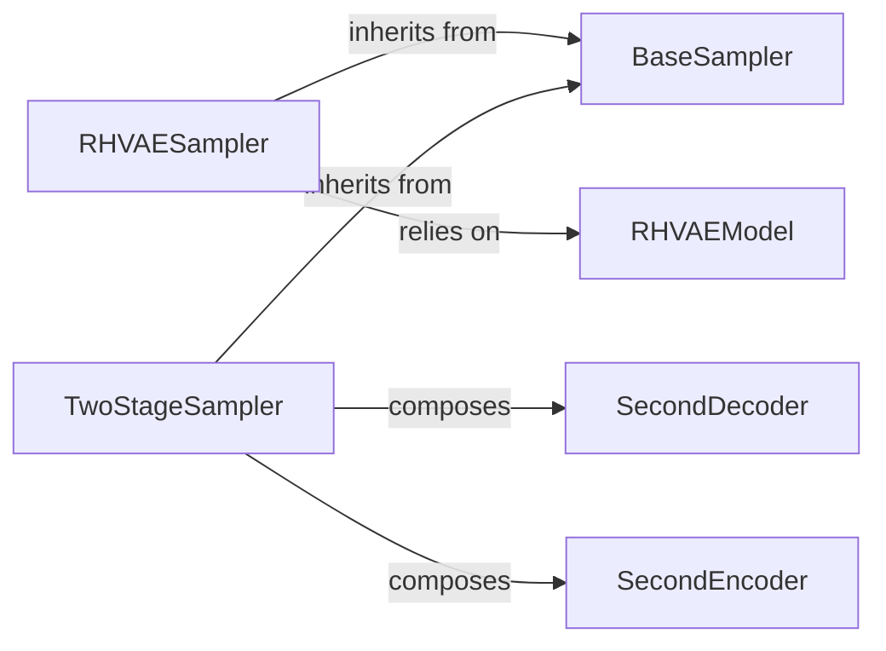

## Details

The sampling subsystem in `pythae` is built around a `BaseSampler` abstraction, providing a unified interface for various sampling strategies. Concrete implementations like `RHVAESampler` and `TwoStageSampler` extend this base, each addressing specific sampling requirements. The `RHVAESampler` interacts directly with the `RHVAEModel` to leverage its learned manifold for Hamiltonian Monte Carlo-based sampling. In contrast, the `TwoStageSampler` orchestrates a multi-stage process, composing `SecondDecoder` and `SecondEncoder` (which are concrete implementations of `BaseDecoder` and `BaseEncoder` respectively) to refine generated samples. This modular design allows for flexible integration of different sampling techniques and model architectures.
Critical Interaction Pathways:
*   **Sampling Execution:** `RHVAESampler` and `TwoStageSampler` (both inheriting from `BaseSampler`) initiate the `sample()` process.
*   **Model Dependency (RHVAE):** `RHVAESampler` relies on `RHVAEModel` to retrieve essential model parameters (e.g., log-probabilities, gradients) for its HMC algorithm.
*   **Two-Stage Refinement:** `TwoStageSampler` composes `SecondDecoder` and `SecondEncoder` to perform sequential transformations and refinements of samples, indicating a direct functional dependency.

### BaseSampler
This is the abstract base class that establishes the common interface and contract for all sampling strategies. It defines the `sample()` method, ensuring a consistent API across different concrete sampler implementations. It serves as the foundational abstraction for the entire sampling pipeline.

**Related Classes/Methods**:

- <a href="https://github.com/clementchadebec/benchmark_VAE/blob/main/src/pythae/samplers/base/base_sampler.py#L20-L111" target="_blank" rel="noopener noreferrer">`pythae.samplers.base.base_sampler.BaseSampler`:20-111</a>

### RHVAESampler
A concrete sampler implementation specifically designed for Riemannian Hamiltonian VAEs (RHVAE). It generates samples by navigating the learned data manifold using Hamiltonian Monte Carlo (HMC). Its responsibilities include orchestrating the HMC-based sampling process, executing the core HMC algorithm, managing the temperature parameter, and computing gradients essential for HMC dynamics.

**Related Classes/Methods**:

- <a href="https://github.com/clementchadebec/benchmark_VAE/blob/main/src/pythae/samplers/manifold_sampler/rhvae_sampler.py#L8-L194" target="_blank" rel="noopener noreferrer">`pythae.samplers.manifold_sampler.rhvae_sampler.RHVAESampler`:8-194</a>

### TwoStageSampler
Another concrete sampler implementation that employs a two-stage sampling process. This suggests a sequential approach where an initial sample is generated and then refined or transformed. It initializes and integrates `SecondDecoder` and `SecondEncoder` components, which are integral to its two-stage process, and implements the logic for the multi-stage sampling pipeline, potentially to improve sample quality or handle complex data distributions.

**Related Classes/Methods**:

- <a href="https://github.com/clementchadebec/benchmark_VAE/blob/main/src/pythae/samplers/two_stage_vae_sampler/two_stage_sampler.py" target="_blank" rel="noopener noreferrer">`pythae.samplers.two_stage_vae_sampler.two_stage_sampler.TwoStageSampler`</a>

### RHVAEModel
Represents the trained RHVAE model. This component is crucial as the `RHVAESampler` relies on it to obtain model-specific information such as log-probabilities and gradients, which are critical inputs for the Hamiltonian Monte Carlo process. It provides the necessary learned representation for sampling.

**Related Classes/Methods**:

- <a href="https://github.com/clementchadebec/benchmark_VAE/blob/main/src/pythae/models/rhvae/rhvae_model.py#L31-L869" target="_blank" rel="noopener noreferrer">`pythae.models.rhvae.rhvae_model.RHVAE`:31-869</a>

### SecondDecoder
A neural network module, an instance of `BaseDecoder`, composed and utilized by the `TwoStageSampler`. It performs transformations or mappings as part of one of the stages within the two-stage sampling process, contributing to the refinement or transformation of samples. Its architectural importance lies in enabling the multi-stage refinement.

**Related Classes/Methods**:

- <a href="https://github.com/clementchadebec/benchmark_VAE/blob/main/src/pythae/models/base/base_utils.py" target="_blank" rel="noopener noreferrer">`pythae.models.base.base_utils.BaseDecoder`</a>

### SecondEncoder
Similar to `SecondDecoder`, this is a neural network module, an instance of `BaseEncoder`, composed and utilized by the `TwoStageSampler`. It performs transformations or mappings as part of one of the stages within the two-stage sampling process, contributing to the refinement or transformation of samples. Its architectural importance lies in enabling the multi-stage refinement.

**Related Classes/Methods**:

- <a href="https://github.com/clementchadebec/benchmark_VAE/blob/main/src/pythae/models/base/base_utils.py" target="_blank" rel="noopener noreferrer">`pythae.models.base.base_utils.BaseEncoder`</a>

### [FAQ](https://github.com/CodeBoarding/GeneratedOnBoardings/tree/main?tab=readme-ov-file#faq)