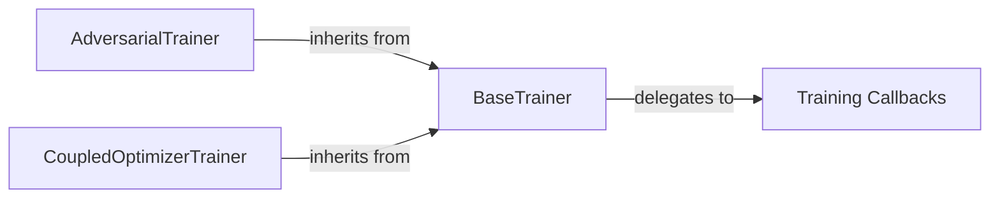

## Details

The `pythae.trainers` subsystem is designed around a flexible and extensible training pipeline, anchored by the `BaseTrainer` component. This foundational component provides the core training loop, handling data loading, optimization, and scheduling, and integrates with a robust `Training Callbacks` system for injecting custom logic. Specialized trainers like `AdversarialTrainer` and `CoupledOptimizerTrainer` extend `BaseTrainer` to implement specific training paradigms, such as adversarial training with distinct optimizers for generator and discriminator, or managing coupled optimizers for different model parts. This inheritance-based structure ensures reusability of core training functionalities while allowing for specialized behaviors. The interaction pathways primarily involve the specialized trainers inheriting from `BaseTrainer` and `BaseTrainer` delegating to `Training Callbacks` for lifecycle events.

### BaseTrainer
The foundational and central component of the training pipeline. It orchestrates the core training loop, managing epochs, batch processing, optimizer and scheduler steps, and integrating with callback mechanisms. It provides the fundamental `train`, `train_step`, `eval_step`, and `predict` functionalities.

**Related Classes/Methods**:

- <a href="https://github.com/clementchadebec/benchmark_VAE/blob/main/src/pythae/trainers/base_trainer/base_trainer.py" target="_blank" rel="noopener noreferrer">`pythae.trainers.base_trainer.BaseTrainer`</a>

### Training Callbacks
A set of extensible hooks (`Callback` class) and concrete implementations (e.g., `MetricConsolePrinterCallback`, `ProgressBarCallback`) that allow for injecting custom logic at various stages of the training lifecycle (e.g., start/end of epoch, batch processing).

**Related Classes/Methods**:

- <a href="https://github.com/clementchadebec/benchmark_VAE/blob/main/src/pythae/trainers/training_callbacks.py" target="_blank" rel="noopener noreferrer">`pythae.trainers.training_callbacks.Callback`</a>

### AdversarialTrainer
A specialized trainer that extends `BaseTrainer` to implement adversarial training paradigms. It manages separate optimizers and distinct training steps for a generator (autoencoder) and a discriminator.

**Related Classes/Methods**:

- <a href="https://github.com/clementchadebec/benchmark_VAE/blob/main/src/pythae/trainers/adversarial_trainer/adversarial_trainer.py" target="_blank" rel="noopener noreferrer">`pythae.trainers.adversarial_trainer.AdversarialTrainer`</a>

### CoupledOptimizerTrainer
A specialized trainer that extends `BaseTrainer` for models requiring separate, but coupled, optimizers for different parts of the model (e.g., encoder and decoder in certain VAE variants).

**Related Classes/Methods**:

- <a href="https://github.com/clementchadebec/benchmark_VAE/blob/main/src/pythae/trainers/coupled_optimizer_trainer/coupled_optimizer_trainer.py" target="_blank" rel="noopener noreferrer">`pythae.trainers.coupled_optimizer_trainer.CoupledOptimizerTrainer`</a>

### [FAQ](https://github.com/CodeBoarding/GeneratedOnBoardings/tree/main?tab=readme-ov-file#faq)