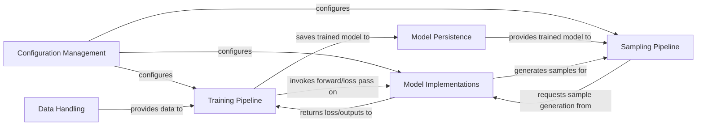

## Details

The pythae project is structured around a clear set of components designed for developing and experimenting with generative models, particularly Variational Autoencoders (VAEs). The Configuration Management component acts as the central hub for defining and loading all experimental parameters, ensuring consistency across model training and sampling. The Data Handling component is responsible for preparing and providing data to the Training Pipeline, which orchestrates the entire model training process, including optimization and evaluation. During training, the Training Pipeline interacts directly with Model Implementations to perform forward passes and compute losses. Once trained, models are saved via the Model Persistence component. For generating new data, the Sampling Pipeline retrieves trained models from Model Persistence and utilizes the Model Implementations to generate samples based on various strategies. This modular design facilitates easy extension and experimentation with different model architectures, training regimes, and sampling methods.

### Configuration Management [[Expand]](./Configuration_Management.md)
Defines, loads, and manages all configuration parameters for models, training, and sampling. Ensures consistent and reproducible experimental setups.

**Related Classes/Methods**:

- <a href="https://github.com/clementchadebec/benchmark_VAE/blob/main/src/pythae/models/base/base_config.py" target="_blank" rel="noopener noreferrer">`pythae.config.base_config`</a>
- <a href="https://github.com/clementchadebec/benchmark_VAE/blob/main/src/pythae/config.py" target="_blank" rel="noopener noreferrer">`pythae.config.config`</a>

### Data Handling
Ingests raw data, applies necessary preprocessing steps, and provides data in a batched format suitable for model training and evaluation.

**Related Classes/Methods**:

- <a href="https://github.com/clementchadebec/benchmark_VAE/blob/main/src/pythae/data/preprocessors.py" target="_blank" rel="noopener noreferrer">`pythae.data.preprocessors`</a>
- <a href="https://github.com/clementchadebec/benchmark_VAE/blob/main/src/pythae/data/datasets.py" target="_blank" rel="noopener noreferrer">`pythae.data.datasets`</a>

### Model Implementations
Encapsulates various generative model architectures (e.g., VAEs, AAEs, VQ-VAEs), including their encoders, decoders, and discriminators. Handles forward passes and loss computations. Provides extension points for custom neural network architectures.

**Related Classes/Methods**:

- <a href="https://github.com/clementchadebec/benchmark_VAE/blob/main/src/pythae/models/base/base_model.py" target="_blank" rel="noopener noreferrer">`pythae.models.base.base_model`</a>
- <a href="https://github.com/clementchadebec/benchmark_VAE/blob/main/src/pythae/models/nn/base_architectures.py" target="_blank" rel="noopener noreferrer">`pythae.models.nn.base_architectures`</a>
- <a href="https://github.com/clementchadebec/benchmark_VAE/blob/main/src/pythae/models/ae/ae_model.py" target="_blank" rel="noopener noreferrer">`pythae.models.ae.ae_model`</a>

### Training Pipeline [[Expand]](./Training_Pipeline.md)
Coordinates the entire model training lifecycle, including epoch loops, batch processing, optimization steps, evaluation, and interaction with experiment tracking. This component integrates optimization, evaluation, and callback mechanisms.

**Related Classes/Methods**:

- <a href="https://github.com/clementchadebec/benchmark_VAE/blob/main/src/pythae/trainers/base_trainer.py" target="_blank" rel="noopener noreferrer">`pythae.trainers.base_trainer`</a>
- <a href="https://github.com/clementchadebec/benchmark_VAE/blob/main/src/pythae/trainers/training_callbacks.py" target="_blank" rel="noopener noreferrer">`pythae.trainers.training_callbacks`</a>

### Model Persistence
Handles the serialization and deserialization of trained model weights and their associated configurations, enabling model saving, loading, and reuse.

**Related Classes/Methods**:

- <a href="https://github.com/clementchadebec/benchmark_VAE/blob/main/src/pythae/models/base/base_model.py" target="_blank" rel="noopener noreferrer">`pythae.models.base.base_model`</a>

### Sampling Pipeline [[Expand]](./Sampling_Pipeline.md)
Generates new data samples from a trained generative model, implementing various sampling strategies (e.g., manifold sampling, two-stage sampling).

**Related Classes/Methods**:

- <a href="https://github.com/clementchadebec/benchmark_VAE/blob/main/src/pythae/samplers/base_sampler.py" target="_blank" rel="noopener noreferrer">`pythae.samplers.base_sampler`</a>
- <a href="https://github.com/clementchadebec/benchmark_VAE/blob/main/src/pythae/samplers/manifold_sampler/rhvae_sampler.py" target="_blank" rel="noopener noreferrer">`pythae.samplers.manifold_sampler.rhvae_sampler`</a>

### [FAQ](https://github.com/CodeBoarding/GeneratedOnBoardings/tree/main?tab=readme-ov-file#faq)