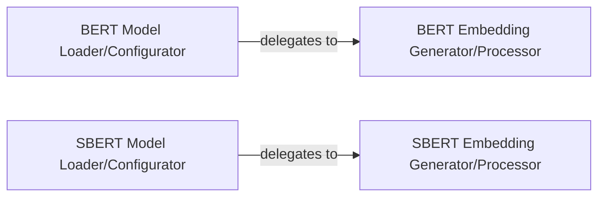

## Details

The Model Management & Embedding Module subsystem is a critical part of the bert-extractive-summarizer project, responsible for handling the loading, configuration, and application of pre-trained transformer models (BERT, SBERT) to generate high-dimensional numerical embeddings for sentences. This aligns with the project's ML Toolkit/Python Library nature, emphasizing modularity and specialized functionalities.

### BERT Model Loader/Configurator
This component serves as the high-level interface for initializing, loading, and configuring the BERT model. It acts as the primary entry point for integrating BERT into the summarization pipeline, abstracting away the complexities of model instantiation.

**Related Classes/Methods**:

- <a href="https://github.com/dmmiller612/bert-extractive-summarizer/blob/master/summarizer/bert.py" target="_blank" rel="noopener noreferrer">`summarizer.bert`</a>

### SBERT Model Loader/Configurator
Similar to the BERT counterpart, this component provides the high-level interface for initializing, loading, and configuring the SBERT model. It is the primary entry point for SBERT integration, offering a parallel mechanism for different embedding models.

**Related Classes/Methods**:

- <a href="https://github.com/dmmiller612/bert-extractive-summarizer/blob/master/summarizer/sbert.py" target="_blank" rel="noopener noreferrer">`summarizer.sbert`</a>

### BERT Embedding Generator/Processor
This component orchestrates and executes the detailed process of generating high-dimensional sentence embeddings specifically using a pre-trained BERT model. Its responsibilities include tokenization, creating input matrices, extracting embeddings from specific layers, and applying pooling strategies.

**Related Classes/Methods**:

- <a href="https://github.com/dmmiller612/bert-extractive-summarizer/blob/master/summarizer/transformer_embeddings/bert_embedding.py" target="_blank" rel="noopener noreferrer">`summarizer.transformer_embeddings.bert_embedding`</a>

### SBERT Embedding Generator/Processor
This component encapsulates the specific logic and API calls for extracting high-dimensional sentence embeddings using a pre-trained SBERT model. It handles the SBERT-specific processing required to convert sentences into numerical vectors.

**Related Classes/Methods**:

- <a href="https://github.com/dmmiller612/bert-extractive-summarizer/blob/master/summarizer/transformer_embeddings/sbert_embedding.py" target="_blank" rel="noopener noreferrer">`summarizer.transformer_embeddings.sbert_embedding`</a>

### [FAQ](https://github.com/CodeBoarding/GeneratedOnBoardings/tree/main?tab=readme-ov-file#faq)