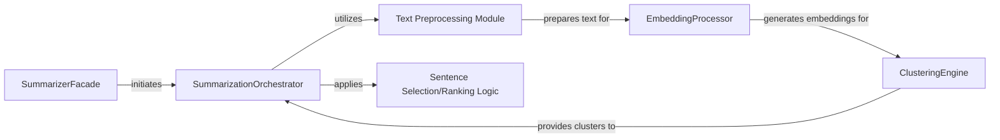

## Details

The `Summarization Core Logic` subsystem is the heart of the summarization pipeline, orchestrating the flow of data and operations from raw text to a concise summary. It encompasses the core components responsible for processing, embedding, clustering, and selecting sentences to form the final output.

### SummarizerFacade
Acts as the primary public entry point for initiating the summarization process. It provides a simplified interface to the complex underlying logic, abstracting away the internal pipeline details. This aligns with the "ML Toolkit/Python Library" pattern, offering a clear API for users.

**Related Classes/Methods**:

- <a href="https://github.com/dmmiller612/bert-extractive-summarizer/blob/master/summarizer/summary_processor.py#L209-L235" target="_blank" rel="noopener noreferrer">`summarizer.summary_processor.__call__`:209-235</a>

### SummarizationOrchestrator
This component is the true "Summarization Core Logic." It orchestrates the overall summarization pipeline, coordinating the sequence of operations including text preprocessing, embedding generation, clustering, and final sentence selection/ranking. It embodies the "Pipeline/Chain of Responsibility" architectural pattern.

**Related Classes/Methods**:

- <a href="https://github.com/dmmiller612/bert-extractive-summarizer/blob/master/summarizer/summary_processor.py#L175-L207" target="_blank" rel="noopener noreferrer">`summarizer.summary_processor.run`:175-207</a>

### Text Preprocessing Module [[Expand]](./Text_Preprocessing_Module.md)
Handles initial text preparation, including sentence tokenization and optional coreference resolution, ensuring the text is in a suitable format for embedding.

**Related Classes/Methods**:

- <a href="https://github.com/dmmiller612/bert-extractive-summarizer/blob/master/summarizer/text_processors/" target="_blank" rel="noopener noreferrer">`summarizer.text_processors`</a>

### EmbeddingProcessor
Manages the generation and preparation of sentence embeddings. This specialized component focuses on transforming input text into numerical representations (embeddings) suitable for subsequent clustering and analysis. It represents a modular step in the pipeline.

**Related Classes/Methods**:

- <a href="https://github.com/dmmiller612/bert-extractive-summarizer/blob/master/summarizer/summary_processor.py#L137-L173" target="_blank" rel="noopener noreferrer">`summarizer.summary_processor.run_embeddings`:137-173</a>
- <a href="https://github.com/dmmiller612/bert-extractive-summarizer/blob/master/summarizer/transformer_embeddings/" target="_blank" rel="noopener noreferrer">`summarizer.transformer_embeddings`</a>

### ClusteringEngine
Executes the core clustering algorithms on the processed sentence embeddings. It groups similar sentences together, which is a critical step for identifying representative sentences for the extractive summary. This is another modular component in the pipeline.

**Related Classes/Methods**:

- <a href="https://github.com/dmmiller612/bert-extractive-summarizer/blob/master/summarizer/summary_processor.py#L89-L135" target="_blank" rel="noopener noreferrer">`summarizer.summary_processor.cluster_runner`:89-135</a>
- <a href="https://github.com/dmmiller612/bert-extractive-summarizer/blob/master/summarizer/cluster_features.py" target="_blank" rel="noopener noreferrer">`summarizer.cluster_features`</a>

### Sentence Selection/Ranking Logic
Responsible for applying algorithms to select the most salient sentences from the clustered data to form the final summary. This is often integrated within the SummarizationOrchestrator.

**Related Classes/Methods**:

- <a href="https://github.com/dmmiller612/bert-extractive-summarizer/blob/master/summarizer/summary_processor.py#L175-L207" target="_blank" rel="noopener noreferrer">`summarizer.summary_processor.run`:175-207</a>
- <a href="https://github.com/dmmiller612/bert-extractive-summarizer/blob/master/summarizer/util.py" target="_blank" rel="noopener noreferrer">`summarizer.util`</a>

### [FAQ](https://github.com/CodeBoarding/GeneratedOnBoardings/tree/main?tab=readme-ov-file#faq)