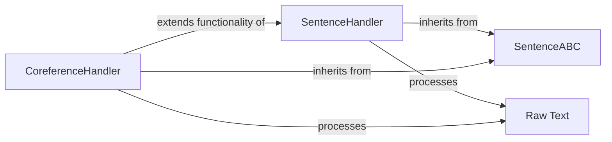

## Details

The `text_processors` subsystem in `bert-extractive-summarizer` is designed to preprocess raw text into a structured format suitable for summarization. It establishes a clear contract through the `SentenceABC` abstract base class, ensuring consistent text processing. `SentenceHandler` provides fundamental sentence segmentation, while `CoreferenceHandler` extends this capability by incorporating coreference resolution, thereby enriching the contextual understanding of the text before summarization. This modular design allows for flexible and extensible text preprocessing strategies.

### SentenceABC
This abstract base class defines the common interface and contract for all sentence processing handlers within the module. It establishes a standardized `process` method signature, ensuring consistency across different text preprocessing strategies.

**Related Classes/Methods**:

- <a href="https://github.com/dmmiller612/bert-extractive-summarizer/blob/master/summarizer/text_processors/sentence_abc.py" target="_blank" rel="noopener noreferrer">`summarizer.text_processors.SentenceABC`</a>

### SentenceHandler
Implements basic sentence segmentation. It takes raw text as input and uses the `spaCy` library to segment it into individual sentences, forming the foundational step for further NLP tasks.

**Related Classes/Methods**:

- <a href="https://github.com/dmmiller612/bert-extractive-summarizer/blob/master/summarizer/text_processors/sentence_handler.py" target="_blank" rel="noopener noreferrer">`summarizer.text_processors.SentenceHandler`</a>

### CoreferenceHandler
Extends sentence processing by incorporating coreference resolution. It leverages `neuralcoref` in conjunction with `spaCy` to identify and resolve coreferring expressions, then segments the coreference-resolved text into sentences, enhancing contextual understanding.

**Related Classes/Methods**:

- <a href="https://github.com/dmmiller612/bert-extractive-summarizer/blob/master/summarizer/text_processors/coreference_handler.py" target="_blank" rel="noopener noreferrer">`summarizer.text_processors.CoreferenceHandler`</a>

### Raw Text
Input raw text data for processing.

**Related Classes/Methods**: _None_

### [FAQ](https://github.com/CodeBoarding/GeneratedOnBoardings/tree/main?tab=readme-ov-file#faq)