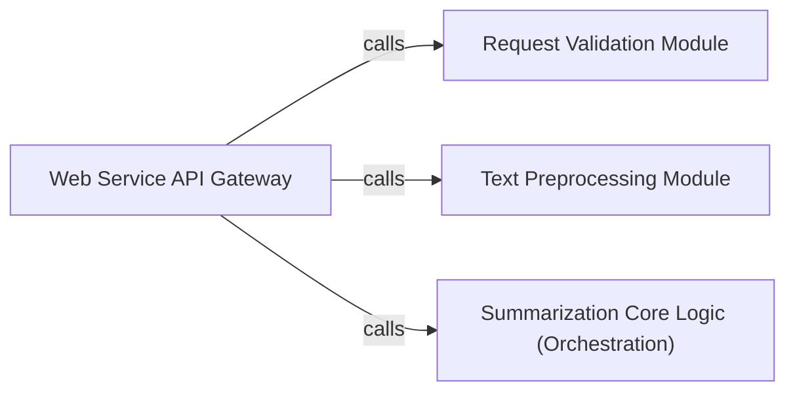

## Details

The `Web Service API Gateway` subsystem is primarily defined by the `server.py` file, which encapsulates the Flask application responsible for handling external HTTP requests and orchestrating the summarization workflow. It serves as the external interface and the initial processing layer for the entire summarization service.

### Web Service API Gateway [[Expand]](./Web_Service_API_Gateway.md)
The primary external interface for the summarization service. It handles incoming HTTP requests, routes them to appropriate handlers, and orchestrates the entire summarization process by delegating tasks to internal modules. It also manages initial text conversion and formatting for the API response. This component embodies the "Web Service" pattern, acting as the public-facing API.

**Related Classes/Methods**:

- <a href="https://github.com/dmmiller612/bert-extractive-summarizer/blob/master/server.py#L40-L48" target="_blank" rel="noopener noreferrer">`server.run`:40-48</a>

### Request Validation Module
Responsible for validating the integrity and correctness of incoming HTTP request parameters. It ensures that inputs conform to expected types and formats, preventing erroneous data from reaching the core summarization logic. This aligns with robust API design principles.

**Related Classes/Methods**:

- <a href="https://github.com/dmmiller612/bert-extractive-summarizer/blob/master/server.py#L28-L29" target="_blank" rel="noopener noreferrer">`server.__should_skip`:28-29</a>
- <a href="https://github.com/dmmiller612/bert-extractive-summarizer/blob/master/server.py#L21-L26" target="_blank" rel="noopener noreferrer">`server.__isint`:21-26</a>

### Text Preprocessing Module [[Expand]](./Text_Preprocessing_Module.md)
Performs necessary transformations on the raw input text received via the API. This includes converting text based on specified ratios or sentence counts, and formatting it into paragraphs, preparing the data for the core summarization algorithm. This module acts as a data preparation pipeline step.

**Related Classes/Methods**:

- <a href="https://github.com/dmmiller612/bert-extractive-summarizer/blob/master/server.py#L58-L73" target="_blank" rel="noopener noreferrer">`server.convert_raw_text_by_ratio`:58-73</a>
- <a href="https://github.com/dmmiller612/bert-extractive-summarizer/blob/master/server.py#L75-L90" target="_blank" rel="noopener noreferrer">`server.convert_raw_text_by_sent`:75-90</a>
- <a href="https://github.com/dmmiller612/bert-extractive-summarizer/blob/master/server.py#L50-L52" target="_blank" rel="noopener noreferrer">`server.convert_to_paragraphs`:50-52</a>

### Summarization Core Logic (Orchestration)
Within the context of the API Gateway, this component represents the direct invocation and orchestration of the underlying extractive summarization algorithm. It acts as the immediate bridge from the API layer to the actual summarization engine, triggering the core NLP pipeline.

**Related Classes/Methods**:

- <a href="https://github.com/dmmiller612/bert-extractive-summarizer/blob/master/server.py#L31-L33" target="_blank" rel="noopener noreferrer">`server.__process_sentences`:31-33</a>

### [FAQ](https://github.com/CodeBoarding/GeneratedOnBoardings/tree/main?tab=readme-ov-file#faq)