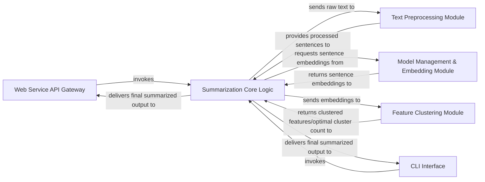

## Details

The `bert-extractive-summarizer` project implements a pipeline-driven architecture for extractive text summarization, accessible via a Web Service API Gateway or a CLI Interface. Raw input text first undergoes processing by the Text Preprocessing Module before being transformed into numerical embeddings by the Model Management & Embedding Module. These embeddings are then analyzed by the Feature Clustering Module to identify key themes. The Summarization Core Logic acts as the central orchestrator, integrating these steps to select and assemble the final summary, which is then returned to the requesting interface. This modular design ensures clear separation of concerns, facilitating maintainability, scalability, and flexible deployment options for the NLP capabilities.

### Web Service API Gateway [[Expand]](./Web_Service_API_Gateway.md)
The external interface for the summarization service, handling incoming HTTP requests, validating parameters, and orchestrating the summarization process. It also manages initial text conversion and formatting for the API.

**Related Classes/Methods**:

- <a href="https://github.com/dmmiller612/bert-extractive-summarizer/blob/master/server.py" target="_blank" rel="noopener noreferrer">`Web Service API Gateway`</a>

### CLI Interface
Provides a command-line interface for direct interaction with the summarization library, handling argument parsing and direct calls to the core logic.

**Related Classes/Methods**:

- <a href="https://github.com/dmmiller612/bert-extractive-summarizer/blob/master/examples/summarize.py" target="_blank" rel="noopener noreferrer">`CLI Interface`</a>

### Text Preprocessing Module [[Expand]](./Text_Preprocessing_Module.md)
Responsible for preparing raw text for the NLP pipeline, including sentence segmentation, tokenization, and optional coreference resolution to enhance contextual understanding.

**Related Classes/Methods**:

- <a href="https://github.com/dmmiller612/bert-extractive-summarizer/blob/master/summarizer/text_processors/sentence_abc.py" target="_blank" rel="noopener noreferrer">`Text Preprocessing Module`</a>
- <a href="https://github.com/dmmiller612/bert-extractive-summarizer/blob/master/summarizer/text_processors/sentence_handler.py" target="_blank" rel="noopener noreferrer">`Text Preprocessing Module`</a>
- <a href="https://github.com/dmmiller612/bert-extractive-summarizer/blob/master/summarizer/text_processors/coreference_handler.py" target="_blank" rel="noopener noreferrer">`Text Preprocessing Module`</a>

### Model Management & Embedding Module [[Expand]](./Model_Management_Embedding_Module.md)
Manages the loading, configuration, and application of pre-trained transformer models (BERT, SBERT) to generate high-dimensional numerical embeddings for sentences.

**Related Classes/Methods**:

- <a href="https://github.com/dmmiller612/bert-extractive-summarizer/blob/master/summarizer/bert.py" target="_blank" rel="noopener noreferrer">`Model Management & Embedding Module`</a>
- <a href="https://github.com/dmmiller612/bert-extractive-summarizer/blob/master/summarizer/sbert.py" target="_blank" rel="noopener noreferrer">`Model Management & Embedding Module`</a>
- <a href="https://github.com/dmmiller612/bert-extractive-summarizer/blob/master/summarizer/transformer_embeddings/bert_embedding.py" target="_blank" rel="noopener noreferrer">`Model Management & Embedding Module`</a>
- <a href="https://github.com/dmmiller612/bert-extractive-summarizer/blob/master/summarizer/transformer_embeddings/sbert_embedding.py" target="_blank" rel="noopener noreferrer">`Model Management & Embedding Module`</a>

### Feature Clustering Module
Applies clustering algorithms to sentence embeddings to group similar sentences, identify key themes, and reduce redundancy, crucial for selecting representative sentences for the summary.

**Related Classes/Methods**:

- <a href="https://github.com/dmmiller612/bert-extractive-summarizer/blob/master/summarizer/cluster_features.py" target="_blank" rel="noopener noreferrer">`Feature Clustering Module`</a>

### Summarization Core Logic [[Expand]](./Summarization_Core_Logic.md)
The central orchestrator of the summarization pipeline. It integrates outputs from the Text Preprocessing, Embedding, and Clustering modules, applies sentence ranking/selection algorithms, and constructs the final summarized text.

**Related Classes/Methods**:

- <a href="https://github.com/dmmiller612/bert-extractive-summarizer/blob/master/summarizer/summary_processor.py" target="_blank" rel="noopener noreferrer">`Summarization Core Logic`</a>

### [FAQ](https://github.com/CodeBoarding/GeneratedOnBoardings/tree/main?tab=readme-ov-file#faq)