```mermaid
graph LR
    API_CLI_Interface["API & CLI Interface"]
    Blockchain_Core["Blockchain Core"]
    Network_P2P["Network/P2P"]
    Consensus_Engine["Consensus Engine"]
    EVM_Execution_Environment_["EVM (Execution Environment)"]
    Data_Persistence["Data Persistence"]
    Sync_Manager["Sync Manager"]
    Cryptography["Cryptography"]
    API_CLI_Interface -- "Queries/Submits to" --> Blockchain_Core
    API_CLI_Interface -- "Communicates with" --> Consensus_Engine
    Blockchain_Core -- "Persists to" --> Data_Persistence
    Blockchain_Core -- "Executes via" --> EVM_Execution_Environment_
    Network_P2P -- "Exchanges with" --> Blockchain_Core
    Network_P2P -- "Coordinates with" --> Sync_Manager
    Consensus_Engine -- "Validates with" --> Blockchain_Core
    Consensus_Engine -- "Utilizes" --> EVM_Execution_Environment_
    EVM_Execution_Environment_ -- "Updates" --> Blockchain_Core
    EVM_Execution_Environment_ -- "Accesses" --> Data_Persistence
    Data_Persistence -- "Serves" --> Blockchain_Core
    Data_Persistence -- "Supports" --> EVM_Execution_Environment_
    Sync_Manager -- "Requests from" --> Network_P2P
    Sync_Manager -- "Integrates with" --> Blockchain_Core
    Cryptography -- "Secures" --> Blockchain_Core
    Cryptography -- "Authenticates" --> Network_P2P
    click API_CLI_Interface href "https://github.com/CodeBoarding/GeneratedOnBoardings/blob/main/besu/API_CLI_Interface.md" "Details"
    click Blockchain_Core href "https://github.com/CodeBoarding/GeneratedOnBoardings/blob/main/besu/Blockchain_Core.md" "Details"
    click Consensus_Engine href "https://github.com/CodeBoarding/GeneratedOnBoardings/blob/main/besu/Consensus_Engine.md" "Details"
    click Data_Persistence href "https://github.com/CodeBoarding/GeneratedOnBoardings/blob/main/besu/Data_Persistence.md" "Details"
```

## Details

One paragraph explaining the functionality which is represented by this graph. What the main flow is and what is its purpose.

### API & CLI Interface [[Expand]](./API_CLI_Interface.md)
Provides external interfaces for users and applications to interact with the blockchain client, including JSON-RPC/WebSockets for programmatic access and a command-line interface for client management.

**Related Classes/Methods**: _None_

### Blockchain Core [[Expand]](./Blockchain_Core.md)
The central component responsible for managing the blockchain's data structure, including blocks, transactions, and the overall state. It handles block validation, chain synchronization, and maintaining the canonical chain.

**Related Classes/Methods**: _None_

### Network/P2P
Manages connections to other nodes in the blockchain network, facilitating peer discovery, propagation of transactions, and synchronization of blocks.

**Related Classes/Methods**: _None_

### Consensus Engine [[Expand]](./Consensus_Engine.md)
Implements the blockchain's specific consensus mechanism (e.g., Proof of Work, Proof of Stake), ensuring agreement among nodes on the state of the ledger and the validity of new blocks.

**Related Classes/Methods**: _None_

### EVM (Execution Environment)
Provides the runtime environment for executing smart contract code and processing transactions according to the rules of the Ethereum Virtual Machine.

**Related Classes/Methods**: _None_

### Data Persistence [[Expand]](./Data_Persistence.md)
Handles the storage and retrieval of all blockchain-related data, including blocks, transactions, state data, and receipts, typically using a key-value store.

**Related Classes/Methods**: _None_

### Sync Manager
Orchestrates the process of synchronizing the local blockchain state with the current state of the network, including fetching missing blocks and verifying chain integrity.

**Related Classes/Methods**: _None_

### Cryptography
Offers cryptographic functions essential for secure operations, including hashing, digital signatures, and key management, used for transaction signing, block validation, and peer authentication.

**Related Classes/Methods**: _None_

### [FAQ](https://github.com/CodeBoarding/GeneratedOnBoardings/tree/main?tab=readme-ov-file#faq)