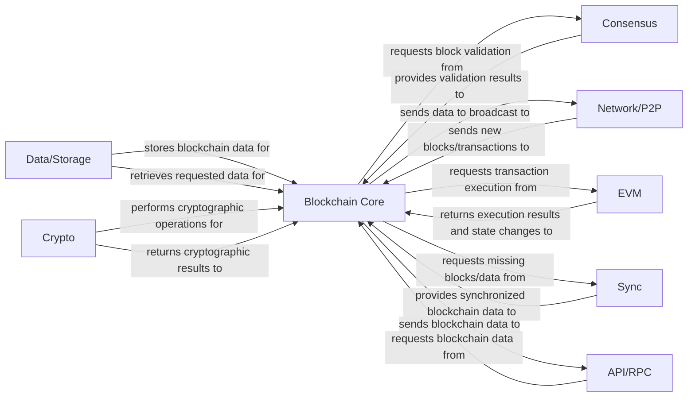

## Details

One paragraph explaining the functionality which is represented by this graph. What the main flow is and what is its purpose.

### Blockchain Core [[Expand]](./Blockchain_Core.md)
Manages the fundamental blockchain data structures, including block and transaction validation, chain organization, and the overall state of the ledger. It orchestrates the flow of data and operations within the blockchain client.

**Related Classes/Methods**: _None_

### Network/P2P
Handles peer-to-peer communication, including discovering peers, maintaining connections, and broadcasting/receiving blocks and transactions across the network.

**Related Classes/Methods**: _None_

### Consensus
Implements the rules and algorithms necessary to achieve agreement among network participants on the state of the blockchain, primarily focusing on block validation and chain selection.

**Related Classes/Methods**: _None_

### EVM
The runtime environment for executing smart contract code and processing transactions that modify the blockchain state.

**Related Classes/Methods**: _None_

### Data/Storage
Manages the persistent storage of blockchain data, including blocks, transactions, and the world state, ensuring data integrity and efficient retrieval.

**Related Classes/Methods**: _None_

### Crypto
Provides cryptographic primitives and functions, such as hashing, digital signatures, and key management, essential for securing blockchain operations.

**Related Classes/Methods**: _None_

### Sync [[Expand]](./Sync.md)
Manages the process of synchronizing the local blockchain state with the current state of the network, including downloading historical blocks and keeping up with new ones.

**Related Classes/Methods**: _None_

### API/RPC
Exposes interfaces (e.g., RPC, WebSockets) for external applications and users to interact with the blockchain client, query data, and submit transactions.

**Related Classes/Methods**: _None_

### [FAQ](https://github.com/CodeBoarding/GeneratedOnBoardings/tree/main?tab=readme-ov-file#faq)