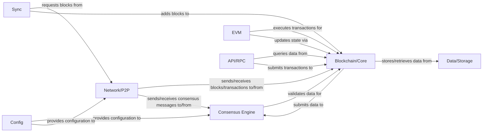

## Details

One paragraph explaining the functionality which is represented by this graph. What the main flow is and what is its purpose.

### Consensus Engine [[Expand]](./Consensus_Engine.md)
Implements the blockchain's consensus algorithm to validate new blocks, ensure chain integrity, and achieve agreement among nodes.

**Related Classes/Methods**: _None_

### Blockchain/Core [[Expand]](./Blockchain_Core.md)
Manages the core blockchain data structure, including blocks, transactions, and the ledger state. Responsible for block creation and chain management.

**Related Classes/Methods**: _None_

### Network/P2P
Handles peer-to-peer communication, including discovering other nodes, propagating transactions and blocks, and maintaining network connections.

**Related Classes/Methods**: _None_

### Data/Storage
Provides persistent storage for the blockchain data, including blocks, transactions, and the world state.

**Related Classes/Methods**: _None_

### EVM
The execution environment for smart contracts and transactions. Processes transaction logic and updates the blockchain state.

**Related Classes/Methods**: _None_

### API/RPC
Exposes an interface (e.g., RPC, WebSockets) for external applications and users to interact with the blockchain client, query data, and submit transactions.

**Related Classes/Methods**: _None_

### Sync [[Expand]](./Sync.md)
Manages the synchronization process, ensuring the local blockchain client is up-to-date with the latest state of the network by fetching missing blocks and transactions from peers.

**Related Classes/Methods**: _None_

### Config
Manages and provides configuration parameters for various components of the blockchain client, such as network settings, database paths, and consensus parameters.

**Related Classes/Methods**: _None_

### [FAQ](https://github.com/CodeBoarding/GeneratedOnBoardings/tree/main?tab=readme-ov-file#faq)