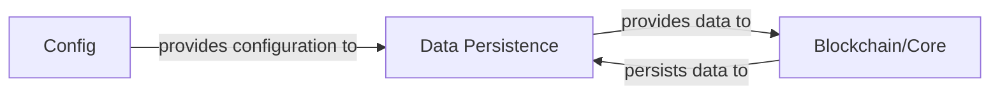

## Details

One paragraph explaining the functionality which is represented by this graph. What the main flow is and what is its purpose.

### Data Persistence [[Expand]](./Data_Persistence.md)
The Data Persistence component is responsible for the reliable and efficient storage and retrieval of all critical blockchain data. This includes the immutable ledger of blocks, individual transactions, and the dynamic world state (e.g., account balances, smart contract storage). It ensures data integrity, availability, and provides the necessary mechanisms for other components to access historical and current blockchain information.

**Related Classes/Methods**: _None_

### Blockchain/Core [[Expand]](./Blockchain_Core.md)
Handles block validation, execution, and synchronization with other nodes, and interacts with Data Persistence for data storage and retrieval.

**Related Classes/Methods**: _None_

### Config
Supplies essential operational parameters to other components, such as database connection strings and storage paths.

**Related Classes/Methods**: _None_

### [FAQ](https://github.com/CodeBoarding/GeneratedOnBoardings/tree/main?tab=readme-ov-file#faq)