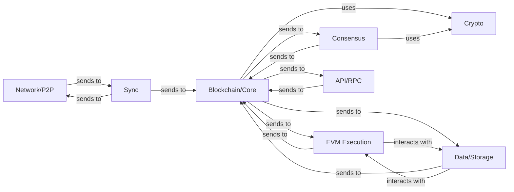

## Details

One paragraph explaining the functionality which is represented by this graph. What the main flow is and what is its purpose.

### Network/P2P
Manages peer-to-peer connections, discovers new peers, and handles the transmission and reception of blockchain data (blocks, transactions) across the network.

**Related Classes/Methods**: _None_

### Consensus
Implements the protocol rules for validating new blocks, achieving agreement among nodes on the state of the blockchain, and ensuring network security and integrity.

**Related Classes/Methods**: _None_

### Blockchain/Core [[Expand]](./Blockchain_Core.md)
The central component responsible for maintaining the blockchain's integrity, managing the chain of blocks, validating transactions, and orchestrating the flow of data between other components.

**Related Classes/Methods**: _None_

### EVM Execution [[Expand]](./EVM_Execution.md)
Executes smart contract bytecode, manages the state transitions resulting from contract interactions, and ensures deterministic execution within the Ethereum Virtual Machine.

**Related Classes/Methods**: _None_

### Data/Storage
Provides persistent storage for the blockchain data, including blocks, transactions, and the world state (account balances, contract code, and storage).

**Related Classes/Methods**: _None_

### API/RPC
Exposes an interface (e.g., JSON-RPC, WebSockets) for external applications and users to interact with the blockchain client, query data, and submit transactions.

**Related Classes/Methods**: _None_

### Sync [[Expand]](./Sync.md)
Manages the process of synchronizing the local blockchain state with the current state of the network, downloading missing blocks and transactions from peers.

**Related Classes/Methods**: _None_

### Crypto
Provides cryptographic primitives and utilities for hashing, digital signatures, key management, and other security-related operations essential for blockchain integrity.

**Related Classes/Methods**: _None_

### [FAQ](https://github.com/CodeBoarding/GeneratedOnBoardings/tree/main?tab=readme-ov-file#faq)