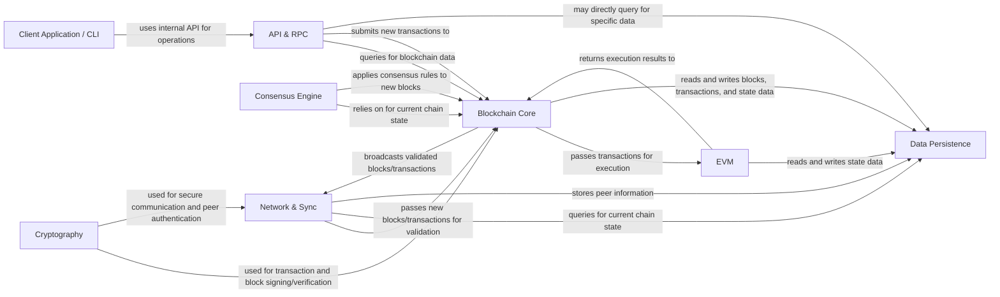

## Details

One paragraph explaining the functionality which is represented by this graph. What the main flow is and what is its purpose.

### Network & Sync [[Expand]](./Network_Sync.md)
Manages peer-to-peer connections, node discovery, and orchestrates the synchronization of the local blockchain state with the network, including exchanging blocks and transactions. It ensures the node is up-to-date with the latest chain.

**Related Classes/Methods**: _None_

### Consensus Engine [[Expand]](./Consensus_Engine.md)
Implements the rules and algorithms (e.g., Proof of Work, Proof of Stake) for achieving agreement among nodes on the blockchain's state and the validity of new blocks. It ensures the integrity and security of the ledger.

**Related Classes/Methods**: _None_

### Blockchain Core [[Expand]](./Blockchain_Core.md)
Responsible for the fundamental data structures of the blockchain, including block and transaction validation, chain organization, and fork resolution. It maintains the integrity and order of the ledger.

**Related Classes/Methods**: _None_

### EVM
Provides the runtime environment for executing smart contracts and processing transactions according to the protocol rules. It handles state transitions based on transaction inputs.

**Related Classes/Methods**: _None_

### Data Persistence [[Expand]](./Data_Persistence.md)
Manages the storage, indexing, and retrieval of all blockchain data, such as blocks, transactions, and state data, ensuring data integrity and efficient access.

**Related Classes/Methods**: _None_

### API & RPC
Exposes interfaces (e.g., JSON-RPC, WebSockets) for external applications and users to interact with the blockchain client, allowing them to query data, submit transactions, and manage the node.

**Related Classes/Methods**: _None_

### Cryptography
Provides essential cryptographic functions for secure operations, including hashing, digital signatures, and key management, underpinning the security of transactions and network communication.

**Related Classes/Methods**: _None_

### Client Application / CLI
Handles application startup, configuration loading, and provides a command-line interface for user interaction and node management (e.g., starting/stopping the node, viewing status).

**Related Classes/Methods**: _None_

### [FAQ](https://github.com/CodeBoarding/GeneratedOnBoardings/tree/main?tab=readme-ov-file#faq)