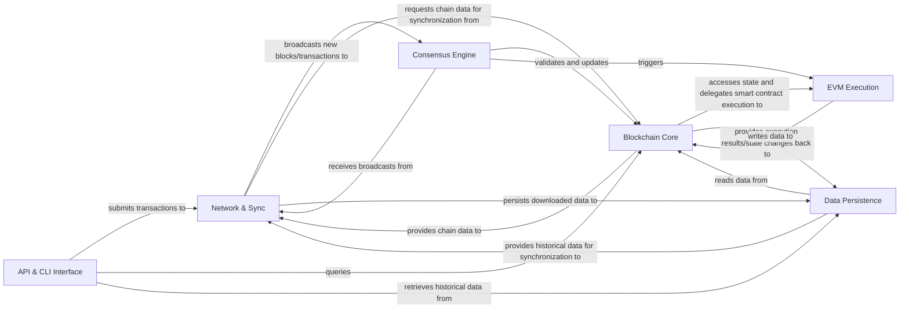

## Details

High-level data flow overview of a blockchain client, detailing abstract components and their interactions.

### Network & Sync [[Expand]](./Network_Sync.md)
Manages peer-to-peer connections, node discovery, and orchestrates the synchronization of the local blockchain state with the network, including exchanging blocks and transactions.

**Related Classes/Methods**: _None_

### Consensus Engine [[Expand]](./Consensus_Engine.md)
Implements the blockchain's consensus algorithm to validate new blocks, ensure chain integrity, and achieve agreement among nodes.

**Related Classes/Methods**: _None_

### Blockchain Core [[Expand]](./Blockchain_Core.md)
Manages the fundamental blockchain data structures, including block and transaction validation, chain organization, the overall state of the ledger, and essential cryptographic operations.

**Related Classes/Methods**: _None_

### EVM Execution [[Expand]](./EVM_Execution.md)
Executes smart contract bytecode, manages the state transitions resulting from contract interactions, and ensures deterministic execution within the Ethereum Virtual Machine.

**Related Classes/Methods**: _None_

### Data Persistence [[Expand]](./Data_Persistence.md)
Provides persistent storage for all blockchain data, including blocks, transactions, and the world state, offering efficient retrieval mechanisms.

**Related Classes/Methods**: _None_

### API & CLI Interface [[Expand]](./API_CLI_Interface.md)
Provides external interfaces for users and applications to interact with the blockchain client, including JSON-RPC/WebSockets for programmatic access and a command-line interface for client management.

**Related Classes/Methods**: _None_

### [FAQ](https://github.com/CodeBoarding/GeneratedOnBoardings/tree/main?tab=readme-ov-file#faq)