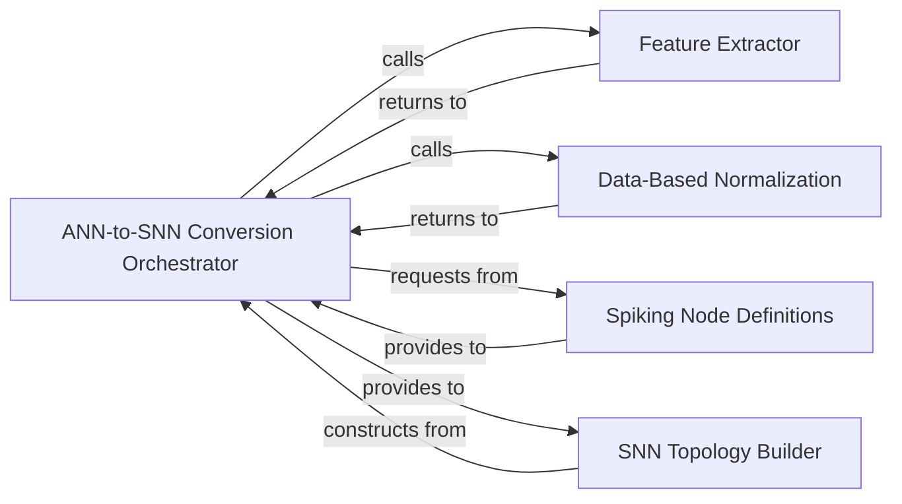

## Details

The ANN-to-SNN Conversion subsystem is primarily encapsulated within the bindsnet.conversion package. Its core functionality is distributed across modules such as conversion.py, nodes.py, and topology.py, which collectively manage the process of transforming Artificial Neural Networks into Spiking Neural Networks.

### ANN-to-SNN Conversion Orchestrator
This component acts as the high-level control unit, orchestrating the entire ANN-to-SNN conversion process. It manages the sequence of operations, including data preparation, feature extraction, normalization, and the coordinated construction of the SNN's spiking nodes and network topology. It serves as the primary interface for initiating and managing the conversion.

**Related Classes/Methods**:

- <a href="https://github.com/BindsNET/bindsnet/blob/master/bindsnet/conversion/conversion.py" target="_blank" rel="noopener noreferrer">`bindsnet.conversion.conversion:ann_to_snn`</a>

### Feature Extractor
Responsible for performing forward passes through the pre-trained Artificial Neural Network (ANN) to capture and extract relevant activations or features from specified layers. These extracted features are crucial for understanding the ANN's learned representations and mapping them effectively to the SNN's spiking behavior.

**Related Classes/Methods**:

- <a href="https://github.com/BindsNET/bindsnet/blob/master/bindsnet/conversion/conversion.py" target="_blank" rel="noopener noreferrer">`bindsnet.conversion.conversion:FeatureExtractor`</a>

### Data-Based Normalization
This component applies data-driven normalization techniques to the extracted ANN activations. Its role is to preprocess and scale the data, ensuring consistency and proper range for effective mapping to SNN spiking rates, thresholds, or other parameters, thereby optimizing the SNN's performance and stability.

**Related Classes/Methods**:

- <a href="https://github.com/BindsNET/bindsnet/blob/master/bindsnet/conversion/conversion.py" target="_blank" rel="noopener noreferrer">`bindsnet.conversion.conversion:data_based_normalization`</a>

### Spiking Node Definitions
Functions as a repository and factory for various spiking neuron models. It defines the properties and behaviors of different types of spiking neurons (e.g., Integrate-and-Fire, Leaky Integrate-and-Fire) and provides mechanisms to instantiate these models based on the characteristics of the original ANN neurons (e.g., ReLU, Sigmoid units).

**Related Classes/Methods**:

- <a href="https://github.com/BindsNET/bindsnet/blob/master/bindsnet/conversion/nodes.py" target="_blank" rel="noopener noreferrer">`bindsnet.conversion.nodes`</a>

### SNN Topology Builder
Manages the structural translation from the ANN to the Spiking Neural Network (SNN). It handles the creation of layers, establishes connections between spiking nodes, and ensures that the overall network architecture of the SNN accurately reflects the connectivity and organization of the original ANN.

**Related Classes/Methods**:

- <a href="https://github.com/BindsNET/bindsnet/blob/master/bindsnet/conversion/topology.py" target="_blank" rel="noopener noreferrer">`bindsnet.conversion.topology`</a>

### [FAQ](https://github.com/CodeBoarding/GeneratedOnBoardings/tree/main?tab=readme-ov-file#faq)