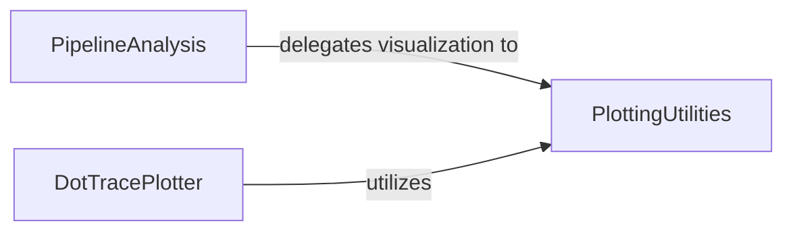

## Details

The Analysis & Visualization subsystem exhibits a clear layered architecture. PlottingUtilities forms the base layer, providing generic plotting primitives. PipelineAnalysis and DotTracePlotter represent higher-level, specialized analysis components that consume and utilize the services of PlottingUtilities to generate domain-specific visualizations. This structure promotes reusability and separation of concerns, where core plotting logic is centralized, and specific analysis tasks are handled by dedicated modules.

### PlottingUtilities
This component serves as the foundational layer for visualization within the bindsnet.analysis subsystem. It provides low-level, generic plotting primitives and utility functions that other analysis components can leverage. Its role is to ensure reusability and consistency across various visualizations, embodying a core utility pattern common in scientific computing libraries.

**Related Classes/Methods**:

- <a href="https://github.com/BindsNET/bindsnet/blob/master/bindsnet/analysis/plotting.py" target="_blank" rel="noopener noreferrer">`bindsnet.analysis.plotting`</a>

### PipelineAnalysis
This component focuses on providing higher-level analytical functions tailored for visualizing specific aspects of Spiking Neural Network (SNN) behavior within a simulation pipeline. This includes functions for plotting neural spike activity and visualizing learned features from convolutional layers, acting as an analytical interface for common SNN outputs. It represents a specialized analysis module built upon the foundational plotting utilities.

**Related Classes/Methods**:

- <a href="https://github.com/BindsNET/bindsnet/blob/master/bindsnet/analysis/pipeline_analysis.py" target="_blank" rel="noopener noreferrer">`bindsnet.analysis.pipeline_analysis`</a>

### DotTracePlotter
This component is responsible for orchestrating the visualization of performance metrics, rewards, and grid-based data. Its primary use case is for debugging and understanding the behavior of models, particularly in reinforcement learning or simulation contexts. It encapsulates specific plotting routines for these distinct data types, leveraging the underlying plotting utilities.

**Related Classes/Methods**:

- <a href="https://github.com/BindsNET/bindsnet/blob/master/bindsnet/analysis/dotTrace_plotter.py" target="_blank" rel="noopener noreferrer">`bindsnet.analysis.dotTrace_plotter`</a>

### [FAQ](https://github.com/CodeBoarding/GeneratedOnBoardings/tree/main?tab=readme-ov-file#faq)