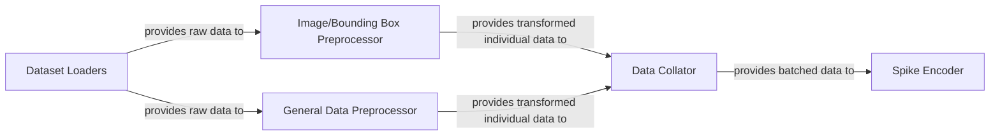

## Details

The data processing subsystem in `bindsnet` begins with `Dataset Loaders`, responsible for acquiring and providing raw dataset samples. These raw samples are then directed to specialized preprocessors: the `Image/Bounding Box Preprocessor` handles visual data transformations, while the `General Data Preprocessor` manages generic data preparation and integrity checks. Both preprocessors operate on individual data samples. Once preprocessed, these individual samples are fed into the `Data Collator`, which aggregates them into optimized batches. Finally, the `Spike Encoder` receives these batched, preprocessed data and converts them into spike trains, the essential input format for Spiking Neural Networks. This sequential flow ensures that data is correctly prepared and formatted for efficient SNN model consumption.

### Dataset Loaders
Manages the initial acquisition and loading of raw datasets from various sources (e.g., `alov300`, `davis`, `spoken_mnist`). This component handles dataset-specific logic, including downloading, integrity checks, and providing the raw data interface. It serves as the entry point for all data into the SNN pipeline.

**Related Classes/Methods**:

- <a href="https://github.com/BindsNET/bindsnet/blob/master/bindsnet/datasets/alov300.py" target="_blank" rel="noopener noreferrer">`bindsnet/datasets/alov300.py`</a>
- <a href="https://github.com/BindsNET/bindsnet/blob/master/bindsnet/datasets/davis.py" target="_blank" rel="noopener noreferrer">`bindsnet/datasets/davis.py`</a>
- <a href="https://github.com/BindsNET/bindsnet/blob/master/bindsnet/datasets/spoken_mnist.py" target="_blank" rel="noopener noreferrer">`bindsnet/datasets/spoken_mnist.py`</a>
- <a href="https://github.com/BindsNET/bindsnet/blob/master/bindsnet/datasets/dataloader.py" target="_blank" rel="noopener noreferrer">`bindsnet/datasets/dataloader.py`</a>

### Image/Bounding Box Preprocessor
Applies specialized transformations to individual image and bounding box data samples, such as scaling, cropping, shifting, and recentering. These operations are often used for data augmentation, normalization, or preparing visual data for specific SNN architectures *before* batching.

**Related Classes/Methods**:

- <a href="https://github.com/BindsNET/bindsnet/blob/master/bindsnet/datasets/preprocess.py" target="_blank" rel="noopener noreferrer">`bindsnet/datasets/preprocess.py`</a>

### General Data Preprocessor
Handles generic data preparation workflows applicable to various individual data types, including file integrity checks, hashing, and saving processed data to disk. This component ensures data consistency and can manage cached versions of preprocessed data *before* batching.

**Related Classes/Methods**:

- <a href="https://github.com/BindsNET/bindsnet/blob/master/bindsnet/preprocessing/preprocessing.py" target="_blank" rel="noopener noreferrer">`bindsnet/preprocessing/preprocessing.py`</a>

### Data Collator
Aggregates preprocessed individual data samples into batches, optimizing data flow for efficient processing by PyTorch-based SNN models during training or inference. It is particularly crucial for time-series or sequential data.

**Related Classes/Methods**:

- <a href="https://github.com/BindsNET/bindsnet/blob/master/bindsnet/datasets/collate.py" target="_blank" rel="noopener noreferrer">`bindsnet/datasets/collate.py`</a>

### Spike Encoder
Converts preprocessed and batched numerical or image data into spike trains, which are the native input format for Spiking Neural Networks. This is a critical step that bridges traditional data representations with the event-driven nature of SNNs.

**Related Classes/Methods**:

- <a href="https://github.com/BindsNET/bindsnet/blob/master/bindsnet/encoding/encoders.py" target="_blank" rel="noopener noreferrer">`bindsnet/encoding/encoders.py`</a>

### [FAQ](https://github.com/CodeBoarding/GeneratedOnBoardings/tree/main?tab=readme-ov-file#faq)