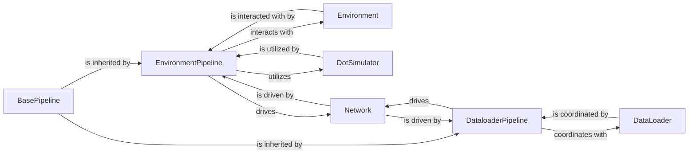

## Details

The `bindsnet` project's core architecture for SNN experiments revolves around a pipeline-driven approach. The `BasePipeline` establishes a foundational workflow, which is then specialized by `EnvironmentPipeline` for environment-interaction tasks and `DataloaderPipeline` for data management. These pipelines orchestrate interactions with key components: `Environment` (or `GymEnvironment`) for external world simulation, `DotSimulator` for specific dot-tracking environments, `Network` for the SNN model itself, and `DataLoader` (within `bindsnet.datasets`) for data provision. This modular design ensures clear separation of concerns, allowing for flexible and extensible experiment configurations.

### BasePipeline
Serves as the abstract foundation for all experiment pipelines. It defines the generic workflow for executing SNN experiments, including initialization, stepping through the experiment, testing, recursive operations on sub-components, and plotting results. It ensures a consistent structure for various experiment types, aligning with the "Pipeline Architecture" pattern.

**Related Classes/Methods**:

- <a href="https://github.com/BindsNET/bindsnet/blob/master/bindsnet/pipeline/base_pipeline.py#L36-L221" target="_blank" rel="noopener noreferrer">`bindsnet.pipeline.base_pipeline.BasePipeline`:36-221</a>

### EnvironmentPipeline
Specializes in orchestrating experiments that involve interaction with an external environment, particularly for training reinforcement learning agents or models that learn through environmental feedback. It manages the environment's state and drives the simulation forward, embodying the "Simulation & Environment Interaction" aspect.

**Related Classes/Methods**:

- <a href="https://github.com/BindsNET/bindsnet/blob/master/bindsnet/pipeline/environment_pipeline.py#L15-L320" target="_blank" rel="noopener noreferrer">`bindsnet.pipeline.environment_pipeline.EnvironmentPipeline`:15-320</a>

### DataloaderPipeline
Manages the loading, preprocessing, and feeding of data into the SNN models during experiments. It ensures that data is available in the correct format and at the right time for the simulation or training process, aligning with the "Data Handling & Preprocessing" component pattern.

**Related Classes/Methods**:

- <a href="https://github.com/BindsNET/bindsnet/blob/master/bindsnet/pipeline/dataloader_pipeline.py#L13-L73" target="_blank" rel="noopener noreferrer">`bindsnet.pipeline.dataloader_pipeline.DataloaderPipeline`:13-73</a>

### Environment
Represents the external environment with which the SNN model interacts, providing observations and receiving actions. This component is crucial for reinforcement learning tasks.

**Related Classes/Methods**:

- <a href="https://github.com/BindsNET/bindsnet/blob/master/bindsnet/environment/environment.py#L13-L54" target="_blank" rel="noopener noreferrer">`bindsnet.environment.environment.Environment`:13-54</a>

### DotSimulator
A specialized environment simulator, often used within `EnvironmentPipeline`, for creating and managing moving "dots" in a grid. It provides observations and computes rewards based on the SNN's interaction with these dots.

**Related Classes/Methods**:

- <a href="https://github.com/BindsNET/bindsnet/blob/master/bindsnet/environment/dot_simulator.py#L43-L489" target="_blank" rel="noopener noreferrer">`bindsnet.environment.dot_simulator.DotSimulator`:43-489</a>

### Network
Represents the core Spiking Neural Network (SNN) model that is being simulated or trained within the experiment. It receives inputs from either the environment or a dataloader and processes them.

**Related Classes/Methods**:

- <a href="https://github.com/BindsNET/bindsnet/blob/master/bindsnet/network/network.py#L31-L491" target="_blank" rel="noopener noreferrer">`bindsnet.network.network.Network`:31-491</a>

### DataLoader
Provides functionalities for accessing, loading, and managing various datasets used as input for SNN experiments. It ensures data is prepared and delivered to the `Network` component.

**Related Classes/Methods**:

- <a href="https://github.com/BindsNET/bindsnet/blob/master/bindsnet/datasets/dataloader.py#L6-L33" target="_blank" rel="noopener noreferrer">`bindsnet.datasets.dataloader.DataLoader`:6-33</a>

### [FAQ](https://github.com/CodeBoarding/GeneratedOnBoardings/tree/main?tab=readme-ov-file#faq)