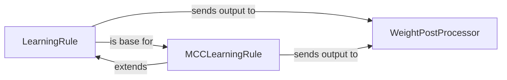

## Details

The `Learning Mechanisms` subsystem is a critical part of `bindsnet`, responsible for adapting synaptic weights based on various learning rules. It adheres to the project's architectural bias towards a modular and extensible scientific computing library for SNNs.

### LearningRule
This component serves as the abstract foundation for various synaptic weight update rules. It provides a generalized interface and common mechanisms, acting as a dispatcher that directs updates to specific connection types (e.g., 1D, 2D, 3D, convolutional) via internal helper methods. It defines the core `update` method as a central entry point for weight adjustments.

**Related Classes/Methods**:

- <a href="https://github.com/BindsNET/bindsnet/blob/master/bindsnet/learning/learning.py#L25-L101" target="_blank" rel="noopener noreferrer">`bindsnet.learning.learning.LearningRule`:25-101</a>

### MCCLearningRule
A concrete and specialized implementation of the Mean-Covariance Control (MCC) learning algorithm. It manages its own specific connection updates and contains the unique logic for weight adjustment according to the MCC rule, extending or overriding the base `LearningRule`'s update mechanism.

**Related Classes/Methods**:

- <a href="https://github.com/BindsNET/bindsnet/blob/master/bindsnet/learning/learning.py" target="_blank" rel="noopener noreferrer">`bindsnet.learning.learning.MCCLearningRule`</a>

### WeightPostProcessor
This component handles operations applied to synaptic weights *after* the primary learning rule has been executed. This can include normalization, clipping, or other constraints to ensure weight stability or adherence to specific criteria.

**Related Classes/Methods**:

- <a href="https://github.com/BindsNET/bindsnet/blob/master/bindsnet/learning/learning.py" target="_blank" rel="noopener noreferrer">`bindsnet.learning.learning.WeightPostProcessor`</a>

### [FAQ](https://github.com/CodeBoarding/GeneratedOnBoardings/tree/main?tab=readme-ov-file#faq)