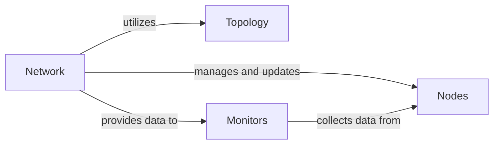

## Details

The `bindsnet` SNN simulation subsystem is structured around four core components: `Network`, `Nodes`, `Topology`, and `Monitors`. The `Network` acts as the central orchestrator, managing the simulation's progression and coordinating interactions between the `Nodes` (individual neurons) and the `Topology` (synaptic connections). `Nodes` represent the computational units that process information and generate spikes, while `Topology` defines how these nodes are interconnected. `Monitors` are specialized components that observe and collect data from both the `Network` and `Nodes` to provide insights into the simulation's dynamic behavior, facilitating analysis and evaluation of the SNN.

### Network
The central orchestrator for SNN simulations. It manages the overall simulation flow, including spike propagation, neuron state updates, and time step advancement. This aligns with the "Simulation & Environment Interaction" pattern.

**Related Classes/Methods**:

- <a href="https://github.com/BindsNET/bindsnet/blob/master/bindsnet/network/network.py#L31-L491" target="_blank" rel="noopener noreferrer">`bindsnet.network.network.Network`:31-491</a>

### Nodes
Represents the fundamental computational units (neurons) within the SNN. These units process inputs, generate spikes, and update their internal states.

**Related Classes/Methods**:

- <a href="https://github.com/BindsNET/bindsnet/blob/master/bindsnet/network/nodes.py#L9-L162" target="_blank" rel="noopener noreferrer">`bindsnet.network.nodes.Nodes`:9-162</a>

### Topology
Defines the structural connectivity (synapses) and their properties between `Nodes` within the SNN. It dictates how information flows and interacts across the network.

**Related Classes/Methods**:

- <a href="https://github.com/BindsNET/bindsnet/blob/master/bindsnet/network/topology.py#L251-L381" target="_blank" rel="noopener noreferrer">`bindsnet.network.topology.Connection`:251-381</a>

### Monitors
Specialized components designed to observe and record the dynamic activity and state of the SNN throughout the simulation. This supports the "Analysis & Evaluation" pattern by providing insights into network behavior.

**Related Classes/Methods**:

- <a href="https://github.com/BindsNET/bindsnet/blob/master/bindsnet/network/monitors.py#L30-L121" target="_blank" rel="noopener noreferrer">`bindsnet.network.monitors.Monitor`:30-121</a>

### [FAQ](https://github.com/CodeBoarding/GeneratedOnBoardings/tree/main?tab=readme-ov-file#faq)