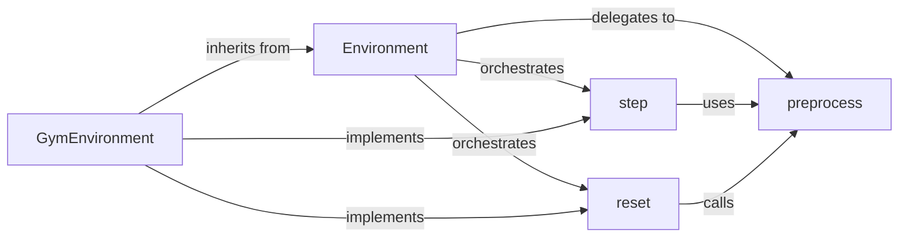

## Details

The `Simulation Environments` subsystem is primarily defined by the `bindsnet.environment` package, specifically the `environment.py` file. This file contains the core abstract `Environment` class and its concrete implementation, `GymEnvironment`, which interfaces with OpenAI Gym. The following components are central to the `Simulation Environments` subsystem, aligning with ML Toolkit/Scientific Computing Library patterns by providing clear interfaces for interaction with external environments.

### Environment
This is the foundational abstract class that defines the contract for all simulation environments within BindsNET. It establishes the essential methods and properties that any concrete environment must implement, acting as the primary interface for SNNs to interact with external simulations.

**Related Classes/Methods**:

- <a href="https://github.com/BindsNET/bindsnet/blob/master/bindsnet/environment/environment.py#L13-L54" target="_blank" rel="noopener noreferrer">`bindsnet.environment.environment.Environment`:13-54</a>

### GymEnvironment
A concrete implementation of the `Environment` abstract class specifically designed to interface with OpenAI Gym environments. This component bridges the gap between BindsNET's SNNs and the vast array of Gym-compatible simulation environments, translating Gym's observations and actions into a format usable by BindsNET.

**Related Classes/Methods**:

- <a href="https://github.com/BindsNET/bindsnet/blob/master/bindsnet/environment/environment.py#L57-L261" target="_blank" rel="noopener noreferrer">`bindsnet.environment.environment.GymEnvironment`:57-261</a>

### step
A core method defined within the `Environment` class (and implemented by concrete environments like `GymEnvironment`) responsible for advancing the simulation by one time step. It takes an action and returns the new observation, reward, done flag, and info.

**Related Classes/Methods**:

- <a href="https://github.com/BindsNET/bindsnet/blob/master/bindsnet/environment/environment.py" target="_blank" rel="noopener noreferrer">`bindsnet.environment.environment.Environment:step`</a>

### reset
A core method defined within the `Environment` class (and implemented by concrete environments) responsible for resetting the environment to an initial state. This is crucial for starting new simulation episodes.

**Related Classes/Methods**:

- <a href="https://github.com/BindsNET/bindsnet/blob/master/bindsnet/environment/environment.py" target="_blank" rel="noopener noreferrer">`bindsnet.environment.environment.Environment:reset`</a>

### preprocess
An internal helper method used by `Environment` and its implementations (like `GymEnvironment`) to prepare observations or states. This ensures data is in the correct format and scale for the SNN.

**Related Classes/Methods**:

- <a href="https://github.com/BindsNET/bindsnet/blob/master/bindsnet/environment/environment.py" target="_blank" rel="noopener noreferrer">`bindsnet.environment.environment.Environment:preprocess`</a>

### [FAQ](https://github.com/CodeBoarding/GeneratedOnBoardings/tree/main?tab=readme-ov-file#faq)