```mermaid
graph LR
    Data_Handling_Encoding["Data Handling & Encoding"]
    SNN_Core_Models_Topology_["SNN Core (Models & Topology)"]
    SNN_Simulation_Engine["SNN Simulation Engine"]
    Learning_Mechanisms["Learning Mechanisms"]
    Simulation_Environments["Simulation Environments"]
    Experiment_Orchestration["Experiment Orchestration"]
    ANN_to_SNN_Conversion["ANN-to-SNN Conversion"]
    Analysis_Visualization["Analysis & Visualization"]
    Data_Handling_Encoding -- "provides encoded data to" --> SNN_Simulation_Engine
    Data_Handling_Encoding -- "processes observations from" --> Simulation_Environments
    SNN_Core_Models_Topology_ -- "defines network structure for" --> SNN_Simulation_Engine
    SNN_Core_Models_Topology_ -- "is updated by" --> Learning_Mechanisms
    SNN_Core_Models_Topology_ -- "receives models from" --> ANN_to_SNN_Conversion
    SNN_Simulation_Engine -- "executes models from" --> SNN_Core_Models_Topology_
    SNN_Simulation_Engine -- "generates activity for" --> Learning_Mechanisms
    SNN_Simulation_Engine -- "produces data for" --> Analysis_Visualization
    Learning_Mechanisms -- "updates" --> SNN_Core_Models_Topology_
    Learning_Mechanisms -- "processes activity from" --> SNN_Simulation_Engine
    Simulation_Environments -- "provides observations to" --> Data_Handling_Encoding
    Simulation_Environments -- "is managed by" --> Experiment_Orchestration
    Experiment_Orchestration -- "orchestrates" --> Data_Handling_Encoding
    Experiment_Orchestration -- "orchestrates" --> SNN_Simulation_Engine
    Experiment_Orchestration -- "orchestrates" --> Learning_Mechanisms
    Experiment_Orchestration -- "orchestrates" --> Simulation_Environments
    Experiment_Orchestration -- "orchestrates" --> Analysis_Visualization
    ANN_to_SNN_Conversion -- "outputs converted models to" --> SNN_Core_Models_Topology_
    Analysis_Visualization -- "consumes data from" --> SNN_Simulation_Engine
    Analysis_Visualization -- "is triggered by" --> Experiment_Orchestration
    click Data_Handling_Encoding href "https://github.com/CodeBoarding/GeneratedOnBoardings/blob/main/bindsnet/Data_Handling_Encoding.md" "Details"
    click SNN_Core_Models_Topology_ href "https://github.com/CodeBoarding/GeneratedOnBoardings/blob/main/bindsnet/SNN_Core_Models_Topology_.md" "Details"
    click SNN_Simulation_Engine href "https://github.com/CodeBoarding/GeneratedOnBoardings/blob/main/bindsnet/SNN_Simulation_Engine.md" "Details"
    click Learning_Mechanisms href "https://github.com/CodeBoarding/GeneratedOnBoardings/blob/main/bindsnet/Learning_Mechanisms.md" "Details"
    click Simulation_Environments href "https://github.com/CodeBoarding/GeneratedOnBoardings/blob/main/bindsnet/Simulation_Environments.md" "Details"
    click Experiment_Orchestration href "https://github.com/CodeBoarding/GeneratedOnBoardings/blob/main/bindsnet/Experiment_Orchestration.md" "Details"
    click ANN_to_SNN_Conversion href "https://github.com/CodeBoarding/GeneratedOnBoardings/blob/main/bindsnet/ANN_to_SNN_Conversion.md" "Details"
    click Analysis_Visualization href "https://github.com/CodeBoarding/GeneratedOnBoardings/blob/main/bindsnet/Analysis_Visualization.md" "Details"
```

## Details

The `bindsnet` project is structured around a core Spiking Neural Network (SNN) simulation engine, enabling the design, simulation, and analysis of SNNs. The `Data Handling & Encoding` component is responsible for preparing diverse datasets for the SNN, often processing observations from `Simulation Environments`. The `SNN Core (Models & Topology)` defines the fundamental network architecture, which is then executed by the `SNN Simulation Engine`. Learning in the network is managed by `Learning Mechanisms`, which adapt the `SNN Core` based on activity generated by the `SNN Simulation Engine`. For advanced use cases, the `ANN-to-SNN Conversion` component allows the integration of pre-trained Artificial Neural Networks into the SNN framework. The entire experimental workflow, from data loading to simulation and learning, is orchestrated by the `Experiment Orchestration` component. Finally, the `Analysis & Visualization` component provides tools to monitor and understand the SNN's behavior and performance, consuming data directly from the `SNN Simulation Engine` and being triggered by the `Experiment Orchestration` for comprehensive insights. This modular design facilitates clear data flow and interaction patterns, making it suitable for detailed architectural diagrams.

### Data Handling & Encoding [[Expand]](./Data_Handling_Encoding.md)
Manages the loading, preprocessing, and encoding of diverse datasets into spike-based representations, making raw data consumable by the SNN simulation engine.

**Related Classes/Methods**:

- <a href="https://github.com/BindsNET/bindsnet/blob/master/bindsnet/datasets" target="_blank" rel="noopener noreferrer">`bindsnet.datasets`</a>
- <a href="https://github.com/BindsNET/bindsnet/blob/master/bindsnet/datasets/dataloader.py" target="_blank" rel="noopener noreferrer">`bindsnet.datasets.dataloader`</a>
- <a href="https://github.com/BindsNET/bindsnet/blob/master/bindsnet/datasets/preprocess.py" target="_blank" rel="noopener noreferrer">`bindsnet.datasets.preprocess`</a>
- <a href="https://github.com/BindsNET/bindsnet/blob/master/bindsnet/encoding/encoders.py" target="_blank" rel="noopener noreferrer">`bindsnet.encoding.encoders`</a>
- <a href="https://github.com/BindsNET/bindsnet/blob/master/bindsnet/preprocessing/preprocessing.py" target="_blank" rel="noopener noreferrer">`bindsnet.preprocessing.preprocessing`</a>

### SNN Core (Models & Topology) [[Expand]](./SNN_Core_Models_Topology_.md)
Defines the fundamental building blocks of Spiking Neural Networks, encompassing individual neuron models, synaptic connections, and the overall network architecture.

**Related Classes/Methods**:

- <a href="https://github.com/BindsNET/bindsnet/blob/master/bindsnet/network/nodes.py" target="_blank" rel="noopener noreferrer">`bindsnet.network.nodes`</a>
- <a href="https://github.com/BindsNET/bindsnet/blob/master/bindsnet/network/topology.py" target="_blank" rel="noopener noreferrer">`bindsnet.network.topology`</a>
- <a href="https://github.com/BindsNET/bindsnet/blob/master/bindsnet/network/network.py" target="_blank" rel="noopener noreferrer">`bindsnet.network.network`</a>

### SNN Simulation Engine [[Expand]](./SNN_Simulation_Engine.md)
The central orchestrator for executing Spiking Neural Network simulations. It manages the propagation of spikes, updates neuron states, and advances activity through the network over discrete time steps.

**Related Classes/Methods**:

- <a href="https://github.com/BindsNET/bindsnet/blob/master/bindsnet/network/network.py" target="_blank" rel="noopener noreferrer">`bindsnet.network.network`</a>
- <a href="https://github.com/BindsNET/bindsnet/blob/master/bindsnet/network/monitors.py" target="_blank" rel="noopener noreferrer">`bindsnet.network.monitors`</a>

### Learning Mechanisms [[Expand]](./Learning_Mechanisms.md)
Implements a variety of learning rules and optimization algorithms designed to adapt synaptic weights based on neuron activity, external feedback, or specific learning objectives.

**Related Classes/Methods**:

- <a href="https://github.com/BindsNET/bindsnet/blob/master/bindsnet/learning/learning.py" target="_blank" rel="noopener noreferrer">`bindsnet.learning.learning`</a>
- <a href="https://github.com/BindsNET/bindsnet/blob/master/bindsnet/learning/learning.py" target="_blank" rel="noopener noreferrer">`bindsnet.learning.post_process`</a>

### Simulation Environments [[Expand]](./Simulation_Environments.md)
Provides interfaces for the SNN to interact with external environments, notably those compatible with OpenAI Gym. This component handles the generation of observations and the application of actions.

**Related Classes/Methods**:

- <a href="https://github.com/BindsNET/bindsnet/blob/master/bindsnet/environment/environment.py" target="_blank" rel="noopener noreferrer">`bindsnet.environment.environment`</a>
- <a href="https://github.com/BindsNET/bindsnet/blob/master/bindsnet/environment/environment.py" target="_blank" rel="noopener noreferrer">`bindsnet.environment.gym`</a>

### Experiment Orchestration [[Expand]](./Experiment_Orchestration.md)
Defines and executes end-to-end workflows for SNN experiments, seamlessly integrating data handling, model simulation, learning, and environment interaction into coherent and reproducible pipelines.

**Related Classes/Methods**:

- <a href="https://github.com/BindsNET/bindsnet/blob/master/bindsnet/pipeline/base_pipeline.py" target="_blank" rel="noopener noreferrer">`bindsnet.pipeline.base_pipeline`</a>
- <a href="https://github.com/BindsNET/bindsnet/blob/master/bindsnet/pipeline/environment_pipeline.py" target="_blank" rel="noopener noreferrer">`bindsnet.pipeline.environment_pipeline`</a>
- <a href="https://github.com/BindsNET/bindsnet/blob/master/bindsnet/pipeline/dataloader_pipeline.py" target="_blank" rel="noopener noreferrer">`bindsnet.pipeline.dataloader_pipeline`</a>

### ANN-to-SNN Conversion [[Expand]](./ANN_to_SNN_Conversion.md)
Facilitates the conversion of pre-trained Artificial Neural Networks (ANNs) into Spiking Neural Networks (SNNs), enabling the transfer of learned knowledge.

**Related Classes/Methods**:

- <a href="https://github.com/BindsNET/bindsnet/blob/master/bindsnet/conversion/conversion.py" target="_blank" rel="noopener noreferrer">`bindsnet.conversion.conversion`</a>
- <a href="https://github.com/BindsNET/bindsnet/blob/master/bindsnet/conversion/nodes.py" target="_blank" rel="noopener noreferrer">`bindsnet.conversion.nodes`</a>
- <a href="https://github.com/BindsNET/bindsnet/blob/master/bindsnet/conversion/topology.py" target="_blank" rel="noopener noreferrer">`bindsnet.conversion.topology`</a>

### Analysis & Visualization [[Expand]](./Analysis_Visualization.md)
Provides a suite of tools and utilities for monitoring SNN activity, evaluating performance metrics, and generating insightful visualizations for debugging and understanding network behavior.

**Related Classes/Methods**:

- <a href="https://github.com/BindsNET/bindsnet/blob/master/bindsnet/analysis/pipeline_analysis.py" target="_blank" rel="noopener noreferrer">`bindsnet.analysis.pipeline_analysis`</a>
- <a href="https://github.com/BindsNET/bindsnet/blob/master/bindsnet/analysis/plotting.py" target="_blank" rel="noopener noreferrer">`bindsnet.analysis.plotting`</a>
- <a href="https://github.com/BindsNET/bindsnet/blob/master/bindsnet/analysis/visualization.py" target="_blank" rel="noopener noreferrer">`bindsnet.analysis.visualization`</a>
- <a href="https://github.com/BindsNET/bindsnet/blob/master/bindsnet/analysis/dotTrace_plotter.py" target="_blank" rel="noopener noreferrer">`bindsnet.analysis.dotTrace_plotter`</a>

### [FAQ](https://github.com/CodeBoarding/GeneratedOnBoardings/tree/main?tab=readme-ov-file#faq)