```mermaid
graph LR
    Grammar_Definition_Generation_Pgen_["Grammar Definition & Generation (Pgen)"]
    AST_Parsing_Core_Lib2to3_Adaptation_["AST Parsing Core (Lib2to3 Adaptation)"]
    AST_Representation_Manipulation_PyTree_Black_Nodes_["AST Representation & Manipulation (PyTree & Black Nodes)"]
    AST_Conversion_Debugging_Utilities["AST Conversion & Debugging Utilities"]
    Grammar_Definition_Generation_Pgen_ -- "provides grammar to" --> AST_Parsing_Core_Lib2to3_Adaptation_
    AST_Parsing_Core_Lib2to3_Adaptation_ -- "produces" --> AST_Representation_Manipulation_PyTree_Black_Nodes_
    AST_Representation_Manipulation_PyTree_Black_Nodes_ -- "is utilized by" --> AST_Conversion_Debugging_Utilities
    AST_Parsing_Core_Lib2to3_Adaptation_ -- "uses" --> AST_Representation_Manipulation_PyTree_Black_Nodes_
```

## Component Details

The AST Parsing & Manipulation subsystem in `black` is responsible for converting Python source code into an Abstract Syntax Tree (AST) and providing tools for its traversal, querying, and modification. This process involves defining and generating the grammar, core parsing using a modified `lib2to3` library, representing the AST with custom node structures, and offering utilities for conversion to standard ASTs and debugging.

### Grammar Definition & Generation (Pgen)
This component is responsible for defining, loading, and generating the Python grammar used by the parser. It includes functionalities for converting grammar definitions into internal representations (NFA/DFA states) and persisting them.

**Related Classes/Methods**:

- <a href="https://github.com/psf/black/blob/master/src/blib2to3/pgen2/pgen.py#L18-L361" target="_blank" rel="noopener noreferrer">`black.src.blib2to3.pgen2.pgen.ParserGenerator` (18:361)</a>
- <a href="https://github.com/psf/black/blob/master/src/blib2to3/pgen2/pgen.py#L14-L15" target="_blank" rel="noopener noreferrer">`black.src.blib2to3.pgen2.pgen.PgenGrammar` (14:15)</a>
- <a href="https://github.com/psf/black/blob/master/src/blib2to3/pgen2/pgen.py#L364-L373" target="_blank" rel="noopener noreferrer">`black.src.blib2to3.pgen2.pgen.NFAState` (364:373)</a>
- <a href="https://github.com/psf/black/blob/master/src/blib2to3/pgen2/pgen.py#L376-L414" target="_blank" rel="noopener noreferrer">`black.src.blib2to3.pgen2.pgen.DFAState` (376:414)</a>
- <a href="https://github.com/psf/black/blob/master/src/blib2to3/pgen2/pgen.py#L417-L419" target="_blank" rel="noopener noreferrer">`black.src.blib2to3.pgen2.pgen.generate_grammar` (417:419)</a>
- <a href="https://github.com/psf/black/blob/master/src/blib2to3/pgen2/driver.py#L237-L259" target="_blank" rel="noopener noreferrer">`black.src.blib2to3.pgen2.driver.load_grammar` (237:259)</a>
- <a href="https://github.com/psf/black/blob/master/src/blib2to3/pgen2/driver.py#L271-L292" target="_blank" rel="noopener noreferrer">`black.src.blib2to3.pgen2.driver.load_packaged_grammar` (271:292)</a>
- <a href="https://github.com/psf/black/blob/master/src/blib2to3/pgen2/grammar.py#L31-L167" target="_blank" rel="noopener noreferrer">`black.src.blib2to3.pgen2.grammar.Grammar` (31:167)</a>
- <a href="https://github.com/psf/black/blob/master/src/blib2to3/pygram.py#L165-L204" target="_blank" rel="noopener noreferrer">`black.src.blib2to3.pygram.initialize` (165:204)</a>
- <a href="https://github.com/psf/black/blob/master/src/blib2to3/pgen2/conv.py#L38-L256" target="_blank" rel="noopener noreferrer">`black.src.blib2to3.pgen2.conv.Converter` (38:256)</a>

### AST Parsing Core (Lib2to3 Adaptation)
This component handles the core parsing of Python source code into an Abstract Syntax Tree (AST) by performing lexical analysis (tokenization) and syntactic analysis. It adapts and utilizes a modified version of Python's `lib2to3` library for this purpose.

**Related Classes/Methods**:

- <a href="https://github.com/psf/black/blob/master/src/blib2to3/pgen2/tokenize.py#L130-L240" target="_blank" rel="noopener noreferrer">`black.src.blib2to3.pgen2.tokenize.tokenize` (130:240)</a>
- <a href="https://github.com/psf/black/blob/master/src/blib2to3/pgen2/driver.py#L51-L105" target="_blank" rel="noopener noreferrer">`black.src.blib2to3.pgen2.driver.TokenProxy` (51:105)</a>
- <a href="https://github.com/psf/black/blob/master/src/blib2to3/pgen2/parse.py#L129-L394" target="_blank" rel="noopener noreferrer">`black.src.blib2to3.pgen2.parse.Parser` (129:394)</a>
- <a href="https://github.com/psf/black/blob/master/src/blib2to3/pgen2/parse.py#L48-L111" target="_blank" rel="noopener noreferrer">`black.src.blib2to3.pgen2.parse.Recorder` (48:111)</a>
- <a href="https://github.com/psf/black/blob/master/src/blib2to3/pgen2/driver.py#L115-L181" target="_blank" rel="noopener noreferrer">`black.src.blib2to3.pgen2.driver.Driver:parse_tokens` (115:181)</a>
- <a href="https://github.com/psf/black/blob/master/src/blib2to3/pgen2/driver.py#L191-L194" target="_blank" rel="noopener noreferrer">`black.src.blib2to3.pgen2.driver.Driver:parse_string` (191:194)</a>
- <a href="https://github.com/psf/black/blob/master/src/black/parsing.py#L55-L102" target="_blank" rel="noopener noreferrer">`black.src.black.parsing.lib2to3_parse` (55:102)</a>
- <a href="https://github.com/psf/black/blob/master/src/black/parsing.py#L105-L112" target="_blank" rel="noopener noreferrer">`black.src.black.parsing.matches_grammar` (105:112)</a>
- <a href="https://github.com/psf/black/blob/master/src/black/parsing.py#L20-L21" target="_blank" rel="noopener noreferrer">`black.src.black.parsing.InvalidInput` (20:21)</a>
- <a href="https://github.com/psf/black/blob/master/src/blib2to3/pgen2/literals.py#L1-L1" target="_blank" rel="noopener noreferrer">`black.src.blib2to3.pgen2.literals` (1:1)</a>

### AST Representation & Manipulation (PyTree & Black Nodes)
This component defines the fundamental data structures for representing the Abstract Syntax Tree (AST), including nodes, leaves, and pattern matching utilities. It also provides mechanisms for traversing and manipulating these tree structures, such as the `Visitor` pattern used throughout `black`.

**Related Classes/Methods**:

- <a href="https://github.com/psf/black/blob/master/src/blib2to3/pytree.py#L54-L229" target="_blank" rel="noopener noreferrer">`black.src.blib2to3.pytree.Base` (54:229)</a>
- <a href="https://github.com/psf/black/blob/master/src/blib2to3/pytree.py#L232-L369" target="_blank" rel="noopener noreferrer">`black.src.blib2to3.pytree.Node` (232:369)</a>
- <a href="https://github.com/psf/black/blob/master/src/blib2to3/pytree.py#L372-L473" target="_blank" rel="noopener noreferrer">`black.src.blib2to3.pytree.Leaf` (372:473)</a>
- <a href="https://github.com/psf/black/blob/master/src/blib2to3/pytree.py#L30-L44" target="_blank" rel="noopener noreferrer">`black.src.blib2to3.pytree.type_repr` (30:44)</a>
- <a href="https://github.com/psf/black/blob/master/src/blib2to3/pytree.py#L499-L587" target="_blank" rel="noopener noreferrer">`black.src.blib2to3.pytree.BasePattern` (499:587)</a>
- <a href="https://github.com/psf/black/blob/master/src/blib2to3/pytree.py#L590-L635" target="_blank" rel="noopener noreferrer">`black.src.blib2to3.pytree.LeafPattern` (590:635)</a>
- <a href="https://github.com/psf/black/blob/master/src/blib2to3/pytree.py#L638-L703" target="_blank" rel="noopener noreferrer">`black.src.blib2to3.pytree.NodePattern` (638:703)</a>
- <a href="https://github.com/psf/black/blob/master/src/blib2to3/pytree.py#L706-L912" target="_blank" rel="noopener noreferrer">`black.src.blib2to3.pytree.WildcardPattern` (706:912)</a>
- <a href="https://github.com/psf/black/blob/master/src/blib2to3/pytree.py#L915-L946" target="_blank" rel="noopener noreferrer">`black.src.blib2to3.pytree.NegatedPattern` (915:946)</a>
- <a href="https://github.com/psf/black/blob/master/src/blib2to3/pytree.py#L949-L976" target="_blank" rel="noopener noreferrer">`black.src.blib2to3.pytree.generate_matches` (949:976)</a>
- <a href="https://github.com/psf/black/blob/master/src/blib2to3/pytree.py#L476-L493" target="_blank" rel="noopener noreferrer">`black.src.blib2to3.pytree.convert` (476:493)</a>
- <a href="https://github.com/psf/black/blob/master/src/black/nodes.py#L150-L181" target="_blank" rel="noopener noreferrer">`black.src.black.nodes.Visitor` (150:181)</a>

### AST Conversion & Debugging Utilities
This component offers utility functions for converting the `lib2to3`-based ASTs into standard Python `ast.AST` objects, stringifying ASTs for comparison and testing, and debugging tools for visualizing and inspecting the tree structure.

**Related Classes/Methods**:

- <a href="https://github.com/psf/black/blob/master/src/black/parsing.py#L137-L156" target="_blank" rel="noopener noreferrer">`black.src.black.parsing.parse_ast` (137:156)</a>
- <a href="https://github.com/psf/black/blob/master/src/black/parsing.py#L169-L171" target="_blank" rel="noopener noreferrer">`black.src.black.parsing.stringify_ast` (169:171)</a>
- <a href="https://github.com/psf/black/blob/master/src/black/parsing.py#L182-L252" target="_blank" rel="noopener noreferrer">`black.src.black.parsing._stringify_ast` (182:252)</a>
- <a href="https://github.com/psf/black/blob/master/src/black/parsing.py#L174-L179" target="_blank" rel="noopener noreferrer">`black.src.black.parsing._stringify_ast_with_new_parent` (174:179)</a>
- <a href="https://github.com/psf/black/blob/master/src/black/parsing.py#L255-L260" target="_blank" rel="noopener noreferrer">`black.src.black.parsing._unwrap_tuples` (255:260)</a>
- <a href="https://github.com/psf/black/blob/master/src/black/parsing.py#L159-L166" target="_blank" rel="noopener noreferrer">`black.src.black.parsing._normalize` (159:166)</a>
- <a href="https://github.com/psf/black/blob/master/src/black/debug.py#L16-L55" target="_blank" rel="noopener noreferrer">`black.src.black.debug.DebugVisitor` (16:55)</a>
- <a href="https://github.com/psf/black/blob/master/src/black/debug.py#L47-L55" target="_blank" rel="noopener noreferrer">`black.src.black.debug.DebugVisitor:show` (47:55)</a>

### [FAQ](https://github.com/CodeBoarding/GeneratedOnBoardings/tree/main?tab=readme-ov-file#faq)