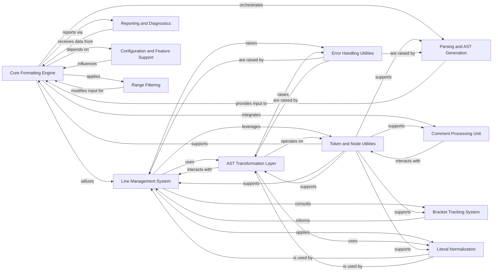

## Component Details

This component contains the fundamental logic for transforming Python code according to Black's style. It involves generating lines from the Abstract Syntax Tree (AST), applying various code transformations (merging strings, stripping/wrapping parentheses, splitting strings), and normalizing different code elements like strings, numbers, and comments.

### Core Formatting Engine
The central component responsible for orchestrating the entire code formatting process, including parsing, applying transformations, and generating the final output.

**Related Classes/Methods**:

- <a href="https://github.com/psf/black/blob/master/src/black/__init__.py#L1063-L1088" target="_blank" rel="noopener noreferrer">`black.src.black.__init__:format_file_contents` (1063:1088)</a>
- <a href="https://github.com/psf/black/blob/master/src/black/__init__.py#L1172-L1216" target="_blank" rel="noopener noreferrer">`black.src.black.__init__:format_str` (1172:1216)</a>
- <a href="https://github.com/psf/black/blob/master/src/black/__init__.py#L1219-L1270" target="_blank" rel="noopener noreferrer">`black.src.black.__init__:_format_str_once` (1219:1270)</a>

### Line Management System
Manages the creation, manipulation, and splitting of individual lines of code during the formatting process, ensuring adherence to line length limits and proper indentation.

**Related Classes/Methods**:

- <a href="https://github.com/psf/black/blob/master/src/black/linegen.py#L101-L600" target="_blank" rel="noopener noreferrer">`black.src.black.linegen.LineGenerator` (101:600)</a>
- <a href="https://github.com/psf/black/blob/master/src/black/lines.py#L40-L496" target="_blank" rel="noopener noreferrer">`black.src.black.lines.Line` (40:496)</a>
- <a href="https://github.com/psf/black/blob/master/src/black/lines.py#L511-L529" target="_blank" rel="noopener noreferrer">`black.src.black.lines.LinesBlock` (511:529)</a>
- <a href="https://github.com/psf/black/blob/master/src/black/lines.py#L533-L769" target="_blank" rel="noopener noreferrer">`black.src.black.lines.EmptyLineTracker` (533:769)</a>

### AST Transformation Layer
Applies various structural transformations to the Abstract Syntax Tree (AST) to achieve Black's specific formatting rules, including string merging, parenthesis handling, and power operator adjustments.

**Related Classes/Methods**:

- <a href="https://github.com/psf/black/blob/master/src/black/trans.py#L205-L308" target="_blank" rel="noopener noreferrer">`black.src.black.trans.StringTransformer` (205:308)</a>
- <a href="https://github.com/psf/black/blob/master/src/black/trans.py#L338-L396" target="_blank" rel="noopener noreferrer">`black.src.black.trans.CustomSplitMapMixin` (338:396)</a>
- <a href="https://github.com/psf/black/blob/master/src/black/trans.py#L399-L850" target="_blank" rel="noopener noreferrer">`black.src.black.trans.StringMerger` (399:850)</a>
- <a href="https://github.com/psf/black/blob/master/src/black/trans.py#L853-L1041" target="_blank" rel="noopener noreferrer">`black.src.black.trans.StringParenStripper` (853:1041)</a>
- <a href="https://github.com/psf/black/blob/master/src/black/trans.py#L1044-L1304" target="_blank" rel="noopener noreferrer">`black.src.black.trans.BaseStringSplitter` (1044:1304)</a>
- <a href="https://github.com/psf/black/blob/master/src/black/trans.py#L1382-L1886" target="_blank" rel="noopener noreferrer">`black.src.black.trans.StringSplitter` (1382:1886)</a>
- <a href="https://github.com/psf/black/blob/master/src/black/trans.py#L1889-L2279" target="_blank" rel="noopener noreferrer">`black.src.black.trans.StringParenWrapper` (1889:2279)</a>
- <a href="https://github.com/psf/black/blob/master/src/black/trans.py#L2282-L2421" target="_blank" rel="noopener noreferrer">`black.src.black.trans.StringParser` (2282:2421)</a>

### Comment Processing Unit
Responsible for identifying, extracting, normalizing, and re-inserting comments into the formatted code, including handling special `fmt: off` directives.

**Related Classes/Methods**:

- <a href="https://github.com/psf/black/blob/master/src/black/comments.py#L1-L1" target="_blank" rel="noopener noreferrer">`black.src.black.comments` (1:1)</a>

### Token and Node Utilities
Provides a set of utility functions for inspecting, manipulating, and creating AST nodes and tokens, forming a foundational layer for other components.

**Related Classes/Methods**: _None_

### Bracket Tracking System
Keeps track of open and closed brackets to assist in correct line breaking and indentation decisions.

**Related Classes/Methods**:

- <a href="https://github.com/psf/black/blob/master/src/black/brackets.py#L60-L216" target="_blank" rel="noopener noreferrer">`black.src.black.brackets.BracketTracker` (60:216)</a>

### Literal Normalization
Handles the specific formatting rules for string and numeric literals, ensuring consistency in their representation.

**Related Classes/Methods**:

- <a href="https://github.com/psf/black/blob/master/src/black/strings.py#L1-L1" target="_blank" rel="noopener noreferrer">`black.src.black.strings` (1:1)</a>
- <a href="https://github.com/psf/black/blob/master/src/black/numerics.py#L1-L1" target="_blank" rel="noopener noreferrer">`black.src.black.numerics` (1:1)</a>

### Parsing and AST Generation
Converts raw Python source code into an Abstract Syntax Tree (AST) for further processing.

**Related Classes/Methods**: _None_

### Reporting and Diagnostics
Manages the output of formatting results, errors, and generates diffs for changes.

**Related Classes/Methods**: _None_

### Configuration and Feature Support
Determines the formatting behavior based on user-defined configurations and Python version features.

**Related Classes/Methods**: _None_

### Range Filtering
Applies formatting only to specified line ranges within a file.

**Related Classes/Methods**: _None_

### Error Handling Utilities
Provides mechanisms for handling and propagating errors within the formatting process.

**Related Classes/Methods**: _None_

### [FAQ](https://github.com/CodeBoarding/GeneratedOnBoardings/tree/main?tab=readme-ov-file#faq)