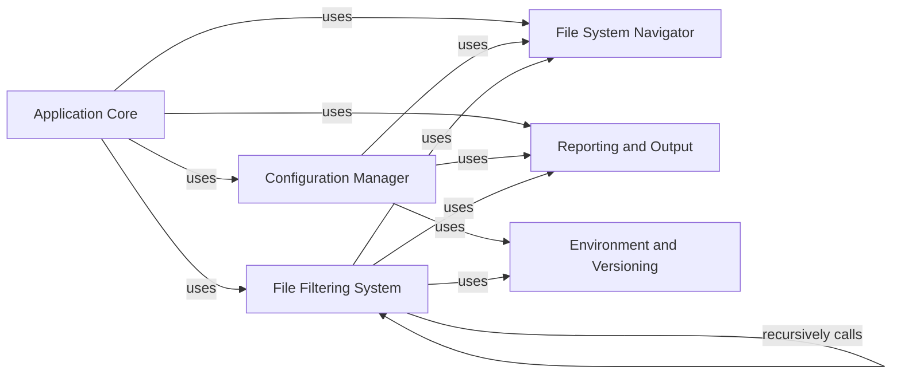

## Component Details

This component overview describes the `Configuration & File Management` subsystem of the Black formatter. It details how Black discovers project roots, reads and parses configuration from `pyproject.toml` files, applies `.gitignore` rules and other exclusion patterns, and ultimately determines which files should be formatted. The system is modularized into components responsible for file system navigation, configuration handling, and file filtering, all orchestrated by the application's core.

### File System Navigator
This component is responsible for navigating the file system, identifying the project root, resolving file paths, and handling user-specific configuration paths. It provides foundational file system operations for other components.

**Related Classes/Methods**:

- <a href="https://github.com/psf/black/blob/master/src/black/files.py#L47-L95" target="_blank" rel="noopener noreferrer">`black.src.black.files:find_project_root` (47:95)</a>
- <a href="https://github.com/psf/black/blob/master/src/black/files.py#L42-L43" target="_blank" rel="noopener noreferrer">`black.src.black.files._cached_resolve` (42:43)</a>
- <a href="https://github.com/psf/black/blob/master/src/black/files.py#L221-L237" target="_blank" rel="noopener noreferrer">`black.src.black.files.find_user_pyproject_toml` (221:237)</a>
- <a href="https://github.com/psf/black/blob/master/src/black/files.py#L279-L289" target="_blank" rel="noopener noreferrer">`black.src.black.files.best_effort_relative_path` (279:289)</a>
- <a href="https://github.com/psf/black/blob/master/src/black/files.py#L255-L276" target="_blank" rel="noopener noreferrer">`black.src.black.files.resolves_outside_root_or_cannot_stat` (255:276)</a>

### Configuration Manager
This component handles the loading, parsing, and interpretation of pyproject.toml configuration files. It extracts Black-specific settings and infers the target Python version based on project metadata.

**Related Classes/Methods**:

- <a href="https://github.com/psf/black/blob/master/src/black/files.py#L98-L117" target="_blank" rel="noopener noreferrer">`black.src.black.files:find_pyproject_toml` (98:117)</a>
- <a href="https://github.com/psf/black/blob/master/src/black/files.py#L121-L135" target="_blank" rel="noopener noreferrer">`black.src.black.files:parse_pyproject_toml` (121:135)</a>
- <a href="https://github.com/psf/black/blob/master/src/black/files.py#L36-L38" target="_blank" rel="noopener noreferrer">`black.src.black.files._load_toml` (36:38)</a>
- <a href="https://github.com/psf/black/blob/master/src/black/files.py#L138-L160" target="_blank" rel="noopener noreferrer">`black.src.black.files:infer_target_version` (138:160)</a>
- <a href="https://github.com/psf/black/blob/master/src/black/files.py#L163-L175" target="_blank" rel="noopener noreferrer">`black.src.black.files:parse_req_python_version` (163:175)</a>
- <a href="https://github.com/psf/black/blob/master/src/black/files.py#L178-L192" target="_blank" rel="noopener noreferrer">`black.src.black.files:parse_req_python_specifier` (178:192)</a>
- <a href="https://github.com/psf/black/blob/master/src/black/files.py#L195-L217" target="_blank" rel="noopener noreferrer">`black.src.black.files:strip_specifier_set` (195:217)</a>
- `black.src.black:read_pyproject_toml` (full file reference)
- `black.src.black:spellcheck_pyproject_toml_keys` (full file reference)

### File Filtering System
This component is responsible for generating a list of Python files to be processed, applying various exclusion rules based on .gitignore files and user-defined regex patterns. It ensures only relevant files are passed to the formatting engine.

**Related Classes/Methods**:

- <a href="https://github.com/psf/black/blob/master/src/black/files.py#L320-L406" target="_blank" rel="noopener noreferrer">`black.src.black.files:gen_python_files` (320:406)</a>
- <a href="https://github.com/psf/black/blob/master/src/black/files.py#L292-L309" target="_blank" rel="noopener noreferrer">`black.src.black.files._path_is_ignored` (292:309)</a>
- <a href="https://github.com/psf/black/blob/master/src/black/files.py#L312-L317" target="_blank" rel="noopener noreferrer">`black.src.black.files.path_is_excluded` (312:317)</a>
- <a href="https://github.com/psf/black/blob/master/src/black/files.py#L241-L252" target="_blank" rel="noopener noreferrer">`black.src.black.files.get_gitignore` (241:252)</a>
- `black.src.black:get_sources` (full file reference)
- `black.src.black.re_compile_maybe_verbose` (full file reference)

### Application Core
This component represents the main entry point and orchestrator of the Black application. It coordinates interactions between other components to achieve the overall formatting task.

**Related Classes/Methods**:

- `black.src.black:main` (full file reference)
- `black.src.black:validate_regex` (full file reference)

### Reporting and Output
This component handles all output operations, including error reporting and general messages to the user.

**Related Classes/Methods**:

- <a href="https://github.com/psf/black/blob/master/src/black/output.py#L38-L39" target="_blank" rel="noopener noreferrer">`black.output.err` (38:39)</a>
- <a href="https://github.com/psf/black/blob/master/src/black/output.py#L34-L35" target="_blank" rel="noopener noreferrer">`black.output.out` (34:35)</a>

### Environment and Versioning
This component provides utilities for checking environment-specific dependencies (like Jupyter) and defining target Python versions for formatting.

**Related Classes/Methods**:

- <a href="https://github.com/psf/black/blob/master/src/black/handle_ipynb_magics.py#L55-L65" target="_blank" rel="noopener noreferrer">`black.handle_ipynb_magics.jupyter_dependencies_are_installed` (55:65)</a>
- <a href="https://github.com/psf/black/blob/master/src/black/mode.py#L16-L31" target="_blank" rel="noopener noreferrer">`black.mode.TargetVersion` (16:31)</a>

### [FAQ](https://github.com/CodeBoarding/GeneratedOnBoardings/tree/main?tab=readme-ov-file#faq)