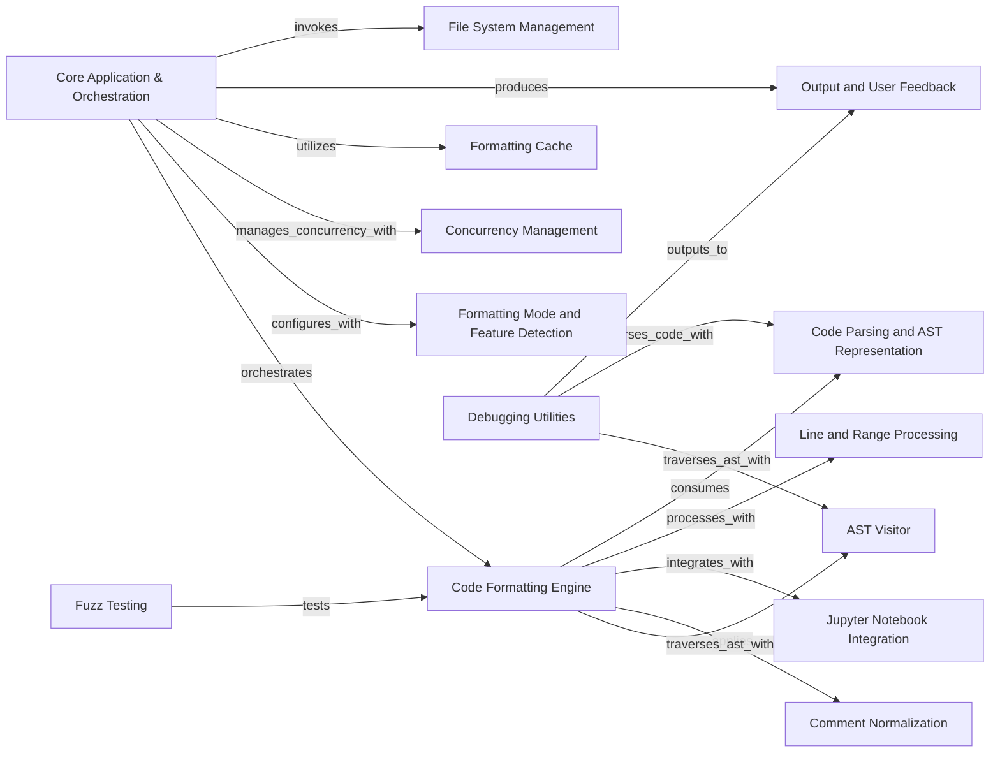

## Component Details

This graph describes the architecture of the Black formatter, detailing its various components and their interactions. The main flow starts with the `Core Application & Orchestration` component, which handles input, discovers files, and orchestrates the formatting process. It leverages `File System Management` for file discovery, `Formatting Cache` for performance, and `Concurrency Management` for parallel processing. The core formatting logic resides in the `Code Formatting Engine`, which in turn relies on `Code Parsing and AST Representation` to build the AST, `Line and Range Processing` for detailed line-by-line formatting, `Jupyter Notebook Integration` for notebook-specific handling, `Comment Normalization` for comment processing, and `AST Visitor` for tree traversal. All output and user feedback are managed by the `Output and User Feedback` component. Additionally, `Formatting Mode and Feature Detection` configures the formatting behavior, and `Debugging Utilities` and `Fuzz Testing` provide support for development and testing. The purpose of this architecture is to efficiently and consistently format Python code according to Black's style guidelines.

### Core Application & Orchestration
This component serves as the primary entry point and orchestrator for the Black formatter. It handles command-line arguments, discovers files to format, and coordinates the overall formatting process, including single file formatting, stdin/stdout formatting, and concurrent processing.

**Related Classes/Methods**:

- <a href="https://github.com/psf/black/blob/master/src/black/__main__.py#L1-L1" target="_blank" rel="noopener noreferrer">`black.src.black.__main__:main` (1:1)</a>
- <a href="https://github.com/psf/black/blob/master/src/black/__init__.py#L1584-L1592" target="_blank" rel="noopener noreferrer">`black.src.black.__init__:patched_main` (1584:1592)</a>
- <a href="https://github.com/psf/black/blob/master/src/black/__init__.py#L837-L864" target="_blank" rel="noopener noreferrer">`black.src.black.__init__:reformat_code` (837:864)</a>
- <a href="https://github.com/psf/black/blob/master/src/black/__init__.py#L870-L923" target="_blank" rel="noopener noreferrer">`black.src.black.__init__:reformat_one` (870:923)</a>
- <a href="https://github.com/psf/black/blob/master/src/black/__init__.py#L926-L991" target="_blank" rel="noopener noreferrer">`black.src.black.__init__:format_file_in_place` (926:991)</a>
- <a href="https://github.com/psf/black/blob/master/src/black/__init__.py#L994-L1043" target="_blank" rel="noopener noreferrer">`black.src.black.__init__:format_stdin_to_stdout` (994:1043)</a>
- <a href="https://github.com/psf/black/blob/master/src/black/__init__.py#L727-L822" target="_blank" rel="noopener noreferrer">`black.src.black.__init__:get_sources` (727:822)</a>
- <a href="https://github.com/psf/black/blob/master/src/black/__init__.py#L825-L834" target="_blank" rel="noopener noreferrer">`black.src.black.__init__:path_empty` (825:834)</a>
- <a href="https://github.com/psf/black/blob/master/src/black/__init__.py#L1046-L1060" target="_blank" rel="noopener noreferrer">`black.src.black.__init__:check_stability_and_equivalence` (1046:1060)</a>
- <a href="https://github.com/psf/black/blob/master/src/black/__init__.py#L1514-L1544" target="_blank" rel="noopener noreferrer">`black.src.black.__init__:assert_equivalent` (1514:1544)</a>
- <a href="https://github.com/psf/black/blob/master/src/black/__init__.py#L1547-L1572" target="_blank" rel="noopener noreferrer">`black.src.black.__init__:assert_stable` (1547:1572)</a>
- <a href="https://github.com/psf/black/blob/master/src/black/debug.py#L16-L55" target="_blank" rel="noopener noreferrer">`black.src.black.debug.DebugVisitor` (16:55)</a>

### Code Formatting Engine
This component encapsulates the core logic for applying Black's formatting rules to Python code. It includes functions for formatting code strings, individual cells, and Jupyter notebook content, ensuring consistent style and structure. It also provides utilities for validating the stability and equivalence of formatted code.

**Related Classes/Methods**:

- <a href="https://github.com/psf/black/blob/master/src/black/__init__.py#L1063-L1088" target="_blank" rel="noopener noreferrer">`black.src.black.__init__:format_file_contents` (1063:1088)</a>
- <a href="https://github.com/psf/black/blob/master/src/black/__init__.py#L1091-L1125" target="_blank" rel="noopener noreferrer">`black.src.black.__init__:format_cell` (1091:1125)</a>
- <a href="https://github.com/psf/black/blob/master/src/black/__init__.py#L1140-L1169" target="_blank" rel="noopener noreferrer">`black.src.black.__init__:format_ipynb_string` (1140:1169)</a>
- <a href="https://github.com/psf/black/blob/master/src/black/__init__.py#L1172-L1216" target="_blank" rel="noopener noreferrer">`black.src.black.__init__:format_str` (1172:1216)</a>
- <a href="https://github.com/psf/black/blob/master/src/black/__init__.py#L1219-L1270" target="_blank" rel="noopener noreferrer">`black.src.black.__init__:_format_str_once` (1219:1270)</a>
- <a href="https://github.com/psf/black/blob/master/src/black/__init__.py#L1046-L1060" target="_blank" rel="noopener noreferrer">`black.src.black.__init__:check_stability_and_equivalence` (1046:1060)</a>
- <a href="https://github.com/psf/black/blob/master/src/black/__init__.py#L1514-L1544" target="_blank" rel="noopener noreferrer">`black.src.black.__init__:assert_equivalent` (1514:1544)</a>
- <a href="https://github.com/psf/black/blob/master/src/black/__init__.py#L1547-L1572" target="_blank" rel="noopener noreferrer">`black.src.black.__init__:assert_stable` (1547:1572)</a>
- <a href="https://github.com/psf/black/blob/master/src/black/__init__.py#L1273-L1287" target="_blank" rel="noopener noreferrer">`black.src.black.__init__:decode_bytes` (1273:1287)</a>
- <a href="https://github.com/psf/black/blob/master/src/black/__init__.py#L1457-L1504" target="_blank" rel="noopener noreferrer">`black.src.black.__init__:get_future_imports` (1457:1504)</a>

### File System Management
Manages interactions with the file system, including locating project roots, finding configuration files, applying .gitignore rules, and generating lists of Python files for processing. It also provides utilities for stream handling.

**Related Classes/Methods**:

- <a href="https://github.com/psf/black/blob/master/src/black/files.py#L47-L95" target="_blank" rel="noopener noreferrer">`black.files.find_project_root` (47:95)</a>
- <a href="https://github.com/psf/black/blob/master/src/black/files.py#L221-L237" target="_blank" rel="noopener noreferrer">`black.files.find_user_pyproject_toml` (221:237)</a>
- <a href="https://github.com/psf/black/blob/master/src/black/files.py#L241-L252" target="_blank" rel="noopener noreferrer">`black.files.get_gitignore` (241:252)</a>
- <a href="https://github.com/psf/black/blob/master/src/black/files.py#L312-L317" target="_blank" rel="noopener noreferrer">`black.files.path_is_excluded` (312:317)</a>
- <a href="https://github.com/psf/black/blob/master/src/black/files.py#L255-L276" target="_blank" rel="noopener noreferrer">`black.files.resolves_outside_root_or_cannot_stat` (255:276)</a>
- <a href="https://github.com/psf/black/blob/master/src/black/files.py#L279-L289" target="_blank" rel="noopener noreferrer">`black.files.best_effort_relative_path` (279:289)</a>
- <a href="https://github.com/psf/black/blob/master/src/black/files.py#L320-L406" target="_blank" rel="noopener noreferrer">`black.files.gen_python_files` (320:406)</a>
- <a href="https://github.com/psf/black/blob/master/src/black/files.py#L409-L426" target="_blank" rel="noopener noreferrer">`black.files.wrap_stream_for_windows` (409:426)</a>

### Output and User Feedback
Handles all forms of output to the user, including standard messages, error reporting, and generating visual diffs of code changes. It also manages the reporting of formatting results.

**Related Classes/Methods**:

- <a href="https://github.com/psf/black/blob/master/src/black/output.py#L34-L35" target="_blank" rel="noopener noreferrer">`black.output.out` (34:35)</a>
- <a href="https://github.com/psf/black/blob/master/src/black/output.py#L38-L39" target="_blank" rel="noopener noreferrer">`black.output.err` (38:39)</a>
- <a href="https://github.com/psf/black/blob/master/src/black/output.py#L75-L93" target="_blank" rel="noopener noreferrer">`black.output.diff` (75:93)</a>
- <a href="https://github.com/psf/black/blob/master/src/black/output.py#L96-L109" target="_blank" rel="noopener noreferrer">`black.output.color_diff` (96:109)</a>
- <a href="https://github.com/psf/black/blob/master/src/black/output.py#L42-L56" target="_blank" rel="noopener noreferrer">`black.output.ipynb_diff` (42:56)</a>
- <a href="https://github.com/psf/black/blob/master/src/black/output.py#L113-L122" target="_blank" rel="noopener noreferrer">`black.output.dump_to_file` (113:122)</a>
- <a href="https://github.com/psf/black/blob/master/src/black/report.py#L25-L107" target="_blank" rel="noopener noreferrer">`black.report.Report` (25:107)</a>

### Code Parsing and AST Representation
Responsible for converting Python source code into an Abstract Syntax Tree (AST) for internal processing. It includes functions for parsing, stringifying ASTs, and handling AST-related errors. It leverages blib2to3 for the underlying tree structure.

**Related Classes/Methods**:

- <a href="https://github.com/psf/black/blob/master/src/black/parsing.py#L55-L102" target="_blank" rel="noopener noreferrer">`black.parsing.lib2to3_parse` (55:102)</a>
- <a href="https://github.com/psf/black/blob/master/src/black/parsing.py#L137-L156" target="_blank" rel="noopener noreferrer">`black.parsing.parse_ast` (137:156)</a>
- <a href="https://github.com/psf/black/blob/master/src/black/parsing.py#L121-L122" target="_blank" rel="noopener noreferrer">`black.parsing.ASTSafetyError` (121:122)</a>
- <a href="https://github.com/psf/black/blob/master/src/black/parsing.py#L169-L171" target="_blank" rel="noopener noreferrer">`black.parsing.stringify_ast` (169:171)</a>
- <a href="https://github.com/psf/black/blob/master/src/blib2to3/pytree.py#L30-L44" target="_blank" rel="noopener noreferrer">`blib2to3.pytree.type_repr` (30:44)</a>

### Formatting Mode and Feature Detection
Defines and manages the various formatting modes and options available in Black. It also provides utilities to detect and apply features based on the target Python version.

**Related Classes/Methods**:

- <a href="https://github.com/psf/black/blob/master/src/black/mode.py#L227-L287" target="_blank" rel="noopener noreferrer">`black.mode.Mode` (227:287)</a>
- <a href="https://github.com/psf/black/blob/master/src/black/mode.py#L192-L193" target="_blank" rel="noopener noreferrer">`black.mode.supports_feature` (192:193)</a>
- <a href="https://github.com/psf/black/blob/master/src/black/__init__.py#L1447-L1454" target="_blank" rel="noopener noreferrer">`black.src.black.__init__:detect_target_versions` (1447:1454)</a>

### Line and Range Processing
Manages the processing of code lines and specified line ranges. This includes sanitizing and adjusting ranges, converting unchanged lines, generating formatted lines, and tracking empty lines to maintain correct spacing.

**Related Classes/Methods**:

- <a href="https://github.com/psf/black/blob/master/src/black/ranges.py#L22-L41" target="_blank" rel="noopener noreferrer">`black.ranges.parse_line_ranges` (22:41)</a>
- <a href="https://github.com/psf/black/blob/master/src/black/ranges.py#L49-L74" target="_blank" rel="noopener noreferrer">`black.ranges.sanitized_lines` (49:74)</a>
- <a href="https://github.com/psf/black/blob/master/src/black/ranges.py#L77-L154" target="_blank" rel="noopener noreferrer">`black.ranges.adjusted_lines` (77:154)</a>
- <a href="https://github.com/psf/black/blob/master/src/black/ranges.py#L157-L186" target="_blank" rel="noopener noreferrer">`black.ranges.convert_unchanged_lines` (157:186)</a>
- <a href="https://github.com/psf/black/blob/master/src/black/linegen.py#L101-L600" target="_blank" rel="noopener noreferrer">`black.linegen.LineGenerator` (101:600)</a>
- <a href="https://github.com/psf/black/blob/master/src/black/linegen.py#L614-L735" target="_blank" rel="noopener noreferrer">`black.linegen.transform_line` (614:735)</a>
- <a href="https://github.com/psf/black/blob/master/src/black/lines.py#L533-L769" target="_blank" rel="noopener noreferrer">`black.lines.EmptyLineTracker` (533:769)</a>
- <a href="https://github.com/psf/black/blob/master/src/black/lines.py#L548-L596" target="_blank" rel="noopener noreferrer">`black.lines.EmptyLineTracker.maybe_empty_lines` (548:596)</a>

### Jupyter Notebook Integration
Provides specific functionalities for handling the unique aspects of Jupyter Notebooks during formatting, such as validating cells and managing magic commands and their associated syntax.

**Related Classes/Methods**:

- <a href="https://github.com/psf/black/blob/master/src/black/handle_ipynb_magics.py#L55-L65" target="_blank" rel="noopener noreferrer">`black.handle_ipynb_magics.jupyter_dependencies_are_installed` (55:65)</a>
- <a href="https://github.com/psf/black/blob/master/src/black/handle_ipynb_magics.py#L68-L93" target="_blank" rel="noopener noreferrer">`black.handle_ipynb_magics.validate_cell` (68:93)</a>
- <a href="https://github.com/psf/black/blob/master/src/black/handle_ipynb_magics.py#L96-L125" target="_blank" rel="noopener noreferrer">`black.handle_ipynb_magics.remove_trailing_semicolon` (96:125)</a>
- <a href="https://github.com/psf/black/blob/master/src/black/handle_ipynb_magics.py#L152-L191" target="_blank" rel="noopener noreferrer">`black.handle_ipynb_magics.mask_cell` (152:191)</a>
- <a href="https://github.com/psf/black/blob/master/src/black/handle_ipynb_magics.py#L302-L317" target="_blank" rel="noopener noreferrer">`black.handle_ipynb_magics.unmask_cell` (302:317)</a>
- <a href="https://github.com/psf/black/blob/master/src/black/handle_ipynb_magics.py#L128-L149" target="_blank" rel="noopener noreferrer">`black.handle_ipynb_magics.put_trailing_semicolon_back` (128:149)</a>
- <a href="https://github.com/psf/black/blob/master/src/black/__init__.py#L1128-L1137" target="_blank" rel="noopener noreferrer">`black.src.black.__init__:validate_metadata` (1128:1137)</a>

### Formatting Cache
Implements caching mechanisms to store and retrieve formatting results, optimizing performance by avoiding redundant formatting of unchanged files.

**Related Classes/Methods**:

- <a href="https://github.com/psf/black/blob/master/src/black/cache.py#L62-L85" target="_blank" rel="noopener noreferrer">`black.cache.Cache.read` (62:85)</a>
- <a href="https://github.com/psf/black/blob/master/src/black/cache.py#L102-L116" target="_blank" rel="noopener noreferrer">`black.cache.Cache.is_changed` (102:116)</a>
- <a href="https://github.com/psf/black/blob/master/src/black/cache.py#L133-L150" target="_blank" rel="noopener noreferrer">`black.cache.Cache.write` (133:150)</a>

### Concurrency Management
Facilitates the parallel processing of multiple files, enabling Black to reformat code concurrently for improved efficiency.

**Related Classes/Methods**:

- <a href="https://github.com/psf/black/blob/master/src/black/concurrency.py#L72-L119" target="_blank" rel="noopener noreferrer">`black.concurrency.reformat_many` (72:119)</a>

### Comment Normalization
Handles the specific logic for normalizing and processing comments, particularly fmt: off directives that control formatting behavior.

**Related Classes/Methods**:

- <a href="https://github.com/psf/black/blob/master/src/black/comments.py#L169-L175" target="_blank" rel="noopener noreferrer">`black.comments.normalize_fmt_off` (169:175)</a>

### AST Visitor
Provides the base visitor pattern for traversing the Abstract Syntax Tree, allowing for custom operations to be performed on different AST nodes during the formatting process.

**Related Classes/Methods**:

- <a href="https://github.com/psf/black/blob/master/src/black/nodes.py#L153-L175" target="_blank" rel="noopener noreferrer">`black.nodes.Visitor.visit` (153:175)</a>

### Debugging Utilities
Contains tools and a specialized visitor for debugging the internal representation of the code (AST) during the formatting process, aiding in development and troubleshooting.

**Related Classes/Methods**:

- <a href="https://github.com/psf/black/blob/master/src/black/debug.py#L21-L24" target="_blank" rel="noopener noreferrer">`black.src.black.debug.DebugVisitor:out` (21:24)</a>
- <a href="https://github.com/psf/black/blob/master/src/black/debug.py#L26-L44" target="_blank" rel="noopener noreferrer">`black.src.black.debug.DebugVisitor:visit_default` (26:44)</a>
- <a href="https://github.com/psf/black/blob/master/src/black/debug.py#L47-L55" target="_blank" rel="noopener noreferrer">`black.src.black.debug.DebugVisitor:show` (47:55)</a>
- <a href="https://github.com/psf/black/blob/master/src/black/debug.py#L16-L55" target="_blank" rel="noopener noreferrer">`black.src.black.debug.DebugVisitor` (16:55)</a>

### Fuzz Testing
Contains functions specifically designed for fuzz testing the Black formatter, focusing on ensuring idempotency and stability across various syntactically valid Python inputs.

**Related Classes/Methods**:

- <a href="https://github.com/psf/black/blob/master/scripts/fuzz.py#L38-L49" target="_blank" rel="noopener noreferrer">`black.scripts.fuzz:test_idempotent_any_syntatically_valid_python` (38:49)</a>

### [FAQ](https://github.com/CodeBoarding/GeneratedOnBoardings/tree/main?tab=readme-ov-file#faq)