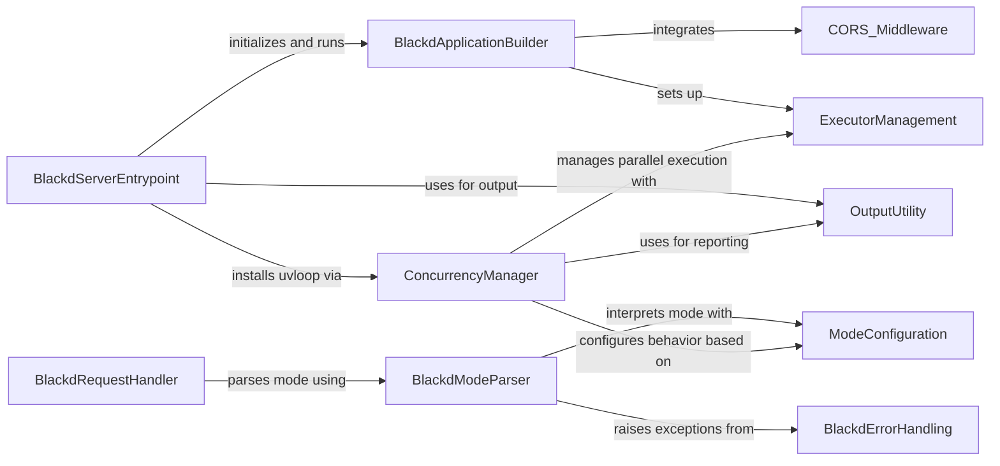

## Component Details

The Daemon Service (blackd) provides Black's formatting capabilities as a long-running HTTP server. It handles incoming formatting requests, parses headers for formatting options, and returns formatted code. The main flow involves the BlackdServerEntrypoint initializing the BlackdApplicationBuilder, which sets up the web application with CORS_Middleware and ExecutorManagement. Incoming requests are processed by BlackdRequestHandler, which uses BlackdModeParser to interpret formatting options, relying on ModeConfiguration for definitions and BlackdErrorHandling for error reporting. ConcurrencyManager is utilized for efficient parallel processing of formatting tasks, interacting with ExecutorManagement and OutputUtility for status updates.

### BlackdServerEntrypoint
This component is responsible for initializing and running the `blackd` server. It sets up the application, potentially installs `uvloop` for better performance, and handles the main execution flow of the server.

**Related Classes/Methods**:

- `black.src.blackd:main` (full file reference)
- `black.src.blackd:patched_main` (full file reference)
- `black.src.blackd.__main__` (full file reference)

### BlackdApplicationBuilder
This component is responsible for constructing the `blackd` web application. It integrates middleware like CORS and sets up the executor for handling formatting requests.

**Related Classes/Methods**:

- `black.src.blackd:make_app` (full file reference)

### BlackdRequestHandler
This component processes incoming requests to the `blackd` server. It involves parsing the formatting mode from headers and invoking the core formatting logic.

**Related Classes/Methods**:

- `black.src.blackd:handle` (full file reference)

### BlackdModeParser
This component is responsible for parsing and validating the formatting mode information received in `blackd` requests, including Python variant headers. It raises specific errors for invalid headers.

**Related Classes/Methods**:

- `black.src.blackd:parse_mode` (full file reference)
- `black.src.blackd:parse_python_variant_header` (full file reference)

### BlackdErrorHandling
This component defines custom exception types used within the `blackd` server for signaling issues related to request headers.

**Related Classes/Methods**:

- `black.src.blackd.HeaderError` (full file reference)
- `black.src.blackd.InvalidVariantHeader` (full file reference)

### OutputUtility
This component provides utilities for printing messages to the console, including styled output and generating diffs between code snippets. It also supports dumping output to temporary files.

**Related Classes/Methods**:

- <a href="https://github.com/psf/black/blob/master/src/black/output.py#L34-L35" target="_blank" rel="noopener noreferrer">`black.output.out` (34:35)</a>

### ModeConfiguration
This component defines data structures and logic for configuring Black's behavior, such as supported Python versions, language features, line length, and preview features. It also provides a mechanism to generate a cache key based on the mode.

**Related Classes/Methods**:

- <a href="https://github.com/psf/black/blob/master/src/black/mode.py#L227-L287" target="_blank" rel="noopener noreferrer">`black.mode.Mode` (227:287)</a>

### ConcurrencyManager
This component manages concurrent execution of formatting tasks, potentially utilizing `uvloop` for improved performance and `ProcessPoolExecutor` or `ThreadPoolExecutor` for parallel processing. It also handles signal handling for task cancellation.

**Related Classes/Methods**:

- <a href="https://github.com/psf/black/blob/master/src/black/concurrency.py#L28-L39" target="_blank" rel="noopener noreferrer">`black.concurrency.maybe_install_uvloop` (28:39)</a>

### CORS_Middleware
This component provides middleware functionality for handling Cross-Origin Resource Sharing (CORS) requests in the `blackd` server, ensuring proper headers are set for cross-origin communication.

**Related Classes/Methods**:

- <a href="https://github.com/psf/black/blob/master/src/blackd/middlewares.py#L11-L35" target="_blank" rel="noopener noreferrer">`black.src.blackd.middlewares.cors` (11:35)</a>

### ExecutorManagement
This component is responsible for managing the execution of tasks, likely involving the creation and shutdown of thread or process pools for parallel processing within `blackd`.

**Related Classes/Methods**:

- `black.src.blackd.executor` (full file reference)

### [FAQ](https://github.com/CodeBoarding/GeneratedOnBoardings/tree/main?tab=readme-ov-file#faq)