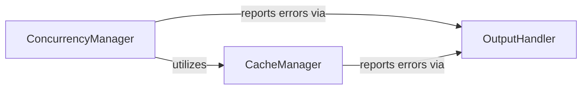

## Component Details

This subsystem enhances the Black formatter's performance by implementing a caching mechanism for already formatted files and providing utilities for concurrent processing. The `ConcurrencyManager` orchestrates the parallel formatting of multiple files, leveraging an executor and integrating with the `CacheManager` to optimize operations. The `CacheManager` handles the persistence and retrieval of formatting results, ensuring that unchanged files are not reprocessed. Both managers utilize the `OutputHandler` for reporting status and errors to the user.

### ConcurrencyManager
Manages concurrent operations for file reformatting. It handles scheduling multiple formatting tasks using an Executor (ProcessPoolExecutor or ThreadPoolExecutor), potentially installing uvloop for performance, and gracefully shutting down concurrent processes. It also provides a mechanism to cancel ongoing operations and integrates with the caching mechanism.

**Related Classes/Methods**:

- <a href="https://github.com/psf/black/blob/master/src/black/concurrency.py#L28-L39" target="_blank" rel="noopener noreferrer">`black.src.black.concurrency.maybe_install_uvloop` (28:39)</a>
- <a href="https://github.com/psf/black/blob/master/src/black/concurrency.py#L42-L46" target="_blank" rel="noopener noreferrer">`black.src.black.concurrency.cancel` (42:46)</a>
- <a href="https://github.com/psf/black/blob/master/src/black/concurrency.py#L49-L66" target="_blank" rel="noopener noreferrer">`black.src.black.concurrency.shutdown` (49:66)</a>
- <a href="https://github.com/psf/black/blob/master/src/black/concurrency.py#L72-L119" target="_blank" rel="noopener noreferrer">`black.src.black.concurrency.reformat_many` (72:119)</a>
- <a href="https://github.com/psf/black/blob/master/src/black/concurrency.py#L122-L191" target="_blank" rel="noopener noreferrer">`black.src.black.concurrency.schedule_formatting` (122:191)</a>

### CacheManager
Manages the caching mechanism for already formatted files to improve performance. It provides functionalities to read from and write to the cache file, filter cached files based on changes, and determine if a file has changed by hashing its content.

**Related Classes/Methods**:

- <a href="https://github.com/psf/black/blob/master/src/black/cache.py#L56-L150" target="_blank" rel="noopener noreferrer">`black.src.black.cache.Cache` (56:150)</a>
- <a href="https://github.com/psf/black/blob/master/src/black/cache.py#L62-L85" target="_blank" rel="noopener noreferrer">`black.src.black.cache.Cache:read` (62:85)</a>
- <a href="https://github.com/psf/black/blob/master/src/black/cache.py#L133-L150" target="_blank" rel="noopener noreferrer">`black.src.black.cache.Cache:write` (133:150)</a>
- <a href="https://github.com/psf/black/blob/master/src/black/cache.py#L118-L131" target="_blank" rel="noopener noreferrer">`black.src.black.cache.Cache:filtered_cached` (118:131)</a>
- <a href="https://github.com/psf/black/blob/master/src/black/cache.py#L102-L116" target="_blank" rel="noopener noreferrer">`black.src.black.cache.Cache:is_changed` (102:116)</a>
- <a href="https://github.com/psf/black/blob/master/src/black/cache.py#L88-L92" target="_blank" rel="noopener noreferrer">`black.src.black.cache.Cache:hash_digest` (88:92)</a>
- <a href="https://github.com/psf/black/blob/master/src/black/cache.py#L95-L100" target="_blank" rel="noopener noreferrer">`black.src.black.cache.Cache:get_file_data` (95:100)</a>
- <a href="https://github.com/psf/black/blob/master/src/black/cache.py#L51-L52" target="_blank" rel="noopener noreferrer">`black.src.black.cache.get_cache_file` (51:52)</a>

### OutputHandler
Provides utilities for handling output, specifically reporting errors and status messages to the user.

**Related Classes/Methods**:

- <a href="https://github.com/psf/black/blob/master/src/black/output.py#L38-L39" target="_blank" rel="noopener noreferrer">`black.src.black.output.err` (38:39)</a>

### [FAQ](https://github.com/CodeBoarding/GeneratedOnBoardings/tree/main?tab=readme-ov-file#faq)