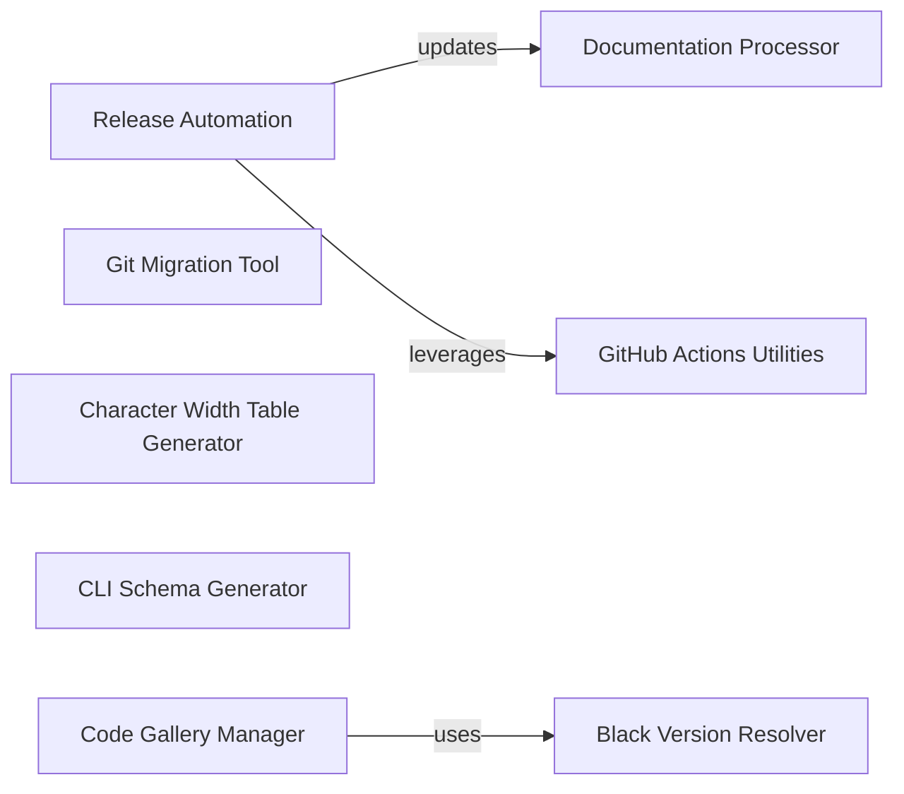

## Component Details

This component overview details the various utility scripts and configurations supporting the Black project's ecosystem. It covers tools for release automation, documentation processing, GitHub Actions integration, code migration, character width table generation, CLI schema generation, Black version resolution, and managing a code gallery. The primary flow involves these standalone utilities assisting in project management, release cycles, and showcasing Black's capabilities.

### Documentation Processor
Manages the processing of documentation files, specifically handling includes and replacing PR numbers with links.

**Related Classes/Methods**:

- <a href="https://github.com/psf/black/blob/master/docs/conf.py#L40-L48" target="_blank" rel="noopener noreferrer">`black.docs.conf.handle_include_read` (40:48)</a>
- <a href="https://github.com/psf/black/blob/master/docs/conf.py#L35-L37" target="_blank" rel="noopener noreferrer">`black.docs.conf.replace_pr_numbers_with_links` (35:37)</a>

### Release Automation
Automates the Black release process, including version management, repository updates, and argument parsing for release scripts.

**Related Classes/Methods**:

- <a href="https://github.com/psf/black/blob/master/scripts/release.py#L93-L201" target="_blank" rel="noopener noreferrer">`black.scripts.release.SourceFiles` (93:201)</a>
- <a href="https://github.com/psf/black/blob/master/scripts/release.py#L94-L104" target="_blank" rel="noopener noreferrer">`black.scripts.release.SourceFiles.__init__` (94:104)</a>
- <a href="https://github.com/psf/black/blob/master/scripts/release.py#L161-L163" target="_blank" rel="noopener noreferrer">`black.scripts.release.SourceFiles.get_current_version` (161:163)</a>
- <a href="https://github.com/psf/black/blob/master/scripts/release.py#L165-L177" target="_blank" rel="noopener noreferrer">`black.scripts.release.SourceFiles.get_next_version` (165:177)</a>
- <a href="https://github.com/psf/black/blob/master/scripts/release.py#L179-L183" target="_blank" rel="noopener noreferrer">`black.scripts.release.SourceFiles.update_repo_for_release` (179:183)</a>
- <a href="https://github.com/psf/black/blob/master/scripts/release.py#L138-L159" target="_blank" rel="noopener noreferrer">`black.scripts.release.SourceFiles.cleanup_changes_template_for_release` (138:159)</a>
- <a href="https://github.com/psf/black/blob/master/scripts/release.py#L185-L201" target="_blank" rel="noopener noreferrer">`black.scripts.release.SourceFiles.update_version_in_docs` (185:201)</a>
- <a href="https://github.com/psf/black/blob/master/scripts/release.py#L213-L226" target="_blank" rel="noopener noreferrer">`black.scripts.release.parse_args` (213:226)</a>
- <a href="https://github.com/psf/black/blob/master/scripts/release.py#L204-L210" target="_blank" rel="noopener noreferrer">`black.scripts.release._handle_debug` (204:210)</a>
- <a href="https://github.com/psf/black/blob/master/scripts/release.py#L229-L240" target="_blank" rel="noopener noreferrer">`black.scripts.release.main` (229:240)</a>
- <a href="https://github.com/psf/black/blob/master/scripts/release.py#L72-L81" target="_blank" rel="noopener noreferrer">`black.scripts.release.get_git_tags` (72:81)</a>
- <a href="https://github.com/psf/black/blob/master/scripts/release.py#L85-L90" target="_blank" rel="noopener noreferrer">`black.scripts.release.tuple_calver` (85:90)</a>
- <a href="https://github.com/psf/black/blob/master/scripts/release.py#L116-L136" target="_blank" rel="noopener noreferrer">`black.scripts.release.SourceFiles.add_template_to_changes` (116:136)</a>

### GitHub Actions Utilities
Provides helper functions for GitHub Actions workflows, primarily for retrieving various code revisions and setting action outputs, often used in CI/CD for diffing or reporting.

**Related Classes/Methods**:

- <a href="https://github.com/psf/black/blob/master/scripts/diff_shades_gha_helper.py#L87-L93" target="_blank" rel="noopener noreferrer">`black.scripts.diff_shades_gha_helper.get_main_revision` (87:93)</a>
- <a href="https://github.com/psf/black/blob/master/scripts/diff_shades_gha_helper.py#L96-L99" target="_blank" rel="noopener noreferrer">`black.scripts.diff_shades_gha_helper.get_pr_revision` (96:99)</a>
- <a href="https://github.com/psf/black/blob/master/scripts/diff_shades_gha_helper.py#L102-L106" target="_blank" rel="noopener noreferrer">`black.scripts.diff_shades_gha_helper.get_pypi_version` (102:106)</a>
- <a href="https://github.com/psf/black/blob/master/scripts/diff_shades_gha_helper.py#L116-L158" target="_blank" rel="noopener noreferrer">`black.scripts.diff_shades_gha_helper.config` (116:158)</a>
- <a href="https://github.com/psf/black/blob/master/scripts/diff_shades_gha_helper.py#L200-L227" target="_blank" rel="noopener noreferrer">`black.scripts.diff_shades_gha_helper.comment_details` (200:227)</a>
- <a href="https://github.com/psf/black/blob/master/scripts/diff_shades_gha_helper.py#L64-L84" target="_blank" rel="noopener noreferrer">`black.scripts.diff_shades_gha_helper.http_get` (64:84)</a>
- <a href="https://github.com/psf/black/blob/master/scripts/diff_shades_gha_helper.py#L46-L61" target="_blank" rel="noopener noreferrer">`black.scripts.diff_shades_gha_helper.set_output` (46:61)</a>

### Git Migration Tool
A script designed to migrate codebases, performing various Git operations as part of the migration process.

**Related Classes/Methods**:

- <a href="https://github.com/psf/black/blob/master/scripts/migrate-black.py#L15-L82" target="_blank" rel="noopener noreferrer">`black.scripts.migrate-black.blackify` (15:82)</a>
- <a href="https://github.com/psf/black/blob/master/scripts/migrate-black.py#L11-L12" target="_blank" rel="noopener noreferrer">`black.scripts.migrate-black.git` (11:12)</a>

### Character Width Table Generator
A utility for generating a table that defines the display width of characters, likely used for consistent formatting.

**Related Classes/Methods**:

- <a href="https://github.com/psf/black/blob/master/scripts/make_width_table.py#L50-L62" target="_blank" rel="noopener noreferrer">`black.scripts.make_width_table.main` (50:62)</a>
- <a href="https://github.com/psf/black/blob/master/scripts/make_width_table.py#L26-L47" target="_blank" rel="noopener noreferrer">`black.scripts.make_width_table.make_width_table` (26:47)</a>

### CLI Schema Generator
Generates a schema from the Click command-line interface definitions, useful for documentation or programmatic interaction with Black's CLI.

**Related Classes/Methods**:

- <a href="https://github.com/psf/black/blob/master/scripts/generate_schema.py#L49-L70" target="_blank" rel="noopener noreferrer">`black.scripts.generate_schema.main` (49:70)</a>
- <a href="https://github.com/psf/black/blob/master/scripts/generate_schema.py#L9-L43" target="_blank" rel="noopener noreferrer">`black.scripts.generate_schema.generate_schema_from_click` (9:43)</a>

### Black Version Resolver
Determines and reads the Black version specifier from project configuration files, ensuring the correct Black version is used.

**Related Classes/Methods**:

- <a href="https://github.com/psf/black/blob/master/action/main.py#L25-L44" target="_blank" rel="noopener noreferrer">`black.action.main.determine_version_specifier` (25:44)</a>
- <a href="https://github.com/psf/black/blob/master/action/main.py#L47-L91" target="_blank" rel="noopener noreferrer">`black.action.main.read_version_specifier_from_pyproject` (47:91)</a>
- <a href="https://github.com/psf/black/blob/master/action/main.py#L94-L115" target="_blank" rel="noopener noreferrer">`black.action.main.find_black_version_in_array` (94:115)</a>

### Code Gallery Manager
Manages a gallery of code examples, involving downloading packages, interacting with Git repositories, and applying Black's formatting to showcase or test its capabilities across diverse codebases.

**Related Classes/Methods**:

- <a href="https://github.com/psf/black/blob/master/gallery/gallery.py#L65-L77" target="_blank" rel="noopener noreferrer">`black.gallery.gallery.get_package_source` (65:77)</a>
- <a href="https://github.com/psf/black/blob/master/gallery/gallery.py#L34-L55" target="_blank" rel="noopener noreferrer">`black.gallery.gallery.get_pypi_download_url` (34:55)</a>
- <a href="https://github.com/psf/black/blob/master/gallery/gallery.py#L96-L103" target="_blank" rel="noopener noreferrer">`black.gallery.gallery.download_and_extract` (96:103)</a>
- <a href="https://github.com/psf/black/blob/master/gallery/gallery.py#L80-L86" target="_blank" rel="noopener noreferrer">`black.gallery.gallery.get_archive_manager` (80:86)</a>
- <a href="https://github.com/psf/black/blob/master/gallery/gallery.py#L89-L93" target="_blank" rel="noopener noreferrer">`black.gallery.gallery.get_first_archive_member` (89:93)</a>
- <a href="https://github.com/psf/black/blob/master/gallery/gallery.py#L106-L114" target="_blank" rel="noopener noreferrer">`black.gallery.gallery.get_package` (106:114)</a>
- <a href="https://github.com/psf/black/blob/master/gallery/gallery.py#L120-L129" target="_blank" rel="noopener noreferrer">`black.gallery.gallery.download_and_extract_top_packages` (120:129)</a>
- <a href="https://github.com/psf/black/blob/master/gallery/gallery.py#L58-L62" target="_blank" rel="noopener noreferrer">`black.gallery.gallery.get_top_packages` (58:62)</a>
- `black.gallery.gallery.git_create_` (full file reference)
- <a href="https://github.com/psf/black/blob/master/gallery/gallery.py#L137-L139" target="_blank" rel="noopener noreferrer">`black.gallery.gallery.git_add_and_commit` (137:139)</a>
- `black.gallery.gallery.init_` (full file reference)
- <a href="https://github.com/psf/black/blob/master/gallery/gallery.py#L199-L223" target="_blank" rel="noopener noreferrer">`black.gallery.gallery.format_repo_with_version` (199:223)</a>
- <a href="https://github.com/psf/black/blob/master/gallery/gallery.py#L142-L151" target="_blank" rel="noopener noreferrer">`black.gallery.gallery.git_switch_branch` (142:151)</a>
- <a href="https://github.com/psf/black/blob/master/gallery/gallery.py#L188-L196" target="_blank" rel="noopener noreferrer">`black.gallery.gallery.black_runner` (188:196)</a>
- `black.gallery.gallery.format_` (full file reference)
- <a href="https://github.com/psf/black/blob/master/gallery/gallery.py#L246-L291" target="_blank" rel="noopener noreferrer">`black.gallery.gallery.main` (246:291)</a>

### [FAQ](https://github.com/CodeBoarding/GeneratedOnBoardings/tree/main?tab=readme-ov-file#faq)