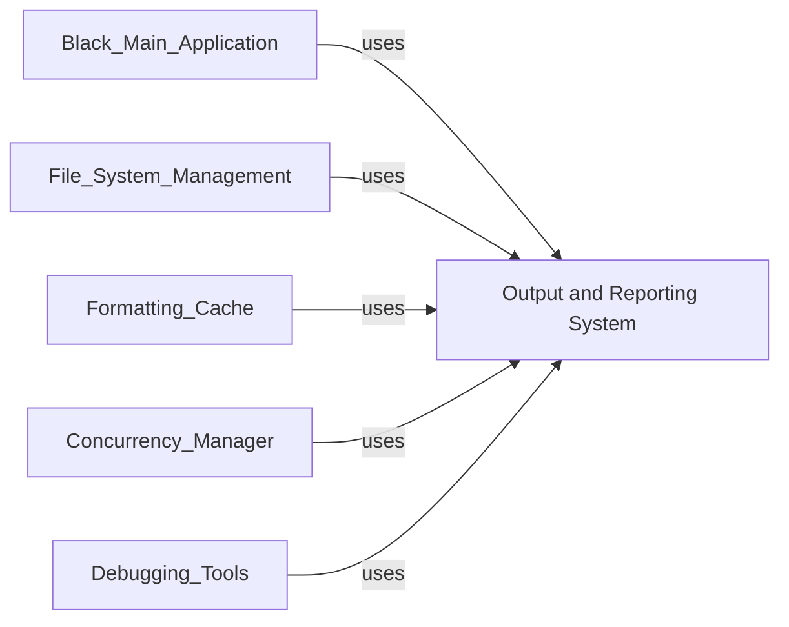

## Component Details

The Output and Reporting System component is responsible for generating and managing all user-facing output within the Black formatter. This includes displaying formatted code, diffs between original and formatted code, various status messages, and error reports. It provides styled console output with colorization for diffs and handles the generation of diffs for both standard Python files and Jupyter notebooks. Furthermore, it manages the overall reporting of the formatting process, including tracking changed files, failed files, and ignored paths, and ultimately determines the final exit code of the application.

### Output and Reporting System
Manages all user-facing output, including success/failure messages, diffs, and overall formatting reports. It provides styled console output and handles diff generation for both Python and Jupyter files, as well as managing the final exit code and summary reporting.

**Related Classes/Methods**:

- <a href="https://github.com/psf/black/blob/master/src/black/output.py#L34-L35" target="_blank" rel="noopener noreferrer">`black.src.black.output:out` (34:35)</a>
- <a href="https://github.com/psf/black/blob/master/src/black/output.py#L16-L21" target="_blank" rel="noopener noreferrer">`black.src.black.output:_out` (16:21)</a>
- <a href="https://github.com/psf/black/blob/master/src/black/output.py#L38-L39" target="_blank" rel="noopener noreferrer">`black.src.black.output:err` (38:39)</a>
- <a href="https://github.com/psf/black/blob/master/src/black/output.py#L25-L30" target="_blank" rel="noopener noreferrer">`black.src.black.output:_err` (25:30)</a>
- <a href="https://github.com/psf/black/blob/master/src/black/output.py#L42-L56" target="_blank" rel="noopener noreferrer">`black.src.black.output:ipynb_diff` (42:56)</a>
- <a href="https://github.com/psf/black/blob/master/src/black/output.py#L75-L93" target="_blank" rel="noopener noreferrer">`black.src.black.output:diff` (75:93)</a>
- <a href="https://github.com/psf/black/blob/master/src/black/output.py#L62-L72" target="_blank" rel="noopener noreferrer">`black.src.black.output._splitlines_no_ff` (62:72)</a>
- <a href="https://github.com/psf/black/blob/master/src/black/output.py#L96-L109" target="_blank" rel="noopener noreferrer">`black.src.black.output:color_diff` (96:109)</a>
- <a href="https://github.com/psf/black/blob/master/src/black/output.py#L113-L122" target="_blank" rel="noopener noreferrer">`black.src.black.output:dump_to_file` (113:122)</a>
- <a href="https://github.com/psf/black/blob/master/src/black/report.py#L25-L107" target="_blank" rel="noopener noreferrer">`black.src.black.report.Report` (25:107)</a>
- <a href="https://github.com/psf/black/blob/master/src/black/report.py#L36-L50" target="_blank" rel="noopener noreferrer">`black.src.black.report.Report:done` (36:50)</a>
- <a href="https://github.com/psf/black/blob/master/src/black/report.py#L52-L55" target="_blank" rel="noopener noreferrer">`black.src.black.report.Report:failed` (52:55)</a>
- <a href="https://github.com/psf/black/blob/master/src/black/report.py#L57-L59" target="_blank" rel="noopener noreferrer">`black.src.black.report.Report:path_ignored` (57:59)</a>
- <a href="https://github.com/psf/black/blob/master/src/black/report.py#L62-L78" target="_blank" rel="noopener noreferrer">`black.src.black.report.Report.return_code` (62:78)</a>
- <a href="https://github.com/psf/black/blob/master/src/black/report.py#L80-L107" target="_blank" rel="noopener noreferrer">`black.src.black.report.Report.__str__` (80:107)</a>
- <a href="https://github.com/psf/black/blob/master/src/black/report.py#L14-L17" target="_blank" rel="noopener noreferrer">`black.src.black.report.Changed` (14:17)</a>
- <a href="https://github.com/psf/black/blob/master/src/black/report.py#L20-L21" target="_blank" rel="noopener noreferrer">`black.src.black.report.NothingChanged` (20:21)</a>

### [FAQ](https://github.com/CodeBoarding/GeneratedOnBoardings/tree/main?tab=readme-ov-file#faq)