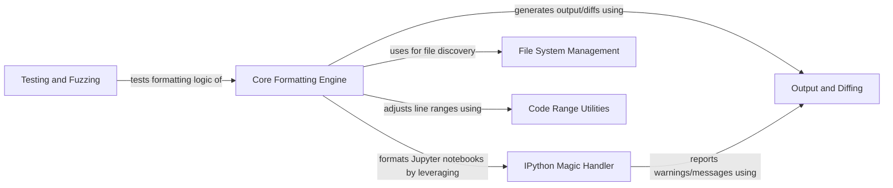

## Component Details

This system provides a comprehensive code formatting solution, primarily focusing on Python code and Jupyter notebooks. It manages file discovery and exclusion, handles specialized formatting for IPython magic commands, and orchestrates the core formatting logic. The system also includes utilities for code range adjustments, robust output and diffing capabilities, and dedicated components for testing and ensuring the stability and equivalence of formatted code.

### IPython Magic Handler
This component is responsible for processing and transforming IPython magic commands within code. It handles masking these magics before formatting and unmasking them afterward to ensure Black can parse and format the code correctly. It also includes checks for Jupyter dependencies and validation of cells.

**Related Classes/Methods**:

- <a href="https://github.com/psf/black/blob/master/src/black/handle_ipynb_magics.py#L55-L65" target="_blank" rel="noopener noreferrer">`black.src.black.handle_ipynb_magics.jupyter_dependencies_are_installed` (55:65)</a>
- <a href="https://github.com/psf/black/blob/master/src/black/handle_ipynb_magics.py#L68-L93" target="_blank" rel="noopener noreferrer">`black.src.black.handle_ipynb_magics.validate_cell` (68:93)</a>
- <a href="https://github.com/psf/black/blob/master/src/black/handle_ipynb_magics.py#L152-L191" target="_blank" rel="noopener noreferrer">`black.src.black.handle_ipynb_magics.mask_cell` (152:191)</a>
- <a href="https://github.com/psf/black/blob/master/src/black/handle_ipynb_magics.py#L206-L227" target="_blank" rel="noopener noreferrer">`black.src.black.handle_ipynb_magics.get_token` (206:227)</a>
- <a href="https://github.com/psf/black/blob/master/src/black/handle_ipynb_magics.py#L230-L258" target="_blank" rel="noopener noreferrer">`black.src.black.handle_ipynb_magics.replace_cell_magics` (230:258)</a>
- <a href="https://github.com/psf/black/blob/master/src/black/handle_ipynb_magics.py#L261-L299" target="_blank" rel="noopener noreferrer">`black.src.black.handle_ipynb_magics.replace_magics` (261:299)</a>
- <a href="https://github.com/psf/black/blob/master/src/black/handle_ipynb_magics.py#L372-L403" target="_blank" rel="noopener noreferrer">`black.src.black.handle_ipynb_magics.CellMagicFinder` (372:403)</a>
- <a href="https://github.com/psf/black/blob/master/src/black/handle_ipynb_magics.py#L414-L508" target="_blank" rel="noopener noreferrer">`black.src.black.handle_ipynb_magics.MagicFinder` (414:508)</a>
- <a href="https://github.com/psf/black/blob/master/src/black/handle_ipynb_magics.py#L302-L317" target="_blank" rel="noopener noreferrer">`black.src.black.handle_ipynb_magics.unmask_cell` (302:317)</a>
- <a href="https://github.com/psf/black/blob/master/src/black/handle_ipynb_magics.py#L96-L125" target="_blank" rel="noopener noreferrer">`black.src.black.handle_ipynb_magics.remove_trailing_semicolon` (96:125)</a>
- <a href="https://github.com/psf/black/blob/master/src/black/handle_ipynb_magics.py#L128-L149" target="_blank" rel="noopener noreferrer">`black.src.black.handle_ipynb_magics.put_trailing_semicolon_back` (128:149)</a>
- <a href="https://github.com/psf/black/blob/master/src/black/handle_ipynb_magics.py#L320-L332" target="_blank" rel="noopener noreferrer">`black.src.black.handle_ipynb_magics._get_code_start` (320:332)</a>
- <a href="https://github.com/psf/black/blob/master/src/black/handle_ipynb_magics.py#L335-L347" target="_blank" rel="noopener noreferrer">`black.src.black.handle_ipynb_magics._is_ipython_magic` (335:347)</a>
- <a href="https://github.com/psf/black/blob/master/src/black/handle_ipynb_magics.py#L350-L355" target="_blank" rel="noopener noreferrer">`black.src.black.handle_ipynb_magics._get_str_args` (350:355)</a>
- <a href="https://github.com/psf/black/blob/master/src/black/handle_ipynb_magics.py#L359-L368" target="_blank" rel="noopener noreferrer">`black.src.black.handle_ipynb_magics.CellMagic` (359:368)</a>
- <a href="https://github.com/psf/black/blob/master/src/black/handle_ipynb_magics.py#L407-L409" target="_blank" rel="noopener noreferrer">`black.src.black.handle_ipynb_magics.OffsetAndMagic` (407:409)</a>

### File System Management
This component is responsible for interacting with the file system to discover Python files, apply exclusion rules (like .gitignore), and handle path resolutions. It ensures that only relevant files are processed by the formatter.

**Related Classes/Methods**:

- <a href="https://github.com/psf/black/blob/master/src/black/files.py#L320-L406" target="_blank" rel="noopener noreferrer">`black.src.black.files.gen_python_files` (320:406)</a>
- <a href="https://github.com/psf/black/blob/master/src/black/files.py#L292-L309" target="_blank" rel="noopener noreferrer">`black.src.black.files._path_is_ignored` (292:309)</a>
- <a href="https://github.com/psf/black/blob/master/src/black/files.py#L312-L317" target="_blank" rel="noopener noreferrer">`black.src.black.files.path_is_excluded` (312:317)</a>
- <a href="https://github.com/psf/black/blob/master/src/black/files.py#L255-L276" target="_blank" rel="noopener noreferrer">`black.src.black.files.resolves_outside_root_or_cannot_stat` (255:276)</a>
- <a href="https://github.com/psf/black/blob/master/src/black/files.py#L241-L252" target="_blank" rel="noopener noreferrer">`black.src.black.files.get_gitignore` (241:252)</a>
- <a href="https://github.com/psf/black/blob/master/src/black/files.py#L279-L289" target="_blank" rel="noopener noreferrer">`black.src.black.files.best_effort_relative_path` (279:289)</a>
- <a href="https://github.com/psf/black/blob/master/src/black/files.py#L409-L426" target="_blank" rel="noopener noreferrer">`black.src.black.files.wrap_stream_for_windows` (409:426)</a>

### Output and Diffing
This component handles the generation and display of differences between original and formatted code. It provides functionalities for producing standard diffs, colored diffs, and specific diffs for Jupyter notebooks, as well as general output and error reporting.

**Related Classes/Methods**:

- <a href="https://github.com/psf/black/blob/master/src/black/output.py#L42-L56" target="_blank" rel="noopener noreferrer">`black.src.black.output.ipynb_diff` (42:56)</a>
- <a href="https://github.com/psf/black/blob/master/src/black/output.py#L75-L93" target="_blank" rel="noopener noreferrer">`black.src.black.output.diff` (75:93)</a>
- <a href="https://github.com/psf/black/blob/master/src/black/output.py#L96-L109" target="_blank" rel="noopener noreferrer">`black.src.black.output.color_diff` (96:109)</a>
- <a href="https://github.com/psf/black/blob/master/src/black/output.py#L34-L35" target="_blank" rel="noopener noreferrer">`black.src.black.output.out` (34:35)</a>
- <a href="https://github.com/psf/black/blob/master/src/black/output.py#L38-L39" target="_blank" rel="noopener noreferrer">`black.src.black.output.err` (38:39)</a>

### Core Formatting Engine
This is the central component of Black, responsible for the actual formatting of Python code and Jupyter notebook cells. It orchestrates the process of reading source, applying formatting rules, and ensuring stability and equivalence of the formatted output. It leverages the IPython Magic Handler for specialized processing of Jupyter notebook content.

**Related Classes/Methods**:

- `black.src.black.get_sources` (full file reference)
- `black.src.black.format_file_in_place` (full file reference)
- `black.src.black.format_stdin_to_stdout` (full file reference)
- `black.src.black.format_file_contents` (full file reference)
- `black.src.black.format_cell` (full file reference)
- `black.src.black.format_ipynb_string` (full file reference)
- `black.src.black.format_str` (full file reference)
- `black.src.black.decode_bytes` (full file reference)
- `black.src.black.re_compile_maybe_verbose` (full file reference)
- `black.src.black.nullcontext` (full file reference)
- `black.src.black.check_stability_and_equivalence` (full file reference)
- `black.src.black._format_str_once` (full file reference)
- `black.src.black.validate_metadata` (full file reference)

### Code Range Utilities
This component provides utilities for handling and adjusting line ranges within the code, which is crucial for applying formatting to specific sections or for reporting changes accurately.

**Related Classes/Methods**:

- <a href="https://github.com/psf/black/blob/master/src/black/ranges.py#L49-L74" target="_blank" rel="noopener noreferrer">`black.ranges.sanitized_lines` (49:74)</a>
- <a href="https://github.com/psf/black/blob/master/src/black/ranges.py#L77-L154" target="_blank" rel="noopener noreferrer">`black.ranges.adjusted_lines` (77:154)</a>

### Testing and Fuzzing
This component contains functions specifically designed for testing the robustness and correctness of the Black formatter, including checks for idempotency and equivalence of formatted code.

**Related Classes/Methods**:

- <a href="https://github.com/psf/black/blob/master/scripts/fuzz.py#L38-L49" target="_blank" rel="noopener noreferrer">`black.scripts.fuzz.test_idempotent_any_syntatically_valid_python` (38:49)</a>
- `black.assert_equivalent` (full file reference)
- `black.assert_stable` (full file reference)

### [FAQ](https://github.com/CodeBoarding/GeneratedOnBoardings/tree/main?tab=readme-ov-file#faq)