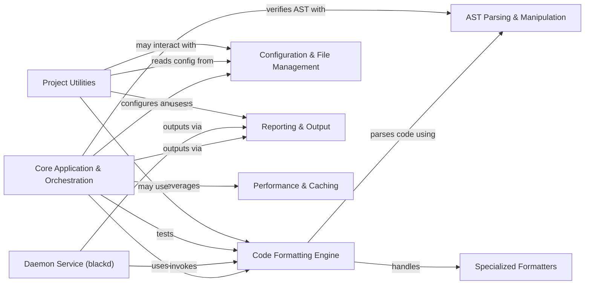

## Component Details

This graph illustrates the architecture of the `black` Python code formatter. Its main purpose is to automatically reformat Python code to adhere to a consistent style. The core flow involves the `Core Application & Orchestration` component handling user input and file discovery, delegating the actual code transformation to the `Code Formatting Engine`. This engine relies on `AST Parsing & Manipulation` to understand the code structure and uses `Specialized Formatters` for specific file types like Jupyter notebooks. Configuration and file filtering are managed by `Configuration & File Management`, while `Reporting & Output` handles user feedback. Performance is optimized through `Performance & Caching`. A `Daemon Service (blackd)` provides formatting as a service, and `Project Utilities` support development, release, and documentation.

### Core Application & Orchestration
This component serves as the primary entry point and orchestrator for the Black formatter. It handles command-line arguments, discovers files to format, and coordinates the overall formatting process, including single file formatting, stdin/stdout formatting, and concurrent processing. It also includes internal testing and validation utilities.

**Related Classes/Methods**:

- <a href="https://github.com/psf/black/blob/master/src/black/__main__.py#L1-L1" target="_blank" rel="noopener noreferrer">`black.src.black.__main__:main` (1:1)</a>
- <a href="https://github.com/psf/black/blob/master/src/black/__init__.py#L1584-L1592" target="_blank" rel="noopener noreferrer">`black.src.black.__init__:patched_main` (1584:1592)</a>
- <a href="https://github.com/psf/black/blob/master/src/black/__init__.py#L837-L864" target="_blank" rel="noopener noreferrer">`black.src.black.__init__:reformat_code` (837:864)</a>
- <a href="https://github.com/psf/black/blob/master/src/black/__init__.py#L870-L923" target="_blank" rel="noopener noreferrer">`black.src.black.__init__:reformat_one` (870:923)</a>
- <a href="https://github.com/psf/black/blob/master/src/black/__init__.py#L926-L991" target="_blank" rel="noopener noreferrer">`black.src.black.__init__:format_file_in_place` (926:991)</a>
- <a href="https://github.com/psf/black/blob/master/src/black/__init__.py#L994-L1043" target="_blank" rel="noopener noreferrer">`black.src.black.__init__:format_stdin_to_stdout` (994:1043)</a>
- <a href="https://github.com/psf/black/blob/master/src/black/__init__.py#L727-L822" target="_blank" rel="noopener noreferrer">`black.src.black.__init__:get_sources` (727:822)</a>
- <a href="https://github.com/psf/black/blob/master/src/black/__init__.py#L825-L834" target="_blank" rel="noopener noreferrer">`black.src.black.__init__:path_empty` (825:834)</a>
- <a href="https://github.com/psf/black/blob/master/src/black/__init__.py#L1046-L1060" target="_blank" rel="noopener noreferrer">`black.src.black.__init__:check_stability_and_equivalence` (1046:1060)</a>
- <a href="https://github.com/psf/black/blob/master/src/black/__init__.py#L1514-L1544" target="_blank" rel="noopener noreferrer">`black.src.black.__init__:assert_equivalent` (1514:1544)</a>
- <a href="https://github.com/psf/black/blob/master/src/black/__init__.py#L1547-L1572" target="_blank" rel="noopener noreferrer">`black.src.black.__init__:assert_stable` (1547:1572)</a>
- <a href="https://github.com/psf/black/blob/master/src/black/debug.py#L16-L55" target="_blank" rel="noopener noreferrer">`black.src.black.debug.DebugVisitor` (16:55)</a>

### Code Formatting Engine
This component contains the fundamental logic for transforming Python code according to Black's style. It involves generating lines from the Abstract Syntax Tree (AST), applying various code transformations (merging strings, stripping/wrapping parentheses, splitting strings), and normalizing different code elements like strings, numbers, and comments.

**Related Classes/Methods**:

- <a href="https://github.com/psf/black/blob/master/src/black/__init__.py#L1063-L1088" target="_blank" rel="noopener noreferrer">`black.src.black.__init__:format_file_contents` (1063:1088)</a>
- <a href="https://github.com/psf/black/blob/master/src/black/__init__.py#L1172-L1216" target="_blank" rel="noopener noreferrer">`black.src.black.__init__:format_str` (1172:1216)</a>
- <a href="https://github.com/psf/black/blob/master/src/black/__init__.py#L1219-L1270" target="_blank" rel="noopener noreferrer">`black.src.black.__init__:_format_str_once` (1219:1270)</a>
- <a href="https://github.com/psf/black/blob/master/src/black/linegen.py#L101-L600" target="_blank" rel="noopener noreferrer">`black.src.black.linegen.LineGenerator` (101:600)</a>
- <a href="https://github.com/psf/black/blob/master/src/black/trans.py#L205-L308" target="_blank" rel="noopener noreferrer">`black.src.black.trans.StringTransformer` (205:308)</a>
- <a href="https://github.com/psf/black/blob/master/src/black/trans.py#L338-L396" target="_blank" rel="noopener noreferrer">`black.src.black.trans.CustomSplitMapMixin` (338:396)</a>
- <a href="https://github.com/psf/black/blob/master/src/black/trans.py#L399-L850" target="_blank" rel="noopener noreferrer">`black.src.black.trans.StringMerger` (399:850)</a>
- <a href="https://github.com/psf/black/blob/master/src/black/trans.py#L853-L1041" target="_blank" rel="noopener noreferrer">`black.src.black.trans.StringParenStripper` (853:1041)</a>
- <a href="https://github.com/psf/black/blob/master/src/black/trans.py#L1044-L1304" target="_blank" rel="noopener noreferrer">`black.src.black.trans.BaseStringSplitter` (1044:1304)</a>
- <a href="https://github.com/psf/black/blob/master/src/black/trans.py#L1382-L1886" target="_blank" rel="noopener noreferrer">`black.src.black.trans.StringSplitter` (1382:1886)</a>
- <a href="https://github.com/psf/black/blob/master/src/black/trans.py#L1889-L2279" target="_blank" rel="noopener noreferrer">`black.src.black.trans.StringParenWrapper` (1889:2279)</a>
- <a href="https://github.com/psf/black/blob/master/src/black/trans.py#L2282-L2421" target="_blank" rel="noopener noreferrer">`black.src.black.trans.StringParser` (2282:2421)</a>
- <a href="https://github.com/psf/black/blob/master/src/black/strings.py#L1-L1" target="_blank" rel="noopener noreferrer">`black.src.black.strings` (1:1)</a>
- <a href="https://github.com/psf/black/blob/master/src/black/numerics.py#L1-L1" target="_blank" rel="noopener noreferrer">`black.src.black.numerics` (1:1)</a>
- <a href="https://github.com/psf/black/blob/master/src/black/brackets.py#L60-L216" target="_blank" rel="noopener noreferrer">`black.src.black.brackets.BracketTracker` (60:216)</a>
- <a href="https://github.com/psf/black/blob/master/src/black/comments.py#L1-L1" target="_blank" rel="noopener noreferrer">`black.src.black.comments` (1:1)</a>
- <a href="https://github.com/psf/black/blob/master/src/black/lines.py#L40-L496" target="_blank" rel="noopener noreferrer">`black.src.black.lines.Line` (40:496)</a>
- <a href="https://github.com/psf/black/blob/master/src/black/lines.py#L511-L529" target="_blank" rel="noopener noreferrer">`black.src.black.lines.LinesBlock` (511:529)</a>
- <a href="https://github.com/psf/black/blob/master/src/black/lines.py#L533-L769" target="_blank" rel="noopener noreferrer">`black.src.black.lines.EmptyLineTracker` (533:769)</a>

### AST Parsing & Manipulation
This component is responsible for parsing Python source code into an Abstract Syntax Tree (AST) and providing utilities for navigating, querying, and manipulating these tree structures. It leverages a modified version of Python's lib2to3 library for parsing.

**Related Classes/Methods**:

- <a href="https://github.com/psf/black/blob/master/src/black/parsing.py#L1-L1" target="_blank" rel="noopener noreferrer">`black.src.black.parsing` (1:1)</a>
- <a href="https://github.com/psf/black/blob/master/src/black/nodes.py#L150-L181" target="_blank" rel="noopener noreferrer">`black.src.black.nodes.Visitor` (150:181)</a>
- <a href="https://github.com/psf/black/blob/master/src/blib2to3/pytree.py#L54-L229" target="_blank" rel="noopener noreferrer">`black.src.blib2to3.pytree.Base` (54:229)</a>
- <a href="https://github.com/psf/black/blob/master/src/blib2to3/pytree.py#L232-L369" target="_blank" rel="noopener noreferrer">`black.src.blib2to3.pytree.Node` (232:369)</a>
- <a href="https://github.com/psf/black/blob/master/src/blib2to3/pytree.py#L372-L473" target="_blank" rel="noopener noreferrer">`black.src.blib2to3.pytree.Leaf` (372:473)</a>
- <a href="https://github.com/psf/black/blob/master/src/blib2to3/pytree.py#L499-L587" target="_blank" rel="noopener noreferrer">`black.src.blib2to3.pytree.BasePattern` (499:587)</a>
- <a href="https://github.com/psf/black/blob/master/src/blib2to3/pytree.py#L590-L635" target="_blank" rel="noopener noreferrer">`black.src.blib2to3.pytree.LeafPattern` (590:635)</a>
- <a href="https://github.com/psf/black/blob/master/src/blib2to3/pytree.py#L638-L703" target="_blank" rel="noopener noreferrer">`black.src.blib2to3.pytree.NodePattern` (638:703)</a>
- <a href="https://github.com/psf/black/blob/master/src/blib2to3/pytree.py#L706-L912" target="_blank" rel="noopener noreferrer">`black.src.blib2to3.pytree.WildcardPattern` (706:912)</a>
- <a href="https://github.com/psf/black/blob/master/src/blib2to3/pgen2/driver.py#L51-L105" target="_blank" rel="noopener noreferrer">`black.src.blib2to3.pgen2.driver.TokenProxy` (51:105)</a>
- <a href="https://github.com/psf/black/blob/master/src/blib2to3/pgen2/driver.py#L108-L223" target="_blank" rel="noopener noreferrer">`black.src.blib2to3.pgen2.driver.Driver` (108:223)</a>
- <a href="https://github.com/psf/black/blob/master/src/blib2to3/pgen2/grammar.py#L31-L167" target="_blank" rel="noopener noreferrer">`black.src.blib2to3.pgen2.grammar.Grammar` (31:167)</a>
- <a href="https://github.com/psf/black/blob/master/src/blib2to3/pgen2/tokenize.py#L130-L240" target="_blank" rel="noopener noreferrer">`black.src.blib2to3.pgen2.tokenize` (130:240)</a>
- <a href="https://github.com/psf/black/blob/master/src/blib2to3/pgen2/conv.py#L38-L256" target="_blank" rel="noopener noreferrer">`black.src.blib2to3.pgen2.conv.Converter` (38:256)</a>
- <a href="https://github.com/psf/black/blob/master/src/blib2to3/pgen2/literals.py#L1-L1" target="_blank" rel="noopener noreferrer">`black.src.blib2to3.pgen2.literals` (1:1)</a>
- <a href="https://github.com/psf/black/blob/master/src/blib2to3/pgen2/parse.py#L48-L111" target="_blank" rel="noopener noreferrer">`black.src.blib2to3.pgen2.parse.Recorder` (48:111)</a>
- <a href="https://github.com/psf/black/blob/master/src/blib2to3/pgen2/parse.py#L129-L394" target="_blank" rel="noopener noreferrer">`black.src.blib2to3.pgen2.parse.Parser` (129:394)</a>
- <a href="https://github.com/psf/black/blob/master/src/blib2to3/pgen2/pgen.py#L18-L361" target="_blank" rel="noopener noreferrer">`black.src.blib2to3.pgen2.pgen.ParserGenerator` (18:361)</a>

### Configuration & File Management
This component handles the discovery of project roots, `pyproject.toml` configuration files, and the parsing of formatting options from these files. It also manages the application of `.gitignore` rules and other exclusion patterns to determine which files should be formatted.

**Related Classes/Methods**:

- <a href="https://github.com/psf/black/blob/master/src/black/files.py#L1-L1" target="_blank" rel="noopener noreferrer">`black.src.black.files` (1:1)</a>
- <a href="https://github.com/psf/black/blob/master/src/black/files.py#L1-L1" target="_blank" rel="noopener noreferrer">`black.src.black.files:read_pyproject_toml` (1:1)</a>
- <a href="https://github.com/psf/black/blob/master/src/black/files.py#L1-L1" target="_blank" rel="noopener noreferrer">`black.src.black.files:spellcheck_pyproject_toml_keys` (1:1)</a>
- <a href="https://github.com/psf/black/blob/master/src/black/files.py#L1-L1" target="_blank" rel="noopener noreferrer">`black.src.black.files:validate_regex` (1:1)</a>

### Reporting & Output
This component is responsible for all user-facing output, including formatted code, diffs between original and formatted code, and various status messages or error reports. It handles colored output and diff generation for both standard Python files and Jupyter notebooks.

**Related Classes/Methods**:

- <a href="https://github.com/psf/black/blob/master/src/black/output.py#L1-L1" target="_blank" rel="noopener noreferrer">`black.src.black.output` (1:1)</a>
- <a href="https://github.com/psf/black/blob/master/src/black/report.py#L25-L107" target="_blank" rel="noopener noreferrer">`black.src.black.report.Report` (25:107)</a>

### Performance & Caching
This component improves the performance of the Black formatter by implementing a caching mechanism for already formatted files. It also provides utilities for concurrent processing of multiple files, leveraging asynchronous operations to speed up formatting tasks.

**Related Classes/Methods**:

- <a href="https://github.com/psf/black/blob/master/src/black/cache.py#L56-L150" target="_blank" rel="noopener noreferrer">`black.src.black.cache.Cache` (56:150)</a>
- <a href="https://github.com/psf/black/blob/master/src/black/concurrency.py#L1-L1" target="_blank" rel="noopener noreferrer">`black.src.black.concurrency` (1:1)</a>

### Specialized Formatters
This component provides specialized logic to correctly parse, format, and reassemble Jupyter notebook (.ipynb) files. It handles cell-specific formatting, magic commands, and ensures the integrity of notebook metadata during the formatting process.

**Related Classes/Methods**:

- <a href="https://github.com/psf/black/blob/master/src/black/handle_ipynb_magics.py#L1-L1" target="_blank" rel="noopener noreferrer">`black.src.black.handle_ipynb_magics` (1:1)</a>
- <a href="https://github.com/psf/black/blob/master/src/black/handle_ipynb_magics.py#L372-L403" target="_blank" rel="noopener noreferrer">`black.src.black.handle_ipynb_magics.CellMagicFinder` (372:403)</a>
- <a href="https://github.com/psf/black/blob/master/src/black/handle_ipynb_magics.py#L414-L508" target="_blank" rel="noopener noreferrer">`black.src.black.handle_ipynb_magics.MagicFinder` (414:508)</a>
- <a href="https://github.com/psf/black/blob/master/src/black/handle_ipynb_magics.py#L1-L1" target="_blank" rel="noopener noreferrer">`black.src.black.handle_ipynb_magics:format_cell` (1:1)</a>
- <a href="https://github.com/psf/black/blob/master/src/black/handle_ipynb_magics.py#L1-L1" target="_blank" rel="noopener noreferrer">`black.src.black.handle_ipynb_magics:format_ipynb_string` (1:1)</a>

### Daemon Service (blackd)
This component implements blackd, a long-running HTTP server that provides Black's formatting capabilities as a service. It handles incoming formatting requests, parses headers for formatting options, and returns formatted code.

**Related Classes/Methods**:

- <a href="https://github.com/psf/black/blob/master/src/blackd/__main__.py#L1-L1" target="_blank" rel="noopener noreferrer">`black.src.blackd.__main__` (1:1)</a>

### Project Utilities
This component comprises various standalone scripts and configurations that assist with project management, release processes, documentation generation, and showcasing formatted code examples. These are generally external to the core formatting logic but support the project's ecosystem.

**Related Classes/Methods**:

- <a href="https://github.com/psf/black/blob/master/scripts/release.py#L5-L209" target="_blank" rel="noopener noreferrer">`black.scripts.release` (5:209)</a>
- <a href="https://github.com/psf/black/blob/master/scripts/release.py#L93-L201" target="_blank" rel="noopener noreferrer">`black.scripts.release.SourceFiles` (93:201)</a>
- <a href="https://github.com/psf/black/blob/master/scripts/diff_shades_gha_helper.py#L1-L1" target="_blank" rel="noopener noreferrer">`black.scripts.diff_shades_gha_helper` (1:1)</a>
- <a href="https://github.com/psf/black/blob/master/action/main.py#L1-L1" target="_blank" rel="noopener noreferrer">`black.action.main` (1:1)</a>
- <a href="https://github.com/psf/black/blob/master/scripts/migrate-black.py#L1-L1" target="_blank" rel="noopener noreferrer">`black.scripts.migrate-black` (1:1)</a>
- <a href="https://github.com/psf/black/blob/master/scripts/make_width_table.py#L26-L47" target="_blank" rel="noopener noreferrer">`black.scripts.make_width_table` (26:47)</a>
- <a href="https://github.com/psf/black/blob/master/scripts/generate_schema.py#L1-L1" target="_blank" rel="noopener noreferrer">`black.scripts.generate_schema` (1:1)</a>
- <a href="https://github.com/psf/black/blob/master/docs/conf.py#L1-L1" target="_blank" rel="noopener noreferrer">`black.docs.conf` (1:1)</a>
- <a href="https://github.com/psf/black/blob/master/gallery/gallery.py#L1-L1" target="_blank" rel="noopener noreferrer">`black.gallery.gallery` (1:1)</a>

### [FAQ](https://github.com/CodeBoarding/GeneratedOnBoardings/tree/main?tab=readme-ov-file#faq)