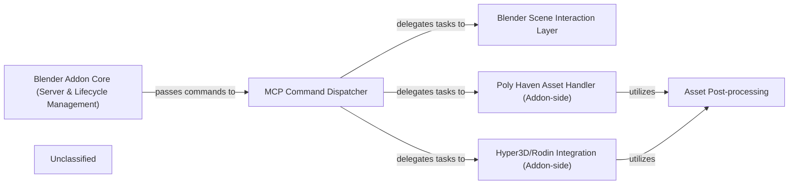

## Details

The Blender MCP Addon subsystem is a Blender plugin that contains an internal TCP server. Its boundaries encompass the code responsible for starting and managing this server, handling client connections, parsing and executing Model Context Protocol (MCP) commands, and directly interacting with the Blender Python API. It also includes the integration points for external asset and generation services like Poly Haven and Hyper3D/Rodin, all operating within the Blender environment.

### Blender Addon Core (Server & Lifecycle Management)
Manages the lifecycle of the Blender Addon, including starting and stopping the internal TCP server loop, and continuously listening for and handling incoming client (MCP Server) requests. It acts as the primary communication hub for the addon.

**Related Classes/Methods**:

- <a href="https://github.com/ahujasid/blender-mcp/blob/main/addon.py#L43-L65" target="_blank" rel="noopener noreferrer">`start`:43-65</a>
- <a href="https://github.com/ahujasid/blender-mcp/blob/main/addon.py#L89-L120" target="_blank" rel="noopener noreferrer">`_server_loop`:89-120</a>
- <a href="https://github.com/ahujasid/blender-mcp/blob/main/addon.py#L122-L180" target="_blank" rel="noopener noreferrer">`_handle_client`:122-180</a>

### MCP Command Dispatcher
Responsible for parsing incoming Model Context Protocol (MCP) commands received from the Blender Addon Core and routing them to the appropriate internal handler functions within the Blender environment.

**Related Classes/Methods**:

- <a href="https://github.com/ahujasid/blender-mcp/blob/main/addon.py#L182-L190" target="_blank" rel="noopener noreferrer">`execute_command`:182-190</a>
- <a href="https://github.com/ahujasid/blender-mcp/blob/main/addon.py#L192-L251" target="_blank" rel="noopener noreferrer">`_execute_command_internal`:192-251</a>

### Blender Scene Interaction Layer
Provides a direct interface for interacting with Blender's internal Python API to query scene data, manipulate objects, and execute arbitrary Blender Python code.

**Related Classes/Methods**:

- <a href="https://github.com/ahujasid/blender-mcp/blob/main/src/blender_mcp/server.py#L244-L255" target="_blank" rel="noopener noreferrer">`get_scene_info`:244-255</a>
- <a href="https://github.com/ahujasid/blender-mcp/blob/main/addon.py#L405-L420" target="_blank" rel="noopener noreferrer">`execute_code`:405-420</a>

### Poly Haven Asset Handler (Addon-side)
Manages the Blender-specific integration of assets from Poly Haven, including processing download requests and applying textures or models to the Blender scene.

**Related Classes/Methods**:

- <a href="https://github.com/ahujasid/blender-mcp/blob/main/src/blender_mcp/server.py#L416-L465" target="_blank" rel="noopener noreferrer">`download_polyhaven_asset`:416-465</a>

### Hyper3D/Rodin Integration (Addon-side)
Handles the Blender-side aspects of Hyper3D/Rodin model generation jobs, including initiating job creation, polling job status, and importing the generated 3D assets into the Blender scene.

**Related Classes/Methods**:

- <a href="https://github.com/ahujasid/blender-mcp/blob/main/addon.py#L1140-L1147" target="_blank" rel="noopener noreferrer">`create_rodin_job`:1140-1147</a>
- <a href="https://github.com/ahujasid/blender-mcp/blob/main/src/blender_mcp/server.py#L803-L844" target="_blank" rel="noopener noreferrer">`poll_rodin_job_status`:803-844</a>
- <a href="https://github.com/ahujasid/blender-mcp/blob/main/src/blender_mcp/server.py#L846-L877" target="_blank" rel="noopener noreferrer">`import_generated_asset`:846-877</a>

### Asset Post-processing
Performs necessary clean-up, validation, and processing on newly imported 3D assets (e.g., GLB models) to ensure they are correctly integrated and usable within the Blender scene.

**Related Classes/Methods**:

- <a href="https://github.com/ahujasid/blender-mcp/blob/main/addon.py#L1245-L1310" target="_blank" rel="noopener noreferrer">`_clean_imported_glb`:1245-1310</a>
- <a href="https://github.com/ahujasid/blender-mcp/blob/main/addon.py#L289-L307" target="_blank" rel="noopener noreferrer">`_get_aabb`:289-307</a>

### Unclassified
Component for all unclassified files and utility functions (Utility functions/External Libraries/Dependencies)

**Related Classes/Methods**: _None_

### [FAQ](https://github.com/CodeBoarding/GeneratedOnBoardings/tree/main?tab=readme-ov-file#faq)