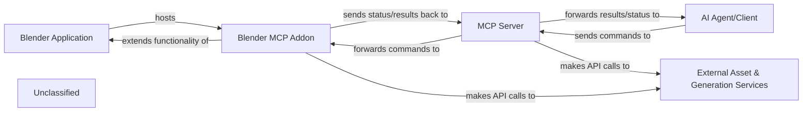

## Details

The system facilitates the creation and manipulation of 3D assets within Blender, orchestrated by an external AI Agent. The MCP Server acts as the central hub, mediating commands from the AI Agent/Client to the Blender MCP Addon and interacting with External Asset & Generation Services for asset acquisition and AI model generation. The Blender MCP Addon, hosted within the Blender Application, executes these commands, imports assets, and directly interacts with certain external services. This architecture ensures a clear separation of concerns, with the server handling orchestration and external service integration, and the addon managing Blender-specific operations.

### Blender Application
The core 3D modeling environment that serves as the host for the Blender MCP Addon. It provides the graphical interface and underlying functionalities for 3D asset manipulation and scene management. As an external, off-the-shelf application, its source code is not part of this project's repository.

**Related Classes/Methods**: _None_

### Blender MCP Addon [[Expand]](./Blender_MCP_Addon.md)
An extension residing within the Blender Application responsible for executing commands received from the MCP Server, managing the import and manipulation of 3D assets, and directly interacting with certain external services for asset generation and status polling.

**Related Classes/Methods**:

- <a href="https://github.com/ahujasid/blender-mcp/blob/main/addon.py#L469-L790" target="_blank" rel="noopener noreferrer">`addon.download_polyhaven_asset`:469-790</a>
- <a href="https://github.com/ahujasid/blender-mcp/blob/main/addon.py#L1140-L1147" target="_blank" rel="noopener noreferrer">`addon.create_rodin_job`:1140-1147</a>
- <a href="https://github.com/ahujasid/blender-mcp/blob/main/addon.py#L1209-L1216" target="_blank" rel="noopener noreferrer">`addon.poll_rodin_job_status`:1209-1216</a>
- <a href="https://github.com/ahujasid/blender-mcp/blob/main/addon.py#L1312-L1319" target="_blank" rel="noopener noreferrer">`addon.import_generated_asset`:1312-1319</a>

### MCP Server
Acts as the central orchestrator, mediating communication between the AI Agent/Client and the Blender MCP Addon. It initiates interactions with external asset and generation services, downloads assets, and manages AI model generation requests.

**Related Classes/Methods**:

- <a href="https://github.com/ahujasid/blender-mcp/blob/main/src/blender_mcp/server.py#L416-L465" target="_blank" rel="noopener noreferrer">`src.blender_mcp.server.download_polyhaven_asset`:416-465</a>
- <a href="https://github.com/ahujasid/blender-mcp/blob/main/src/blender_mcp/server.py#L711-L745" target="_blank" rel="noopener noreferrer">`src.blender_mcp.server.generate_hyper3d_model_via_text`:711-745</a>
- <a href="https://github.com/ahujasid/blender-mcp/blob/main/src/blender_mcp/server.py#L659-L700" target="_blank" rel="noopener noreferrer">`src.blender_mcp.server.download_sketchfab_model`:659-700</a>

### AI Agent/Client
The external intelligent entity (e.g., Claude AI) that orchestrates the overall workflow. It sends high-level commands to the MCP Server to trigger asset acquisition and generation processes, and receives status updates and results. As an external client, its source code is not part of this project's repository.

**Related Classes/Methods**: _None_

### External Asset & Generation Services [[Expand]](./External_Asset_Generation_Services.md)
A collection of third-party online services that provide 3D assets (e.g., Poly Haven, Sketchfab) and AI-powered 3D model generation capabilities (e.g., Hyper3D/Rodin). These services are consumed by the MCP Server and Blender MCP Addon. As external services, their source code is not part of this project's repository.

**Related Classes/Methods**: _None_

### Unclassified
Component for all unclassified files and utility functions (Utility functions/External Libraries/Dependencies)

**Related Classes/Methods**: _None_

### [FAQ](https://github.com/CodeBoarding/GeneratedOnBoardings/tree/main?tab=readme-ov-file#faq)