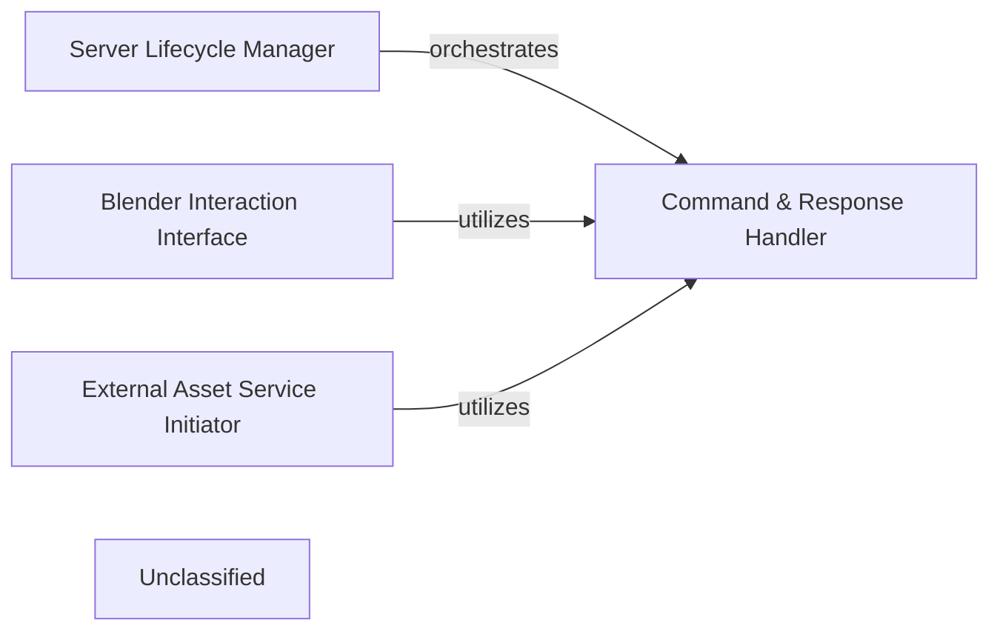

## Details

The MCP Orchestration Server acts as the central broker in the system, translating AI commands into Model Context Protocol (MCP) messages and managing interactions with both the Blender Addon and external asset services. It operates as a standalone Python server, adhering to a client-server and broker architectural pattern.

### Server Lifecycle Manager
Manages the startup, shutdown, and overall lifespan of the MCP Orchestration Server. This includes establishing and maintaining the TCP listener that facilitates communication with the Blender Addon.

**Related Classes/Methods**:

- <a href="https://github.com/ahujasid/blender-mcp/blob/main/src/blender_mcp/server.py#L167-L195" target="_blank" rel="noopener noreferrer">`server_lifespan`:167-195</a>

### Command & Response Handler
Responsible for the low-level TCP communication, sending commands to the Blender Addon, and receiving/processing its responses. It acts as the primary communication conduit within the server.

**Related Classes/Methods**:

- <a href="https://github.com/ahujasid/blender-mcp/blob/main/src/blender_mcp/server.py#L112-L165" target="_blank" rel="noopener noreferrer">`send_command`:112-165</a>
- <a href="https://github.com/ahujasid/blender-mcp/blob/main/src/blender_mcp/server.py#L56-L110" target="_blank" rel="noopener noreferrer">`receive_full_response`:56-110</a>

### Blender Interaction Interface
Provides a high-level interface for querying Blender's current state and executing Blender-specific code snippets via the Blender Addon. It abstracts the direct MCP command details for Blender operations.

**Related Classes/Methods**:

- <a href="https://github.com/ahujasid/blender-mcp/blob/main/src/blender_mcp/server.py#L244-L255" target="_blank" rel="noopener noreferrer">`get_scene_info`:244-255</a>
- <a href="https://github.com/ahujasid/blender-mcp/blob/main/src/blender_mcp/server.py#L318-L333" target="_blank" rel="noopener noreferrer">`execute_blender_code`:318-333</a>

### External Asset Service Initiator
Manages direct interactions with external APIs such as Poly Haven, Hyper3D, and Sketchfab. Its role is to initiate asset generation or download processes and subsequently instruct the Blender Addon (via the Command & Response Handler) to import these assets into the Blender scene.

**Related Classes/Methods**:

- <a href="https://github.com/ahujasid/blender-mcp/blob/main/src/blender_mcp/server.py#L711-L745" target="_blank" rel="noopener noreferrer">`generate_hyper3d_model_via_text`:711-745</a>
- <a href="https://github.com/ahujasid/blender-mcp/blob/main/src/blender_mcp/server.py#L416-L465" target="_blank" rel="noopener noreferrer">`download_polyhaven_asset`:416-465</a>
- <a href="https://github.com/ahujasid/blender-mcp/blob/main/src/blender_mcp/server.py#L659-L700" target="_blank" rel="noopener noreferrer">`download_sketchfab_model`:659-700</a>

### Unclassified
Component for all unclassified files and utility functions (Utility functions/External Libraries/Dependencies)

**Related Classes/Methods**: _None_

### [FAQ](https://github.com/CodeBoarding/GeneratedOnBoardings/tree/main?tab=readme-ov-file#faq)