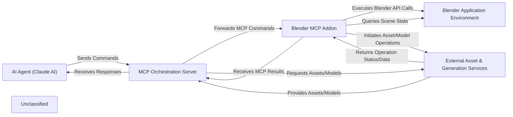

## Details

The `blender-mcp` project facilitates AI-driven 3D model generation and manipulation within Blender. The architecture is centered around an `AI Agent (Claude AI)` that orchestrates the process by sending high-level commands to the `MCP Orchestration Server`. This server acts as a central broker, translating these commands into a Machine Control Protocol (MCP) and managing interactions with various `External Asset & Generation Services` (Poly Haven, Hyper3D, Sketchfab). The `MCP Orchestration Server` then forwards these MCP commands to the `Blender MCP Addon`, a plugin running within the `Blender Application Environment`. The `Blender MCP Addon` executes these commands by directly interacting with the Blender Python API, querying the scene state, and performing 3D manipulations. Results and scene information are then relayed back through the `MCP Orchestration Server` to the `AI Agent (Claude AI)`. This setup allows for a clear separation of concerns, with the AI handling high-level decision-making, the orchestration server managing command translation and external service integration, and the Blender addon executing precise 3D operations.

### AI Agent (Claude AI)
The external intelligent agent that orchestrates the 3D modeling process, sending high-level commands and interpreting responses. This component is external to the project and interacts with the `MCP Orchestration Server`.

**Related Classes/Methods**:

- <a href="https://github.com/ahujasid/blender-mcp/blob/main/src/blender_mcp/server.py#L112-L165" target="_blank" rel="noopener noreferrer">`src.blender_mcp.server.send_command`:112-165</a>
- <a href="https://github.com/ahujasid/blender-mcp/blob/main/src/blender_mcp/server.py#L56-L110" target="_blank" rel="noopener noreferrer">`src.blender_mcp.server.receive_full_response`:56-110</a>

### MCP Orchestration Server [[Expand]](./MCP_Orchestration_Server.md)
A standalone Python server acting as the central broker, translating AI commands into MCP and managing interactions with external asset services.

**Related Classes/Methods**:

- <a href="https://github.com/ahujasid/blender-mcp/blob/main/src/blender_mcp/server.py#L167-L195" target="_blank" rel="noopener noreferrer">`src.blender_mcp.server.server_lifespan`:167-195</a>
- <a href="https://github.com/ahujasid/blender-mcp/blob/main/src/blender_mcp/server.py#L112-L165" target="_blank" rel="noopener noreferrer">`src.blender_mcp.server.send_command`:112-165</a>
- <a href="https://github.com/ahujasid/blender-mcp/blob/main/src/blender_mcp/server.py#L56-L110" target="_blank" rel="noopener noreferrer">`src.blender_mcp.server.receive_full_response`:56-110</a>
- <a href="https://github.com/ahujasid/blender-mcp/blob/main/src/blender_mcp/server.py#L244-L255" target="_blank" rel="noopener noreferrer">`src.blender_mcp.server.get_scene_info`:244-255</a>
- <a href="https://github.com/ahujasid/blender-mcp/blob/main/src/blender_mcp/server.py#L318-L333" target="_blank" rel="noopener noreferrer">`src.blender_mcp.server.execute_blender_code`:318-333</a>
- <a href="https://github.com/ahujasid/blender-mcp/blob/main/src/blender_mcp/server.py#L711-L745" target="_blank" rel="noopener noreferrer">`src.blender_mcp.server.generate_hyper3d_model_via_text`:711-745</a>
- <a href="https://github.com/ahujasid/blender-mcp/blob/main/src/blender_mcp/server.py#L416-L465" target="_blank" rel="noopener noreferrer">`src.blender_mcp.server.download_polyhaven_asset`:416-465</a>
- <a href="https://github.com/ahujasid/blender-mcp/blob/main/src/blender_mcp/server.py#L659-L700" target="_blank" rel="noopener noreferrer">`src.blender_mcp.server.download_sketchfab_model`:659-700</a>

### Blender Application Environment
The core 3D modeling software (Blender) that provides the runtime environment for the Blender MCP Addon and fundamental 3D manipulation capabilities. This is an external application.

**Related Classes/Methods**:

- <a href="https://github.com/ahujasid/blender-mcp/blob/main/addon.py#L182-L190" target="_blank" rel="noopener noreferrer">`addon.execute_command`:182-190</a>
- <a href="https://github.com/ahujasid/blender-mcp/blob/main/addon.py#L192-L251" target="_blank" rel="noopener noreferrer">`addon._execute_command_internal`:192-251</a>
- <a href="https://github.com/ahujasid/blender-mcp/blob/main/addon.py#L255-L287" target="_blank" rel="noopener noreferrer">`addon.get_scene_info`:255-287</a>
- <a href="https://github.com/ahujasid/blender-mcp/blob/main/addon.py#L405-L420" target="_blank" rel="noopener noreferrer">`addon.execute_code`:405-420</a>

### Blender MCP Addon [[Expand]](./Blender_MCP_Addon.md)
A Blender plugin containing an internal TCP server that receives and executes MCP commands, directly interacting with the Blender Python API.

**Related Classes/Methods**:

- <a href="https://github.com/ahujasid/blender-mcp/blob/main/addon.py#L43-L65" target="_blank" rel="noopener noreferrer">`addon.start`:43-65</a>
- <a href="https://github.com/ahujasid/blender-mcp/blob/main/addon.py#L89-L120" target="_blank" rel="noopener noreferrer">`addon._server_loop`:89-120</a>
- <a href="https://github.com/ahujasid/blender-mcp/blob/main/addon.py#L122-L180" target="_blank" rel="noopener noreferrer">`addon._handle_client`:122-180</a>
- <a href="https://github.com/ahujasid/blender-mcp/blob/main/addon.py#L182-L190" target="_blank" rel="noopener noreferrer">`addon.execute_command`:182-190</a>
- <a href="https://github.com/ahujasid/blender-mcp/blob/main/addon.py#L192-L251" target="_blank" rel="noopener noreferrer">`addon._execute_command_internal`:192-251</a>
- <a href="https://github.com/ahujasid/blender-mcp/blob/main/addon.py#L255-L287" target="_blank" rel="noopener noreferrer">`addon.get_scene_info`:255-287</a>
- <a href="https://github.com/ahujasid/blender-mcp/blob/main/addon.py#L405-L420" target="_blank" rel="noopener noreferrer">`addon.execute_code`:405-420</a>
- <a href="https://github.com/ahujasid/blender-mcp/blob/main/addon.py#L1140-L1147" target="_blank" rel="noopener noreferrer">`addon.create_rodin_job`:1140-1147</a>
- <a href="https://github.com/ahujasid/blender-mcp/blob/main/addon.py#L1209-L1216" target="_blank" rel="noopener noreferrer">`addon.poll_rodin_job_status`:1209-1216</a>
- <a href="https://github.com/ahujasid/blender-mcp/blob/main/addon.py#L1312-L1319" target="_blank" rel="noopener noreferrer">`addon.import_generated_asset`:1312-1319</a>
- <a href="https://github.com/ahujasid/blender-mcp/blob/main/addon.py#L469-L790" target="_blank" rel="noopener noreferrer">`addon.download_polyhaven_asset`:469-790</a>

### External Asset & Generation Services [[Expand]](./External_Asset_Generation_Services.md)
A collection of external online services providing 3D assets (Poly Haven, Sketchfab) and AI-powered model generation (Hyper3D/Rodin). Interactions with these services are managed by the `MCP Orchestration Server` and `Blender MCP Addon`.

**Related Classes/Methods**:

- <a href="https://github.com/ahujasid/blender-mcp/blob/main/src/blender_mcp/server.py#L416-L465" target="_blank" rel="noopener noreferrer">`src.blender_mcp.server.download_polyhaven_asset`:416-465</a>
- <a href="https://github.com/ahujasid/blender-mcp/blob/main/addon.py#L469-L790" target="_blank" rel="noopener noreferrer">`addon.download_polyhaven_asset`:469-790</a>
- <a href="https://github.com/ahujasid/blender-mcp/blob/main/src/blender_mcp/server.py#L711-L745" target="_blank" rel="noopener noreferrer">`src.blender_mcp.server.generate_hyper3d_model_via_text`:711-745</a>
- <a href="https://github.com/ahujasid/blender-mcp/blob/main/addon.py#L1140-L1147" target="_blank" rel="noopener noreferrer">`addon.create_rodin_job`:1140-1147</a>
- <a href="https://github.com/ahujasid/blender-mcp/blob/main/addon.py#L1209-L1216" target="_blank" rel="noopener noreferrer">`addon.poll_rodin_job_status`:1209-1216</a>
- <a href="https://github.com/ahujasid/blender-mcp/blob/main/addon.py#L1312-L1319" target="_blank" rel="noopener noreferrer">`addon.import_generated_asset`:1312-1319</a>
- <a href="https://github.com/ahujasid/blender-mcp/blob/main/src/blender_mcp/server.py#L659-L700" target="_blank" rel="noopener noreferrer">`src.blender_mcp.server.download_sketchfab_model`:659-700</a>

### Unclassified
Component for all unclassified files and utility functions (Utility functions/External Libraries/Dependencies)

**Related Classes/Methods**: _None_

### [FAQ](https://github.com/CodeBoarding/GeneratedOnBoardings/tree/main?tab=readme-ov-file#faq)