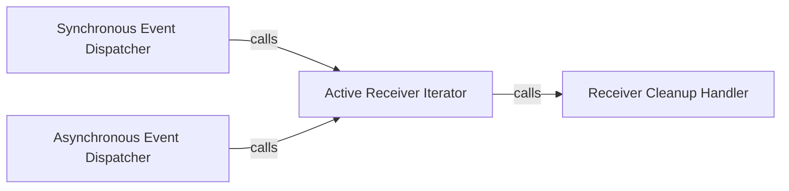

## Details

The `Event Dispatcher` subsystem is responsible for the core mechanism of triggering and managing the execution of all receivers connected to a specific signal when that signal is "sent." Its boundaries are primarily defined by the `send` and `send_async` methods of the `Signal` class, which serve as the entry points for initiating the dispatch process.

### Synchronous Event Dispatcher
The primary component responsible for synchronously triggering the execution of all receivers connected to a `Signal` instance. It iterates through the active receivers and invokes them sequentially.

**Related Classes/Methods**:

- <a href="https://github.com/pallets-eco/blinker/blob/main/src/blinker/base.py" target="_blank" rel="noopener noreferrer">`src.blinker.base.Signal.send`</a>

### Asynchronous Event Dispatcher
The component responsible for asynchronously triggering the execution of all receivers connected to a `Signal` instance. It iterates through the active receivers and invokes them using an asynchronous mechanism, allowing for non-blocking operations.

**Related Classes/Methods**:

- <a href="https://github.com/pallets-eco/blinker/blob/main/src/blinker/base.py" target="_blank" rel="noopener noreferrer">`src.blinker.base.Signal.send_async`</a>

### Active Receiver Iterator
A utility component that provides an iterable of currently active and valid receivers for a given signal. It handles the complexities of weak references and ensures that only callable receivers are returned for dispatch, filtering out expired or invalid ones.

**Related Classes/Methods**:

- <a href="https://github.com/pallets-eco/blinker/blob/main/src/blinker/base.py#L326-L362" target="_blank" rel="noopener noreferrer">`src.blinker.base.receivers_for`:326-362</a>

### Receiver Cleanup Handler
An internal component responsible for cleaning up references to receivers, particularly weak references that are no longer valid or have been explicitly disconnected. This ensures that the signal's receiver list remains clean and efficient.

**Related Classes/Methods**:

- <a href="https://github.com/pallets-eco/blinker/blob/main/src/blinker/base.py#L388-L397" target="_blank" rel="noopener noreferrer">`src.blinker.base._disconnect`:388-397</a>

### [FAQ](https://github.com/CodeBoarding/GeneratedOnBoardings/tree/main?tab=readme-ov-file#faq)