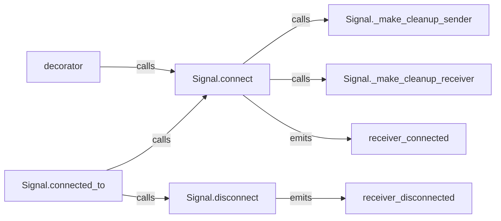

## Details

The Receiver Connection Manager subsystem is central to Blinker's event dispatching system, specifically handling the entire lifecycle of connecting and disconnecting receiver functions to signals. It encapsulates various subscription paradigms and manages weak references for automatic cleanup.

### Signal.connect
Registers a receiver function to a signal, handling weak references and preventing duplicate connections. It is the primary entry point for establishing a signal-receiver relationship.

**Related Classes/Methods**:

- <a href="https://github.com/pallets-eco/blinker/blob/main/src/blinker/base.py" target="_blank" rel="noopener noreferrer">`blinker.base.Signal.connect`</a>

### Signal.disconnect
Unregisters a receiver function from the signal, effectively terminating the signal-receiver relationship.

**Related Classes/Methods**:

- <a href="https://github.com/pallets-eco/blinker/blob/main/src/blinker/base.py" target="_blank" rel="noopener noreferrer">`blinker.base.Signal.disconnect`</a>

### Signal.connected_to
Provides a context manager for temporary signal connections. It ensures that a receiver is connected when entering the context and automatically disconnected upon exiting, simplifying temporary subscriptions.

**Related Classes/Methods**:

- <a href="https://github.com/pallets-eco/blinker/blob/main/src/blinker/base.py" target="_blank" rel="noopener noreferrer">`blinker.base.Signal.connected_to`</a>

### decorator
A syntactic sugar utility that allows functions to be easily connected as receivers to a signal using Python's decorator syntax, enhancing code readability and conciseness.

**Related Classes/Methods**:

- <a href="https://github.com/pallets-eco/blinker/blob/main/src/blinker/base.py#L161-L163" target="_blank" rel="noopener noreferrer">`blinker.base.decorator`:161-163</a>

### Signal._make_cleanup_receiver
Generates a callable responsible for cleaning up the associated receiver when its weak reference expires. This is crucial for automatic resource management and preventing memory leaks.

**Related Classes/Methods**:

- <a href="https://github.com/pallets-eco/blinker/blob/main/src/blinker/base.py" target="_blank" rel="noopener noreferrer">`blinker.base.Signal._make_cleanup_receiver`</a>

### Signal._make_cleanup_sender
Generates a callable responsible for cleaning up the associated sender when its weak reference expires, similar to receiver cleanup but for the sender side.

**Related Classes/Methods**:

- <a href="https://github.com/pallets-eco/blinker/blob/main/src/blinker/base.py" target="_blank" rel="noopener noreferrer">`blinker.base.Signal._make_cleanup_sender`</a>

### receiver_connected
A global signal emitted to notify the system that a receiver has been successfully connected to a signal. This allows other parts of the application to react to connection events.

**Related Classes/Methods**:

- <a href="https://github.com/pallets-eco/blinker/blob/main/src/blinker/base.py#L41-L50" target="_blank" rel="noopener noreferrer">`blinker.base.receiver_connected`:41-50</a>

### receiver_disconnected
A global signal emitted to notify the system that a receiver has been disconnected from a signal, enabling reactions to disconnection events.

**Related Classes/Methods**:

- <a href="https://github.com/pallets-eco/blinker/blob/main/src/blinker/base.py#L52-L71" target="_blank" rel="noopener noreferrer">`blinker.base.receiver_disconnected`:52-71</a>

### [FAQ](https://github.com/CodeBoarding/GeneratedOnBoardings/tree/main?tab=readme-ov-file#faq)