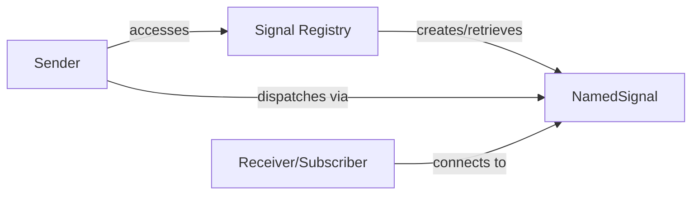

## Details

The Blinker subsystem provides a robust in-process signaling mechanism, primarily centered around the `NamedSignal` component. The `Signal Registry` acts as a central factory, ensuring unique `NamedSignal` instances are available for specific event channels. `Sender` components initiate events by dispatching signals through the `NamedSignal`'s `send` method, while `Receiver/Subscriber` components register their interest with `NamedSignal` via its `connect` method to execute predefined logic upon signal dispatch. This architecture facilitates a decoupled, event-driven communication flow within an application, where components can interact without direct dependencies, enhancing modularity and flexibility.

### Signal Registry [[Expand]](./Signal_Registry.md)
A global factory and registry responsible for creating and retrieving `Signal` instances, particularly named ones. It ensures that for a given name, a unique `Signal` object is always returned, facilitating signal discovery and reuse across an application.

**Related Classes/Methods**:

- <a href="https://github.com/pallets-eco/blinker/blob/main/src/blinker/base.py" target="_blank" rel="noopener noreferrer">`src.blinker.base.signal`</a>

### NamedSignal
Represents a specific named event channel. It directly manages the list of connected receivers and the dispatching logic for that particular signal. It is the concrete "subject" in the Observer pattern.

**Related Classes/Methods**:

- <a href="https://github.com/pallets-eco/blinker/blob/main/src/blinker/base.py#L464-L480" target="_blank" rel="noopener noreferrer">`src.blinker.base.NamedSignal`:464-480</a>

### Sender
Components that initiate events by dispatching signals. They act as the "publishers" or "observables" in the event system, interacting with `NamedSignal` instances by invoking their `send` method.

**Related Classes/Methods**:

- <a href="https://github.com/pallets-eco/blinker/blob/main/src/blinker/base.py" target="_blank" rel="noopener noreferrer">`src.blinker.base.NamedSignal:send`</a>

### Receiver/Subscriber
Components that register interest in specific signals and execute predefined logic when those signals are dispatched. They act as the "observers" in the event system, connecting to `NamedSignal` instances by registering themselves via the `connect` method.

**Related Classes/Methods**:

- <a href="https://github.com/pallets-eco/blinker/blob/main/src/blinker/base.py" target="_blank" rel="noopener noreferrer">`src.blinker.base.NamedSignal:connect`</a>

### [FAQ](https://github.com/CodeBoarding/GeneratedOnBoardings/tree/main?tab=readme-ov-file#faq)