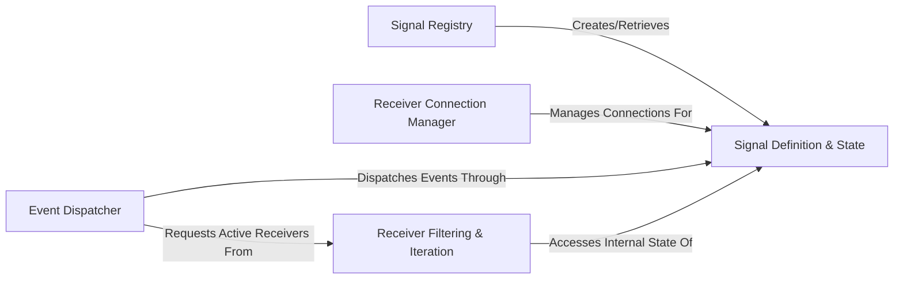

## Details

The `blinker` architecture is designed around a clear event-driven paradigm, making it ideal for decoupled communication within Python applications. The Signal Definition & State component is central, acting as the event channel that maintains connections to various receivers. The Signal Registry provides a centralized mechanism for creating and retrieving these signals, ensuring consistency. Receivers establish their interest in specific signals via the Receiver Connection Manager, which handles the intricate details of linking and unlinking. When an event occurs, the Event Dispatcher takes charge, orchestrating the notification process by iterating through active listeners provided by the Receiver Filtering & Iteration component. This modular design facilitates a clean flow of events from senders to multiple, independently managed receivers, making it highly suitable for visual representation as a flow graph where signals are the conduits of information.

### Signal Definition & State
The fundamental entity representing a distinct event or communication channel. It encapsulates the internal state required to manage connected receivers and senders, including weak references for automatic cleanup.

**Related Classes/Methods**:

- <a href="https://github.com/pallets-eco/blinker/blob/main/src/blinker/base.py" target="_blank" rel="noopener noreferrer">`src.blinker.base.Signal`</a>
- <a href="https://github.com/pallets-eco/blinker/blob/main/src/blinker/base.py" target="_blank" rel="noopener noreferrer">`src.blinker.base.Signal.__init__`</a>
- <a href="https://github.com/pallets-eco/blinker/blob/main/src/blinker/base.py" target="_blank" rel="noopener noreferrer">`src.blinker.base.Signal.receivers`</a>
- <a href="https://github.com/pallets-eco/blinker/blob/main/src/blinker/base.py" target="_blank" rel="noopener noreferrer">`src.blinker.base.Signal._by_receiver`</a>
- <a href="https://github.com/pallets-eco/blinker/blob/main/src/blinker/base.py" target="_blank" rel="noopener noreferrer">`src.blinker.base.Signal._by_sender`</a>
- <a href="https://github.com/pallets-eco/blinker/blob/main/src/blinker/base.py" target="_blank" rel="noopener noreferrer">`src.blinker.base.Signal._weak_senders`</a>

### Signal Registry [[Expand]](./Signal_Registry.md)
A global factory and registry responsible for creating and retrieving `Signal` instances, particularly named ones. This ensures that for a given name, a unique `Signal` object is always returned, facilitating signal discovery and reuse across an application.

**Related Classes/Methods**:

- <a href="https://github.com/pallets-eco/blinker/blob/main/src/blinker/base.py" target="_blank" rel="noopener noreferrer">`src.blinker.base.signal`</a>

### Receiver Connection Manager [[Expand]](./Receiver_Connection_Manager.md)
This component handles the entire lifecycle of connecting and disconnecting receiver functions to specific signals. It supports various paradigms for subscription, including direct function calls, decorator-based connections, and context-managed temporary connections. It also manages the weak referencing of receivers and senders to facilitate automatic cleanup.

**Related Classes/Methods**:

- <a href="https://github.com/pallets-eco/blinker/blob/main/src/blinker/base.py" target="_blank" rel="noopener noreferrer">`src.blinker.base.Signal.connect`</a>
- <a href="https://github.com/pallets-eco/blinker/blob/main/src/blinker/base.py" target="_blank" rel="noopener noreferrer">`src.blinker.base.Signal.disconnect`</a>
- <a href="https://github.com/pallets-eco/blinker/blob/main/src/blinker/base.py" target="_blank" rel="noopener noreferrer">`src.blinker.base.Signal.connect_via`</a>
- <a href="https://github.com/pallets-eco/blinker/blob/main/src/blinker/base.py" target="_blank" rel="noopener noreferrer">`src.blinker.base.Signal.connected_to`</a>
- <a href="https://github.com/pallets-eco/blinker/blob/main/src/blinker/base.py" target="_blank" rel="noopener noreferrer">`src.blinker.base.Signal._make_cleanup_receiver`</a>
- <a href="https://github.com/pallets-eco/blinker/blob/main/src/blinker/base.py" target="_blank" rel="noopener noreferrer">`src.blinker.base.Signal._make_cleanup_sender`</a>

### Event Dispatcher [[Expand]](./Event_Dispatcher.md)
The core mechanism responsible for triggering the execution of all receivers connected to a specific signal when that signal is "sent." It iterates through the active receivers and invokes them, handling both synchronous and asynchronous receiver functions.

**Related Classes/Methods**:

- <a href="https://github.com/pallets-eco/blinker/blob/main/src/blinker/base.py" target="_blank" rel="noopener noreferrer">`src.blinker.base.Signal.send`</a>
- <a href="https://github.com/pallets-eco/blinker/blob/main/src/blinker/base.py" target="_blank" rel="noopener noreferrer">`src.blinker.base.Signal.send_async`</a>

### Receiver Filtering & Iteration
An internal utility that provides an iterable of currently active and valid receiver functions for a given signal and sender. It plays a crucial role in filtering out "dead" weak references (receivers or senders that have been garbage collected) before dispatch.

**Related Classes/Methods**:

- <a href="https://github.com/pallets-eco/blinker/blob/main/src/blinker/base.py" target="_blank" rel="noopener noreferrer">`src.blinker.base.Signal.receivers_for`</a>

### [FAQ](https://github.com/CodeBoarding/GeneratedOnBoardings/tree/main?tab=readme-ov-file#faq)