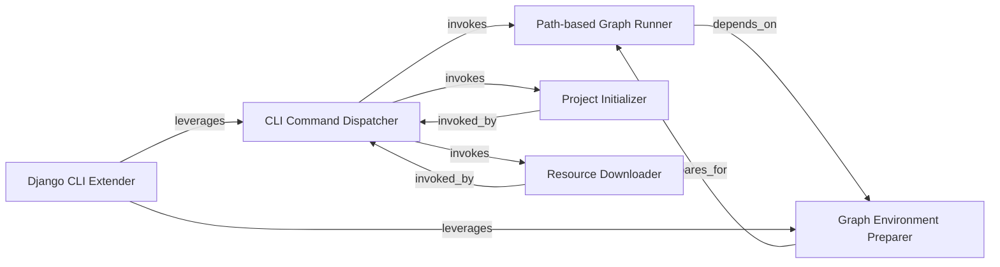

## Details

The Command Line Interface (CLI) subsystem of Bonobo serves as the primary user interface, enabling graph execution, project setup, and various utility functions. It acts as the entry point for most user-driven operations, aligning with the project's focus on data flow and transformation within an ETL framework.

### CLI Command Dispatcher
Serves as the primary entry point for all Bonobo CLI commands. It parses command-line arguments, identifies the requested command, and delegates execution to the appropriate specific command handler. This component embodies the "Orchestrator" pattern for user-driven operations, directing the flow of control based on user input.

**Related Classes/Methods**:

- <a href="https://github.com/python-bonobo/bonobo/blob/develop/bonobo/commands/base.py#L64-L68" target="_blank" rel="noopener noreferrer">`bonobo.commands.base.handle`:64-68</a>

### Graph Environment Preparer
Interprets user input to configure the environment for graph execution. This includes overriding runner configurations and resolving paths to graph definitions, ensuring the ETL pipeline has the correct context before execution. It acts as a "Configuration Management" component for the execution engine.

**Related Classes/Methods**:

- <a href="https://github.com/python-bonobo/bonobo/blob/develop/bonobo/commands/base.py#L75-L100" target="_blank" rel="noopener noreferrer">`bonobo.commands.base.read`:75-100</a>

### Path-based Graph Runner
Executes a Bonobo graph specified by a file path. It ensures necessary dependencies are installed and orchestrates the actual running of the defined ETL pipeline. This is a core "Execution Engine" component within the CLI, directly responsible for initiating data processing.

**Related Classes/Methods**:

- <a href="https://github.com/python-bonobo/bonobo/blob/develop/bonobo/commands/run.py#L28-L37" target="_blank" rel="noopener noreferrer">`bonobo.commands.run._run_path`:28-37</a>

### Project Initializer
Facilitates the creation of new Bonobo projects or components by generating files from templates and setting up directory structures. This supports the "Modularity and Reusability" aspect by providing scaffolding for new ETL projects, enabling developers to quickly set up new pipelines.

**Related Classes/Methods**:

- <a href="https://github.com/python-bonobo/bonobo/blob/develop/bonobo/commands/init.py#L72-L80" target="_blank" rel="noopener noreferrer">`bonobo.commands.init.handle`:72-80</a>

### Resource Downloader
Manages the downloading of external resources, which can serve as data sources for ETL processes. This acts as a specialized "Extractor" utility within the CLI, providing a direct means to acquire data for pipelines.

**Related Classes/Methods**:

- <a href="https://github.com/python-bonobo/bonobo/blob/develop/bonobo/commands/download.py#L14-L22" target="_blank" rel="noopener noreferrer">`bonobo.commands.download.handle`:14-22</a>

### Django CLI Extender
Provides an entry point for Django-specific CLI commands, extending Bonobo's capabilities to integrate with Django projects and execute Django-related Bonobo graphs. This exemplifies the "Plugin/Extension" pattern, showcasing the framework's extensibility.

**Related Classes/Methods**:

- <a href="https://github.com/python-bonobo/bonobo/blob/develop/bonobo/contrib/django/commands.py#L73-L83" target="_blank" rel="noopener noreferrer">`bonobo.contrib.django.commands.handle`:73-83</a>

### [FAQ](https://github.com/CodeBoarding/GeneratedOnBoardings/tree/main?tab=readme-ov-file#faq)