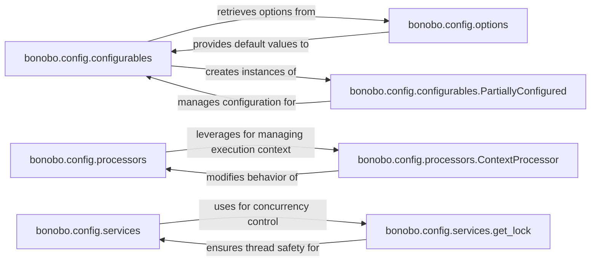

## Details

The bonobo.config subsystem is central to defining and managing the configurable aspects, execution context, and external dependencies within Bonobo ETL graphs. It provides a structured approach to making ETL nodes reusable and adaptable. bonobo.config.configurables allows nodes to declare their configuration needs, leveraging bonobo.config.options to define individual settings. The subsystem also manages dynamic behavior through bonobo.config.processors, which includes bonobo.config.processors.ContextProcessor for execution context management. Furthermore, bonobo.config.services handles the injection and lifecycle of external dependencies, utilizing mechanisms like bonobo.config.services.get_lock for concurrency control. bonobo.config.configurables.PartiallyConfigured facilitates flexible configuration by allowing incremental definition of node settings.

### bonobo.config.configurables
Manages the declaration and application of configurable options for Bonobo nodes (extractors, transformers, loaders). It enables nodes to expose their configuration needs, facilitating dynamic customization and reusability across different ETL scenarios.

**Related Classes/Methods**:

### bonobo.config.options
Represents individual configurable options, managing their default values, retrieval mechanisms, and validation rules. It ensures that configuration values are consistent and reliable.

**Related Classes/Methods**:

### bonobo.config.processors
Manages the lifecycle and application of "processors," which are functions or objects that can modify node behavior based on configuration or execution context. This enables dynamic adjustments during ETL execution.

**Related Classes/Methods**:

### bonobo.config.services
Provides a robust mechanism for defining, validating, resolving, and injecting external dependencies (services) into Bonobo nodes. It also handles concurrency control for shared services.

**Related Classes/Methods**:

### bonobo.config.configurables.PartiallyConfigured
Represents instances of nodes or components where some, but not all, configuration has been defined. It supports deferred or staged configuration, enabling incremental or placeholder-based ETL graph definitions. Its implementation as a _functools.partial subclass allows it to simulate option values from its keywords and args.

**Related Classes/Methods**:

- <a href="https://github.com/python-bonobo/bonobo/blob/develop/bonobo/config/configurables.py#L76-L102" target="_blank" rel="noopener noreferrer">`bonobo.config.configurables.PartiallyConfigured`:76-102</a>

### bonobo.config.processors.ContextProcessor
A specialized type of processor that manages the execution context for ETL processes. It functions as a yielding context manager, allowing setup and teardown of runtime dependencies, enabling nodes to adapt their behavior based on the current execution environment.

**Related Classes/Methods**:

- <a href="https://github.com/python-bonobo/bonobo/blob/develop/bonobo/config/processors.py#L17-L59" target="_blank" rel="noopener noreferrer">`bonobo.config.processors.ContextProcessor`:17-59</a>

### bonobo.config.services.get_lock
Provides a locking mechanism for concurrency control when accessing shared resources or services within ETL pipelines, ensuring thread safety by managing threading.RLock instances.

**Related Classes/Methods**:

- <a href="https://github.com/python-bonobo/bonobo/blob/develop/bonobo/config/services.py#L154-L159" target="_blank" rel="noopener noreferrer">`bonobo.config.services.get_lock`:154-159</a>

### [FAQ](https://github.com/CodeBoarding/GeneratedOnBoardings/tree/main?tab=readme-ov-file#faq)