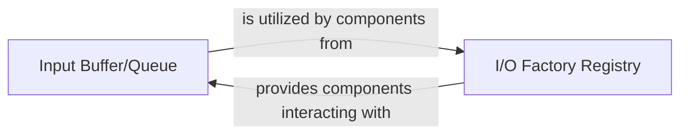

## Details

This subsystem is responsible for the efficient transfer and buffering of data between connected nodes within the ETL graph, acting as the internal plumbing for smooth data movement and providing a registry for I/O factories.

### Input Buffer/Queue
Acts as the core data conduit between processing nodes. It manages the flow of data by providing mechanisms for inserting data (`put`), retrieving data (`get`), and handling graceful termination (`shutdown`). It is also responsible for flow control and maintaining the buffer's state, ensuring smooth and controlled data movement within the ETL pipeline. This component is fundamental for managing the transient state of data as it moves between discrete processing steps.

**Related Classes/Methods**:

- <a href="https://github.com/python-bonobo/bonobo/blob/develop/bonobo/structs/inputs.py#L46-L118" target="_blank" rel="noopener noreferrer">`bonobo.structs.inputs.Input`:46-118</a>
- <a href="https://github.com/python-bonobo/bonobo/blob/develop/bonobo/structs/inputs.py" target="_blank" rel="noopener noreferrer">`bonobo.structs.inputs.Input.put`</a>
- <a href="https://github.com/python-bonobo/bonobo/blob/develop/bonobo/structs/inputs.py" target="_blank" rel="noopener noreferrer">`bonobo.structs.inputs.Input.get`</a>
- <a href="https://github.com/python-bonobo/bonobo/blob/develop/bonobo/structs/inputs.py" target="_blank" rel="noopener noreferrer">`bonobo.structs.inputs.Input.shutdown`</a>
- <a href="https://github.com/python-bonobo/bonobo/blob/develop/bonobo/structs/inputs.py" target="_blank" rel="noopener noreferrer">`bonobo.structs.inputs.Input._decrement_runlevel`</a>
- <a href="https://github.com/python-bonobo/bonobo/blob/develop/bonobo/structs/inputs.py" target="_blank" rel="noopener noreferrer">`bonobo.structs.inputs.Input.alive`</a>

### I/O Factory Registry
Serves as a central hub for managing and providing access to factories that create data readers and writers. It enables the dynamic retrieval and instantiation of specific I/O components, promoting modularity and extensibility for connecting to various data sources and destinations within the ETL framework. This component is crucial for abstracting data source/sink specifics and allowing the data flow to be configured with different I/O mechanisms.

**Related Classes/Methods**:

- <a href="https://github.com/python-bonobo/bonobo/blob/develop/bonobo/registry.py" target="_blank" rel="noopener noreferrer">`bonobo.registry.Registry`</a>
- <a href="https://github.com/python-bonobo/bonobo/blob/develop/bonobo/registry.py" target="_blank" rel="noopener noreferrer">`bonobo.registry.Registry.get_reader_factory_for`</a>
- <a href="https://github.com/python-bonobo/bonobo/blob/develop/bonobo/registry.py" target="_blank" rel="noopener noreferrer">`bonobo.registry.Registry.get_writer_factory_for`</a>
- <a href="https://github.com/python-bonobo/bonobo/blob/develop/bonobo/registry.py" target="_blank" rel="noopener noreferrer">`bonobo.registry.Registry.create_reader`</a>
- <a href="https://github.com/python-bonobo/bonobo/blob/develop/bonobo/registry.py" target="_blank" rel="noopener noreferrer">`bonobo.registry.Registry.create_writer`</a>
- <a href="https://github.com/python-bonobo/bonobo/blob/develop/bonobo/registry.py" target="_blank" rel="noopener noreferrer">`bonobo.registry.Registry.get_factory_for`</a>

### [FAQ](https://github.com/CodeBoarding/GeneratedOnBoardings/tree/main?tab=readme-ov-file#faq)