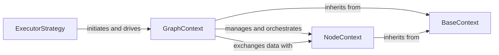

## Details

The Bonobo execution engine orchestrates ETL pipelines through a hierarchical context management system. The `ExecutorStrategy` serves as the entry point, initiating and driving the `GraphContext`. The `GraphContext` acts as the central orchestrator, managing the overall graph execution state and overseeing the lifecycle of individual `NodeContext` instances. `NodeContext` components are responsible for executing specific graph nodes, handling their input and output, and performing data transformations. Both `GraphContext` and `NodeContext` inherit foundational capabilities from `BaseContext`, ensuring consistent lifecycle management and error handling. Data flows between `GraphContext` and `NodeContext` as input is dispatched and processed output is returned, facilitating the sequential and coordinated execution of the ETL pipeline.

### ExecutorStrategy
This component defines and initiates a specific execution strategy for a Bonobo graph (e.g., single-threaded, multi-threaded). It serves as the high-level entry point for running an ETL pipeline by creating and starting the `GraphContext`, applying the chosen execution strategy to the graph.

**Related Classes/Methods**:

- <a href="https://github.com/python-bonobo/bonobo/blob/develop/bonobo/execution/strategies/executor.py#L18-L72" target="_blank" rel="noopener noreferrer">`ExecutorStrategy`:18-72</a>

### GraphContext
This is the primary orchestrator of the Bonobo graph's execution. It manages the overall graph state, initializes and oversees the lifecycle of individual `NodeContext` instances, dispatches events, and ensures the correct sequence and coordination of data processing stages. It embodies the "orchestrator" and "scheduler" aspects of the Execution Engine.

**Related Classes/Methods**:

- <a href="https://github.com/python-bonobo/bonobo/blob/develop/bonobo/execution/contexts/graph.py#L1-L9999" target="_blank" rel="noopener noreferrer">`GraphContext`:1-9999</a>

### NodeContext
Manages the execution lifecycle of a single node (function or generator) within the Bonobo graph. It handles the node's input and output, performs the actual data transformation logic, manages node-specific error states, and ensures data type consistency. It is a managed component, orchestrated by `GraphContext`.

**Related Classes/Methods**:

- <a href="https://github.com/python-bonobo/bonobo/blob/develop/bonobo/execution/contexts/node.py#L1-L9999" target="_blank" rel="noopener noreferrer">`NodeContext`:1-9999</a>

### BaseContext
Provides a common foundational interface and implementation for all execution contexts (`GraphContext`, `NodeContext`). It manages fundamental lifecycle states (start, stop, kill), status tracking, and basic error handling, ensuring consistent context management across different levels of execution within the engine.

**Related Classes/Methods**:

- <a href="https://github.com/python-bonobo/bonobo/blob/develop/bonobo/execution/contexts/base.py#L130-L143" target="_blank" rel="noopener noreferrer">`BaseContext`:130-143</a>

### [FAQ](https://github.com/CodeBoarding/GeneratedOnBoardings/tree/main?tab=readme-ov-file#faq)