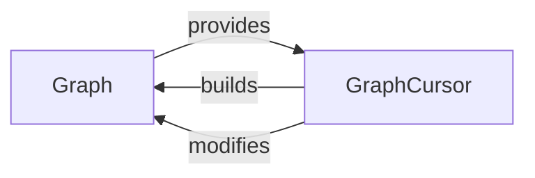

## Details

The `Graph Definition API` subsystem is responsible for programmatically defining and structuring data processing pipelines as Directed Acyclic Graphs (DAGs). Its primary function is to declare the structure of ETL pipelines by managing interconnected nodes that represent atomic data operations.

### Graph
The `Graph` component is the foundational element for constructing and representing the entire data processing pipeline. It serves as the primary orchestrator, holding the collection of nodes (ETL operations) and defining their interconnections to establish the complete data flow. It is the concrete representation of the DAG.

**Related Classes/Methods**:

- <a href="https://github.com/python-bonobo/bonobo/blob/develop/bonobo/structs/graphs.py" target="_blank" rel="noopener noreferrer">`bonobo.structs.graphs.Graph`</a>

### GraphCursor
The `GraphCursor` component provides a fluent and intuitive API for incrementally building and connecting nodes within a `Graph`. It simplifies the process of defining complex data flows, particularly through operator overloading (e.g., `>>`), acting as a temporary builder or pointer that facilitates the sequential linking of operations.

**Related Classes/Methods**:

- <a href="https://github.com/python-bonobo/bonobo/blob/develop/bonobo/structs/graphs.py#L16-L69" target="_blank" rel="noopener noreferrer">`bonobo.structs.graphs.GraphCursor`:16-69</a>

### [FAQ](https://github.com/CodeBoarding/GeneratedOnBoardings/tree/main?tab=readme-ov-file#faq)