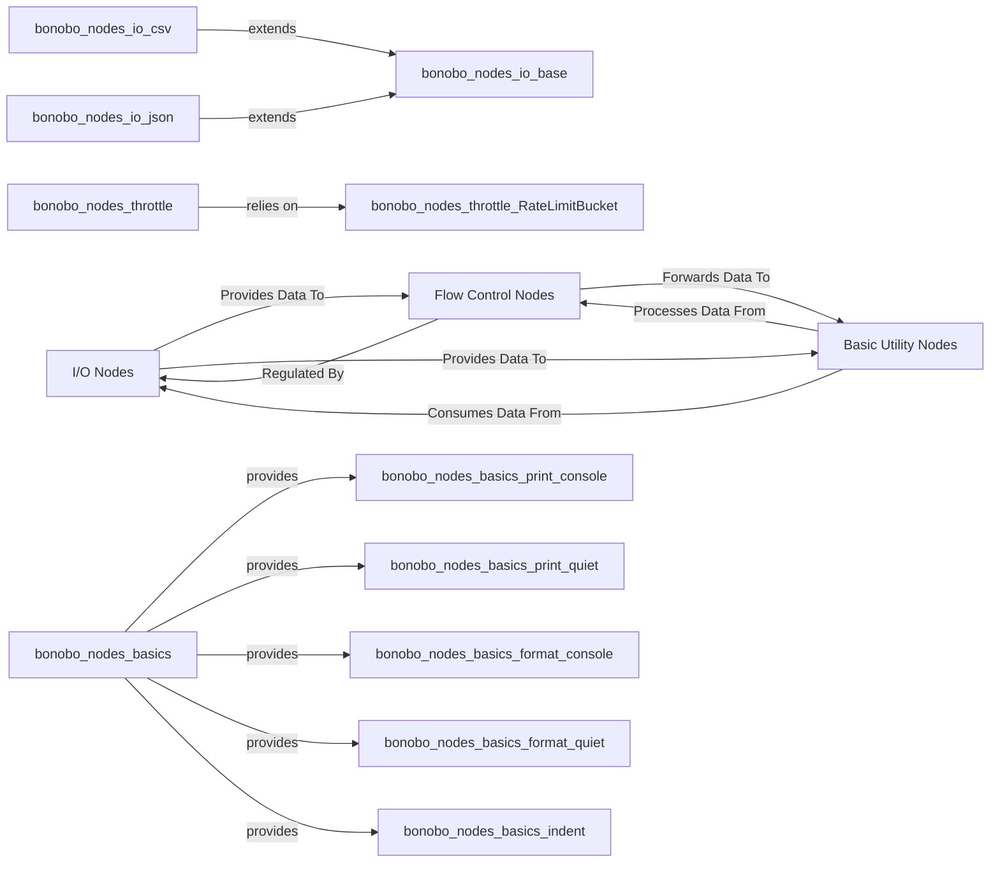

## Details

The bonobo.nodes subsystem forms the operational core of Bonobo's data processing capabilities. It is structured around three primary abstract components: I/O Nodes, Flow Control Nodes, and Basic Utility Nodes. I/O Nodes are responsible for the fundamental tasks of data extraction and loading, offering specialized implementations for various formats that extend a common base. Flow Control Nodes act as crucial intermediaries, regulating the flow of data through the pipeline to ensure efficient and controlled processing, leveraging internal mechanisms like RateLimitBucket. Finally, Basic Utility Nodes provide essential, often terminal, operations for data inspection, formatting, and console output. Data typically flows from I/O Nodes, potentially through Flow Control Nodes for regulation, and then to Basic Utility Nodes for final display or simple transformations, establishing a clear and manageable data pipeline architecture.

### I/O Nodes
This component provides a foundational set of nodes for handling data input (extraction) from various sources and data output (loading) to different destinations. It abstracts common I/O patterns through a bonobo.nodes.io.base class, which is extended by specialized nodes like bonobo.nodes.io.csv and bonobo.nodes.io.json to support diverse formats.

**Related Classes/Methods**:

- <a href="https://github.com/python-bonobo/bonobo/blob/develop/bonobo/nodes/io/base.py" target="_blank" rel="noopener noreferrer">`bonobo.nodes.io.base`</a>
- <a href="https://github.com/python-bonobo/bonobo/blob/develop/bonobo/nodes/io/file.py" target="_blank" rel="noopener noreferrer">`bonobo.nodes.io.file`</a>
- <a href="https://github.com/python-bonobo/bonobo/blob/develop/bonobo/nodes/io/csv.py" target="_blank" rel="noopener noreferrer">`bonobo.nodes.io.csv`</a>
- <a href="https://github.com/python-bonobo/bonobo/blob/develop/bonobo/nodes/io/json.py" target="_blank" rel="noopener noreferrer">`bonobo.nodes.io.json`</a>

### Flow Control Nodes
This component implements mechanisms to control the rate at which data flows through a Bonobo graph. The bonobo.nodes.throttle node within this component relies on bonobo.nodes.throttle.RateLimitBucket to manage and enforce data processing limits, acting as a specialized transformer to prevent downstream operations from being overwhelmed.

**Related Classes/Methods**:

- <a href="https://github.com/python-bonobo/bonobo/blob/develop/bonobo/nodes/throttle.py" target="_blank" rel="noopener noreferrer">`bonobo.nodes.throttle`</a>
- <a href="https://github.com/python-bonobo/bonobo/blob/develop/bonobo/nodes/throttle.py#L7-L32" target="_blank" rel="noopener noreferrer">`bonobo.nodes.throttle.RateLimitBucket`:7-32</a>

### Basic Utility Nodes
This component offers fundamental utility operations primarily focused on displaying processed data to the console and basic data formatting. The bonobo.nodes.basics module provides functions such as print_console, print_quiet, format_console, format_quiet, and indent, which are often used for debugging, monitoring, or simple output tasks within a pipeline.

**Related Classes/Methods**:

- <a href="https://github.com/python-bonobo/bonobo/blob/develop/bonobo/nodes/basics.py" target="_blank" rel="noopener noreferrer">`bonobo.nodes.basics`</a>
- <a href="https://github.com/python-bonobo/bonobo/blob/develop/bonobo/nodes/basics.py" target="_blank" rel="noopener noreferrer">`bonobo.nodes.basics:print_console`</a>
- <a href="https://github.com/python-bonobo/bonobo/blob/develop/bonobo/nodes/basics.py" target="_blank" rel="noopener noreferrer">`bonobo.nodes.basics:print_quiet`</a>
- <a href="https://github.com/python-bonobo/bonobo/blob/develop/bonobo/nodes/basics.py" target="_blank" rel="noopener noreferrer">`bonobo.nodes.basics:format_console`</a>
- <a href="https://github.com/python-bonobo/bonobo/blob/develop/bonobo/nodes/basics.py" target="_blank" rel="noopener noreferrer">`bonobo.nodes.basics:format_quiet`</a>
- <a href="https://github.com/python-bonobo/bonobo/blob/develop/bonobo/nodes/basics.py" target="_blank" rel="noopener noreferrer">`bonobo.nodes.basics:indent`</a>

### [FAQ](https://github.com/CodeBoarding/GeneratedOnBoardings/tree/main?tab=readme-ov-file#faq)