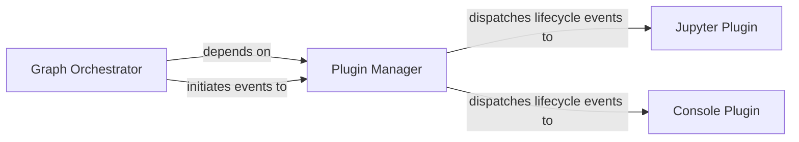

## Details

The `Plugin System` in Bonobo is designed to extend the core ETL framework's functionality at runtime, allowing for dynamic integration with various environments and tools.

### Plugin Manager
This is the foundational component responsible for the lifecycle management of all plugins. It provides mechanisms for registering, unregistering, and dispatching events to active plugins, ensuring that Bonobo's execution flow can be dynamically extended.

**Related Classes/Methods**:

- <a href="https://github.com/python-bonobo/bonobo/blob/develop/bonobo/execution/contexts/plugin.py" target="_blank" rel="noopener noreferrer">`bonobo.execution.contexts.plugin`</a>

### Graph Orchestrator
While a broader component of the Bonobo execution engine, it acts as the primary client of the `Plugin Manager`. It integrates plugin lifecycle events directly into the overall ETL pipeline execution, triggering plugin actions at appropriate stages.

**Related Classes/Methods**:

- <a href="https://github.com/python-bonobo/bonobo/blob/develop/bonobo/execution/contexts/graph.py" target="_blank" rel="noopener noreferrer">`bonobo.execution.contexts.graph`</a>

### Jupyter Plugin
A concrete implementation of a plugin tailored for the Jupyter Notebook environment. It extends Bonobo's capabilities to provide interactive features and better integration within Jupyter, adapting the ETL process to an interactive context.

**Related Classes/Methods**:

- <a href="https://github.com/python-bonobo/bonobo/blob/develop/bonobo/plugins/jupyter.py" target="_blank" rel="noopener noreferrer">`bonobo.plugins.jupyter`</a>

### Console Plugin
A concrete plugin designed to enhance the user experience when Bonobo pipelines are executed in command-line or console environments. It provides features like enhanced feedback, progress indicators, or specific console controls.

**Related Classes/Methods**:

- <a href="https://github.com/python-bonobo/bonobo/blob/develop/bonobo/plugins/console.py" target="_blank" rel="noopener noreferrer">`bonobo.plugins.console`</a>

### [FAQ](https://github.com/CodeBoarding/GeneratedOnBoardings/tree/main?tab=readme-ov-file#faq)