```mermaid
graph LR
    Command_Line_Interface_CLI_["Command Line Interface (CLI)"]
    Graph_Definition_API["Graph Definition API"]
    Node_Library_ETL_Operations_["Node Library (ETL Operations)"]
    Configuration_Dependency_Management["Configuration & Dependency Management"]
    Execution_Engine["Execution Engine"]
    Data_Flow_Buffering["Data Flow & Buffering"]
    Plugin_System["Plugin System"]
    Command_Line_Interface_CLI_ -- "Initiates Execution Of" --> Execution_Engine
    Command_Line_Interface_CLI_ -- "Loads/References" --> Graph_Definition_API
    Graph_Definition_API -- "Composes With" --> Node_Library_ETL_Operations_
    Graph_Definition_API -- "Provides Graph To" --> Execution_Engine
    Node_Library_ETL_Operations_ -- "Utilizes" --> Configuration_Dependency_Management
    Node_Library_ETL_Operations_ -- "Reads From/Writes To" --> Data_Flow_Buffering
    Configuration_Dependency_Management -- "Configures/Injects Into" --> Node_Library_ETL_Operations_
    Configuration_Dependency_Management -- "Influences" --> Execution_Engine
    Execution_Engine -- "Executes" --> Graph_Definition_API
    Execution_Engine -- "Manages Execution Of" --> Node_Library_ETL_Operations_
    Execution_Engine -- "Interacts With" --> Data_Flow_Buffering
    Execution_Engine -- "Integrates With" --> Plugin_System
    Data_Flow_Buffering -- "Facilitates Data Exchange Between" --> Node_Library_ETL_Operations_
    Data_Flow_Buffering -- "Managed By" --> Execution_Engine
    Plugin_System -- "Extends/Hooks Into" --> Execution_Engine
    click Command_Line_Interface_CLI_ href "https://github.com/CodeBoarding/GeneratedOnBoardings/blob/main/bonobo/Command_Line_Interface_CLI_.md" "Details"
    click Graph_Definition_API href "https://github.com/CodeBoarding/GeneratedOnBoardings/blob/main/bonobo/Graph_Definition_API.md" "Details"
    click Node_Library_ETL_Operations_ href "https://github.com/CodeBoarding/GeneratedOnBoardings/blob/main/bonobo/Node_Library_ETL_Operations_.md" "Details"
    click Configuration_Dependency_Management href "https://github.com/CodeBoarding/GeneratedOnBoardings/blob/main/bonobo/Configuration_Dependency_Management.md" "Details"
    click Execution_Engine href "https://github.com/CodeBoarding/GeneratedOnBoardings/blob/main/bonobo/Execution_Engine.md" "Details"
    click Data_Flow_Buffering href "https://github.com/CodeBoarding/GeneratedOnBoardings/blob/main/bonobo/Data_Flow_Buffering.md" "Details"
    click Plugin_System href "https://github.com/CodeBoarding/GeneratedOnBoardings/blob/main/bonobo/Plugin_System.md" "Details"
```

## Details

Bonobo's architecture is centered on a robust ETL pipeline paradigm, where data flows through a series of interconnected, functional nodes. The Command Line Interface (CLI) serves as the primary user entry point, allowing users to define and initiate data processing graphs. These graphs are constructed using the Graph Definition API, which leverages a comprehensive Node Library (ETL Operations) for various extraction, transformation, and loading tasks. The Execution Engine is the core orchestrator, taking the defined graph and managing the entire execution lifecycle, including applying execution strategies and handling node contexts. Data movement between nodes is efficiently managed by the Data Flow & Buffering component. Furthermore, the Configuration & Dependency Management system provides flexible configuration and service injection for nodes, while the Plugin System offers extensibility, allowing for seamless integration with external tools and custom behaviors. This design promotes modularity, reusability, and a clear separation of concerns, making it ideal for visual representation as a data flow diagram.

### Command Line Interface (CLI) [[Expand]](./Command_Line_Interface_CLI_.md)
The primary user interface for interacting with Bonobo, enabling graph execution, project setup, and various utility functions. It serves as the entry point for most user-driven operations.

**Related Classes/Methods**:

- <a href="https://github.com/python-bonobo/bonobo/blob/develop/bonobo/_api.py" target="_blank" rel="noopener noreferrer">`bonobo/_api.py`</a>
- <a href="https://github.com/python-bonobo/bonobo/blob/develop/bonobo/commands/" target="_blank" rel="noopener noreferrer">`bonobo/commands/`</a>

### Graph Definition API [[Expand]](./Graph_Definition_API.md)
The core component for programmatically defining and structuring data processing pipelines as Directed Acyclic Graphs (DAGs) of interconnected nodes. This is where the ETL pipeline's structure is declared.

**Related Classes/Methods**:

- <a href="https://github.com/python-bonobo/bonobo/blob/develop/bonobo/structs/graphs.py" target="_blank" rel="noopener noreferrer">`bonobo/structs/graphs.py`</a>

### Node Library (ETL Operations) [[Expand]](./Node_Library_ETL_Operations_.md)
A comprehensive collection of pre-built, reusable functions and generators that serve as the fundamental atomic processing units within a Bonobo graph. These represent the "Extract," "Transform," and "Load" operations.

**Related Classes/Methods**:

- <a href="https://github.com/python-bonobo/bonobo/blob/develop/bonobo/nodes/" target="_blank" rel="noopener noreferrer">`bonobo/nodes/`</a>

### Configuration & Dependency Management [[Expand]](./Configuration_Dependency_Management.md)
Manages the definition, validation, and application of configurable options for Bonobo nodes and other components, and provides a robust mechanism for defining and injecting external dependencies (services) into nodes.

**Related Classes/Methods**:

- <a href="https://github.com/python-bonobo/bonobo/blob/develop/bonobo/config/" target="_blank" rel="noopener noreferrer">`bonobo/config/`</a>

### Execution Engine [[Expand]](./Execution_Engine.md)
Orchestrates the overall execution lifecycle of a Bonobo graph. It manages the graph's state, applies chosen execution strategies (e.g., single-threaded, multi-threaded), and dispatches events to individual node contexts. This is the "orchestrator" and "scheduler" of the ETL process.

**Related Classes/Methods**:

- <a href="https://github.com/python-bonobo/bonobo/blob/develop/bonobo/execution/" target="_blank" rel="noopener noreferrer">`bonobo/execution/`</a>
- <a href="https://github.com/python-bonobo/bonobo/blob/develop/bonobo/execution/contexts/graph.py" target="_blank" rel="noopener noreferrer">`bonobo/execution/contexts/graph.py`</a>
- <a href="https://github.com/python-bonobo/bonobo/blob/develop/bonobo/execution/contexts/node.py" target="_blank" rel="noopener noreferrer">`bonobo/execution/contexts/node.py`</a>
- <a href="https://github.com/python-bonobo/bonobo/blob/develop/bonobo/execution/strategies/executor.py" target="_blank" rel="noopener noreferrer">`bonobo/execution/strategies/executor.py`</a>

### Data Flow & Buffering [[Expand]](./Data_Flow_Buffering.md)
Manages the efficient transfer and buffering of data between connected nodes within the graph. It acts as the internal plumbing (queues or pipes) to ensure smooth data movement and includes a registry for I/O factories.

**Related Classes/Methods**:

- <a href="https://github.com/python-bonobo/bonobo/blob/develop/bonobo/structs/inputs.py" target="_blank" rel="noopener noreferrer">`bonobo/structs/inputs.py`</a>
- <a href="https://github.com/python-bonobo/bonobo/blob/develop/bonobo/registry.py" target="_blank" rel="noopener noreferrer">`bonobo/registry.py`</a>

### Plugin System [[Expand]](./Plugin_System.md)
Enables extending Bonobo's core functionality at runtime through pluggable components. This allows for integrations with external tools (like Jupyter notebooks) or custom behaviors.

**Related Classes/Methods**:

- <a href="https://github.com/python-bonobo/bonobo/blob/develop/bonobo/plugins/" target="_blank" rel="noopener noreferrer">`bonobo/plugins/`</a>
- <a href="https://github.com/python-bonobo/bonobo/blob/develop/bonobo/execution/contexts/plugin.py" target="_blank" rel="noopener noreferrer">`bonobo/execution/contexts/plugin.py`</a>

### [FAQ](https://github.com/CodeBoarding/GeneratedOnBoardings/tree/main?tab=readme-ov-file#faq)