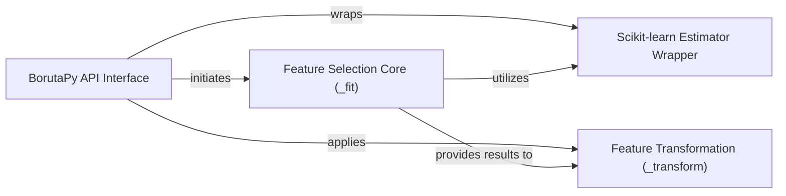

## Details

The `boruta_py` subsystem provides a robust feature selection mechanism by wrapping a generic scikit-learn estimator. The `BorutaPy API Interface` serves as the primary entry point, exposing `fit`, `transform`, and `fit_transform` methods to users. Internally, the `Feature Selection Core (_fit)` component orchestrates the iterative Boruta algorithm, which involves generating shadow features, calculating feature importances using the wrapped `Scikit-learn Estimator Wrapper`, and statistically determining relevant features. Once the feature selection is complete, the `Feature Transformation (_transform)` component applies these results to the input data, returning a reduced dataset containing only the selected features. This architecture ensures a clear separation of concerns, with the API handling user interaction, the core component managing the algorithm, and the transformation component applying the results, all while leveraging the flexibility of scikit-learn estimators.

### BorutaPy API Interface [[Expand]](./BorutaPy_API_Interface.md)
The primary user-facing component, handling initialization and exposing `fit`, `transform`, and `fit_transform` methods. It orchestrates the overall feature selection process. This component serves as the entry point for users interacting with the Boruta algorithm.

**Related Classes/Methods**:

- <a href="https://github.com/scikit-learn-contrib/boruta_py/blob/master/boruta/boruta_py.py" target="_blank" rel="noopener noreferrer">`boruta.boruta_py.BorutaPy.__init__`</a>
- <a href="https://github.com/scikit-learn-contrib/boruta_py/blob/master/boruta/boruta_py.py" target="_blank" rel="noopener noreferrer">`boruta.boruta_py.BorutaPy.fit`</a>
- <a href="https://github.com/scikit-learn-contrib/boruta_py/blob/master/boruta/boruta_py.py" target="_blank" rel="noopener noreferrer">`boruta.boruta_py.BorutaPy.transform`</a>
- <a href="https://github.com/scikit-learn-contrib/boruta_py/blob/master/boruta/boruta_py.py" target="_blank" rel="noopener noreferrer">`boruta.boruta_py.BorutaPy.fit_transform`</a>

### Feature Selection Core (_fit)
An internal component responsible for executing the core Boruta algorithm. This involves the iterative process of evaluating feature importance, comparing it against shadow features, and refining the set of relevant features.

**Related Classes/Methods**:

- <a href="https://github.com/scikit-learn-contrib/boruta_py/blob/master/boruta/boruta_py.py" target="_blank" rel="noopener noreferrer">`boruta.boruta_py.BorutaPy._fit`</a>

### Feature Transformation (_transform)
An internal component responsible for applying the results of the feature selection process. It takes the original dataset and returns a subset of features deemed relevant by the Boruta algorithm.

**Related Classes/Methods**:

- <a href="https://github.com/scikit-learn-contrib/boruta_py/blob/master/boruta/boruta_py.py" target="_blank" rel="noopener noreferrer">`boruta.boruta_py.BorutaPy._transform`</a>

### Scikit-learn Estimator Wrapper
An external, generic scikit-learn compatible estimator (e.g., `RandomForestClassifier`) that the `BorutaPy API Interface` depends on and wraps. This estimator is used internally by the Boruta algorithm to assess feature importance.

**Related Classes/Methods**:

### [FAQ](https://github.com/CodeBoarding/GeneratedOnBoardings/tree/main?tab=readme-ov-file#faq)